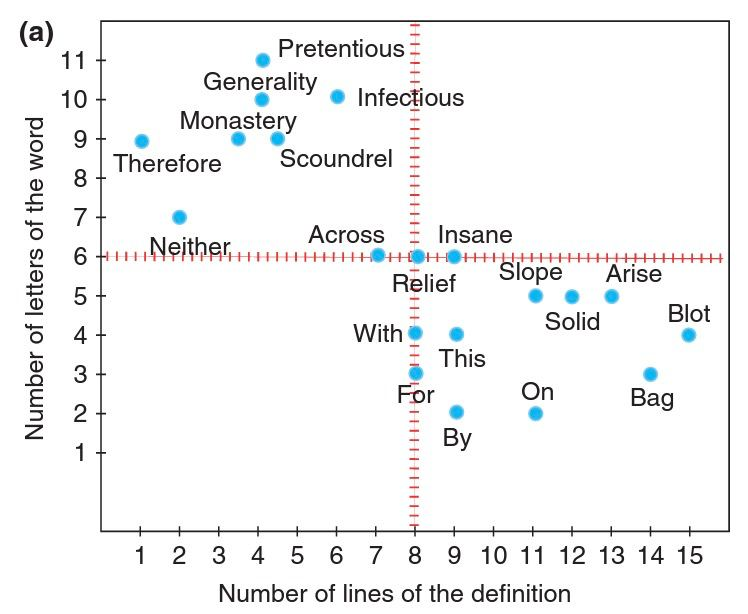
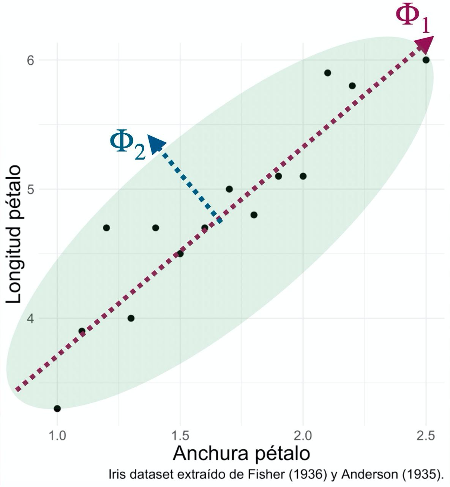
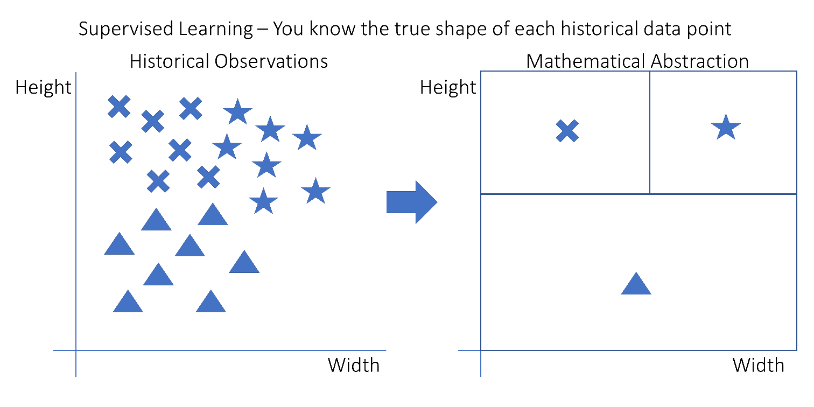
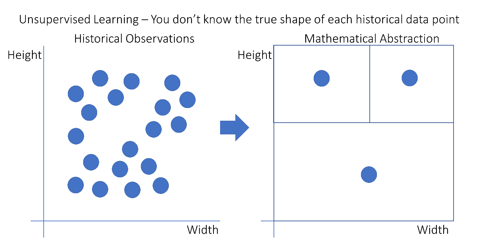
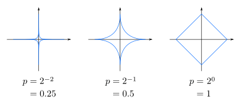
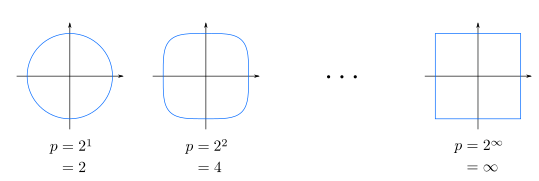
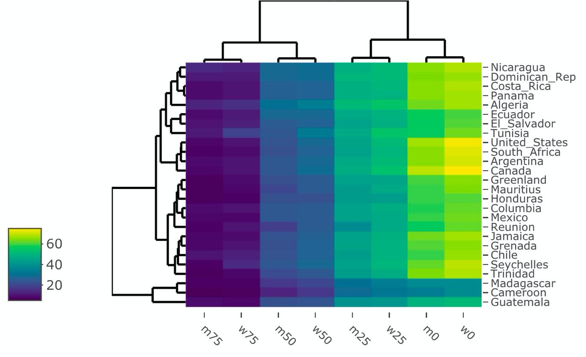
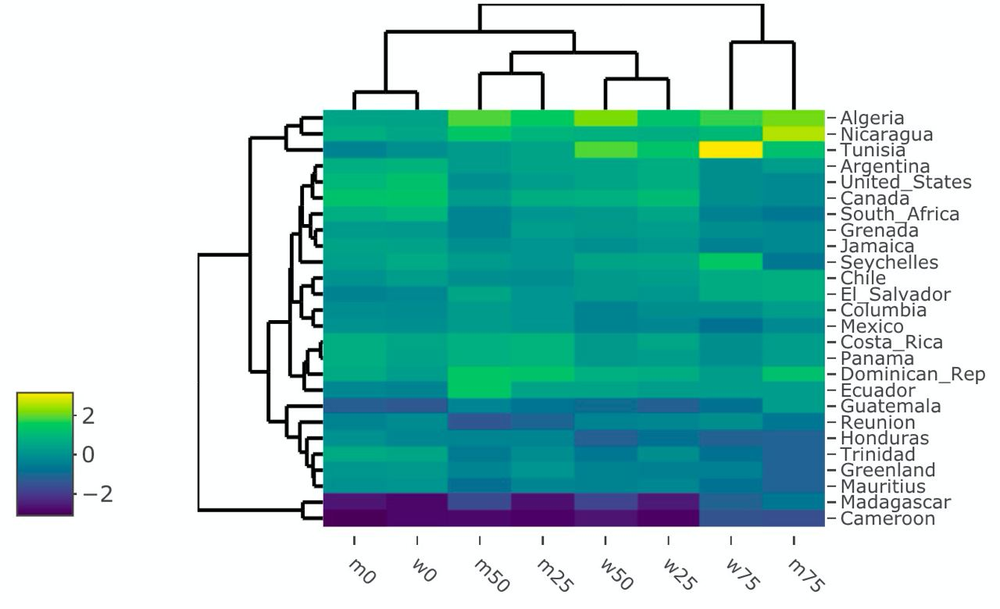

```{r settings, include = FALSE}
options(htmltools.dir.version = FALSE)
knitr::opts_chunk$set(fig.retina = 3, out.width = "100%", cache = FALSE,
                      comment = ">", echo = TRUE, message = FALSE,
                      warning = FALSE, hiline = TRUE, dpi = 120)

# xaringan Extra
# devtools::install_github("gadenbuie/xaringanExtra")
library(xaringanExtra)
use_xaringan_extra(c("tile_view", "animate_css", "tachyons"))
use_tile_view() # panel
# xaringanExtra::use_scribble() # scribble
use_extra_styles(hover_code_line = TRUE,
                 mute_unhighlighted_code = FALSE) # Hover triangle code line
use_clipboard( # About clipboard
  button_text = "Click para copiar código",
  success_text = "Código copiado",
  error_text = "Ctrl+C para copiar"
)
use_freezeframe() # restarting gifs
use_animate_all("fade") # animates
use_panelset() # panels 
```

class: inverse center middle

# ATAJOS DE LAS DIAPOSITIVAS


$$\\[2.7in]$$

.left[Pulsa <kbd-black>O</kbd-black> para ver el panel de diapositivas]
.left[Pulsa <kbd-black>H</kbd-black> para ver otros atajos]
.left[Pulsa <kbd-black>Ctrl+F</kbd-black> tras <kbd-black>O</kbd-black> para buscar en las diapositivas]

---


# Material de las clases


.pull-left[

- **Diapositivas** del curso:
<https://dadosdelaplace.github.io/teaching/pca-clustering>

- **Scripts** del curso:
<https://github.com/dadosdelaplace/teaching/tree/main/bdba-pca-clustering-2022/scripts>

- **Evaluaciones**:
<https://github.com/dadosdelaplace/teaching/tree/main/bdba-pca-clustering-2022/eval>

- **Bibliografía**: <https://github.com/dadosdelaplace/teaching/tree/main/bdba-pca-clustering-2022/biblio>

- **Manual** de R: <https://dadosdelaplace.github.io/courses-intro-R/>

- **Curso de dataviz** en R: <https://dadosdelaplace.github.io/curso-dataviz-ECI-2022>


]

.pull-right[

```{r material, echo = FALSE,  out.width = "83%", fig.align = "right"}

``` 

]

---

# Material de las clases


* Tutorial sobre **covarianzas/correlaciones**:
<https://github.com/dadosdelaplace/teaching/blob/main/bdba-pca-clustering-2022/scripts/cor_cov.Rmd>

* Tutorial sobre **PCA con R**:
<https://github.com/dadosdelaplace/teaching/blob/main/bdba-pca-clustering-2022/scripts/pca_con_R.Rmd>


* Tutorial introductorio sobre **tidyverse**:
<https://github.com/dadosdelaplace/teaching/blob/main/bdba-pca-clustering-2022/scripts/intro_tidyverse.Rmd>

* Curso más **avanzado de tidyverse** (está para bioestadística pero sirve) con ejercicios <https://github.com/dadosdelaplace/teaching/tree/main/bioestad>

* Curso más **avanzado de minería de datos en R**  con ejercicios <https://github.com/dadosdelaplace/teaching/tree/main/data_mining>


---

# Me presento: la turra

.pull-left[

```{r echo = FALSE,  out.width = "80%", fig.align = "left"}
knitr::include_graphics("./img/me.jpeg")
``` 

]

.pull-right[

* **Javier Álvarez Liébana**, nacido en 1989 en Carabanchel Bajo (Madrid)

* Licenciado (UCM) en **Matemáticas** (Erasmus en Bologna mediante). **Máster (UCM) en Ingeniería Matemática** (2013-2014)

&nbsp;

* **Doctorado en estadística** por la Universidad de Granada


* Encargado de la **visualización y análisis de datos covid** de la Consejería de Salud del **Principado de Asturias**

]

&nbsp;

Intentando la **divulgación** por `Twitter (@dadosdelaplace)` e `Instagram (@javieralvarezliebana)`. Mail: <javalv09@ucm.es>

---

# Objetivos


.pull-left[

El propósito de estas clases será el tratamiento de **datos multidimensionales**, con tres objetivos principales:

- **Reducción de la dimensión**: ¿todas las variables aportan información? ¿Todas son necesarias? ¿Podemos transformar las variables para mantener la información de los datos pero reducir la dimensionalidad de los mismos?

- **Visualización**: ¿cuántas dimensiones podemos incluir en un gráfico 2D? ¿Cómo visualizar datos multidimensionales?

- **Encontrar patrones**: ¿cómo agrupar (clusterizar) los elementos en función de sus diferencias y similitudes?

]

.pull-right[

```{r material2, echo = FALSE,  out.width = "120%", fig.align = "left"}

``` 

]

&nbsp;

📚 Estas **diapositivas** han sido elaboradas con el propio `R` haciendo uso del paquete `{xaringan}`
y `{xaringanExtra}`.


---


# Requisitos

Para el presente curso los únicos **requisitos** serán:

1. **Conexión a internet** (para la descarga de algunos datos y paquetes).

2. **Instalar R**: será nuestro **lenguaje**, nuestro **castellano** para poder «comunicarnos con el ordenador. La descarga la haremos (gratuitamente) desde <https://cran.r-project.org/>

3. **Instalar R Studio**. De la misma manera que podemos escribir castellano en un ordenador, en un Word, en un papel o en un tuit, podemos usar distintos IDE (entornos de desarrollo integrados, nuestro Office), para que el trabajo sea más cómodo. Nuestro **Word** para nosotros será **RStudio**.

.left[
  
]

.right[
  
]


---

class: inverse center middle

# BLOQUE I. Selección de variables: PCA

&nbsp;


### [¿Por qué es un paso importante en el análisis de datos multidimensional?](#intro-PCA)

### [Teoría: análisis de componentes principales](#teoria-PCA)

### [Práctica: PCA en R (y visualización)](#practica-PCA)

---

name: intro-PCA
class: center, middle

# ¿Por qué es un paso importante en el análisis de datos multidimensional?

### **¿Qué es el análisis multivariante?**

---

# ¿Qué es el análisis multidimensional?

Hasta la década de los 60, la mayoría de la estadística que se realizaba era

* **estadística unidimensional**: extraer información de una sola variable (rentas, impuestos, exportaciones, etc).

* **estadística bidimensional**: desde que Galton acuñó la regresión, los grandes estadísticos de principios de siglo se centraron en el **análisis bidimensional**, analizando la dependencia entre una variable $X$ y otra variable $Y$, con herramientas como los **coeficientes de correlación** de Pearson, Spearman o Kendall<sup>1</sup>


[1] [📚 Kendall, M. (1938). «A New Measure of Rank Correlation». Biometrika 30 (1–2): 81-89. doi:10.1093/biomet/30.1-2.81](https://doi.org/10.1093/biomet/30.1-2.81)

--

&nbsp;

## Wishart, contigo empezó todo

En 1928, Wishart publicó su famoso artículo <sup>2</sup> en el que, se demostraba y desarrollaba explícitamente la función de distribución de una 
**distribución normal multivariante**, trabajo más tarde extendido y formalizado por Fisher.

[2] [📚 Wishart, J. (1928). «The generalised product moment distribution in samples from a normal multivariate population». Biometrika. 20A (1–2): 32–52. doi:10.1093/biomet/20A.1-2.32](https://doi.org/10.1093/biomet/20A.1-2.32)


---
 
# ¿Qué es el análisis multidimensional?
 
Aunque el verdadero boom no llegó hasta la **década de los 60**, con la publicación del libro «An Introduction to Multivariate Statistical Analysis»<sup>1</sup> de Anderson (1958), proporcionando todo un marco teórico con el que poder trabajar.

[1] [📚 Anderson, T.W. (1958). «An Introduction to Multivariate Analysis». New York: Wiley ISBN 0471026409](http://www.ru.ac.bd/stat/wp-content/uploads/sites/25/2019/03/301_03_Anderson_An-Introduction-to-Multivariate-Statistical-Analysis-2003.pdf)

--

&nbsp;

## **Definición**

> El Análisis Multivariante es la rama de la estadística que estudia las relaciones (CONJUNTAMENTE) entre conjuntos de variables dependientes y los individuos para los cuales se han medido dichas variables (Kendall)


## **Notación**

* $n$ tamaño muestral (número de individuos --> filas).

* $\boldsymbol{X}_i = \left(\boldsymbol{X}_{1, i}, \ldots, \boldsymbol{X}_{i, p} \right)$ conjunto de $p$ variables (--> columnas) medidas para cada individuo $i=1,\ldots,n$.

* Nuestros datos estarán en forma de tabla o matriz $\boldsymbol{X}$ de $n$ filas y $p$ columnas (con $p \ll n$)

---

# Ejemplo de distribución bidimensional: normal bivariante

.pull-left[ 

Veamos un ejemplo sencillo con algo que seguramente nos sea familiar: la **distribución Normal o campana de Gauss** $X \sim \mathcal{N}\left(\mu, \sigma \right)$, cuya función de densidad es

$$f(x) = \frac{1}{\sigma {\sqrt{2\pi}}} e^{-{\frac{(x-\mu )^{2}}{2\sigma^{2}}}}, \quad \mu \in\mathbb{R},~\sigma >0$$

&nbsp;

La normal univariante depende de **dos parámetros**:

* **esperanza o media** $\mu = {\rm E} [X]$ 
* **varianza** (unidimensional) $\sigma^2 := {\rm Var} [X] = {\rm E} [\left(X - \mu \right)^2] = {\rm E} [X^2] - \mu^2$


]


.pull-right[

```{r eval = FALSE}
# Generamos muestra normal
rnorm(n = 10000, mean = 0, sd = 1)
```

```{r echo = FALSE}
library(tidyverse)
# Generamos una muestra normal (n = 10 000)
data <- tibble("x" = rnorm(n = 10000, mean = 0, sd = 1))
```

```{r echo = FALSE, out.width = "80%"}
# Ploteamos
ggplot(data, aes(x = x)) +
  geom_density(fill = "#F29288", alpha = 0.5, size = 1.2) +
  labs(x = "x", y = "f(x) (función densidad)")
```
  

]

---

# Normal bivariante

### **¿Y si medimos para cada individuo DOS variables?**

Si tenemos $\boldsymbol{X} = \left(X_1, X_2 \right)$, ¿qué estadísticos tenemos ahora a nuestra disposición?

* **Medidas marginales** (cada variable por separado):
  - medias $\mu_1:= {\rm E} [X_1]$ y $\mu_2:= {\rm E} [X_2]$
  - varianzas $\sigma_{1}^{2}:=\sigma_{1, 1}^{2} = \sigma_{X_1, X_1}^2$ y $\sigma_{2}^{2}:=\sigma_{2, 2}^{2} = \sigma_{X_2, X_2}^2$.

--

&nbsp;

### **Covarianza**

La varianza ${\rm Var} [X] := \sigma_{X}^2 = {\rm E} [ \left( X - \mu \right)^2 ]$ es una medida de dispersión que nos **cuantifica** la relación de una variable consigo misma. ¿Y si en lugar de medir $X_1$ vs $X_1$ medimos $X_1$ vs $X_2$?

Definiremos la **covarianza** como una especie de varianza en la que cambiamos una de las $X$ por otra variable

$$Cov (X_1, X_2) := \sigma_{1,2} =  {\rm E} [ \left( X_1 - \mu_1 \right) \left( X_2 - \mu_2 \right) ] = {\rm E}[X_1 * X_2] - \mu_1 * \mu_2 = \sigma_{2,1}$$

---

# Normal bivariante

### **Matriz de covarianzas**

Desde un punto de vista teórico, dada una variable aleatoria bidimensional $\boldsymbol{X} = \left(X_1, X_2 \right)^{T}$, con vector de medias $\boldsymbol{\mu} = \left(\mu_1, \mu_2 \right)^{T}$ definiremos la **matriz de varianzas y covarianzas** $\Sigma$ de la siguiente manera:

$$\boldsymbol{\Sigma} := \begin{pmatrix} \sigma_{1,1}^2 & \sigma_{1,2} \\ \sigma_{2,1} & \sigma_{2,2}^2 \end{pmatrix} = \begin{pmatrix} \sigma_{1}^2 & \sigma_{1,2} \\ \sigma_{1,2} & \sigma_{2}^2 \end{pmatrix}, \quad \left| \boldsymbol{\Sigma} \right| = \sigma_{1}^{2}  \sigma_{2}^{2} - \sigma_{1,2}^{2} > 0$$

--

Se puede expresar **matricialmente** como

$\begin{eqnarray}\boldsymbol{\Sigma} = {\rm E} \left[\left(\boldsymbol{X} - \boldsymbol{\mu} \right)^{T}\left(\boldsymbol{X} - \boldsymbol{\mu} \right) \right] &=& {\rm E} \left[\left( X_1  - \mu_1, X_2 - \mu_2 \right)^{T} \begin{pmatrix} X_1  - \mu_1 \\ X_2 - \mu_2 \end{pmatrix} \right] \\ &=& \begin{pmatrix} {\rm E} \left[ \left(X_1  - \mu_1 \right)^2 \right] & {\rm E} \left[\left(X_1  - \mu_1 \right)\left(X_2  - \mu_2 \right) \right] \\ {\rm E} \left[\left(X_2  - \mu_2 \right)\left(X_1  - \mu_1 \right) \right] & {\rm E} \left[\left(X_2  - \mu_2 \right)^2\right] \end{pmatrix} \end{eqnarray}$

**IMPORTANTE**: es una **matriz simétrica** (nos da igual medir $X$ vs $Y$, que $Y$ vs $X$).

---

# Normal multivariante

### **Normal univariante**

$$X \sim \mathcal{N} \left(\mu, \sigma^2 \right), \quad \boldsymbol{\Sigma} = \sigma^2, \quad f(x) =  \frac{1}{\sigma {\sqrt{2\pi}}} e^{-{\frac{(x-\mu )^{2}}{2\sigma^{2}}}} = \frac{1}{\sigma {\sqrt{2\pi}}} e^{-\frac{1}{2} (x-\mu ) \boldsymbol{\Sigma}^{-1} (x-\mu )}$$


### **Normal bivariante**

$$\boldsymbol{X} = \left(X_1, X_2 \right)^{T}  \sim \mathcal{N} \left( \boldsymbol{\mu}, \boldsymbol{\Sigma} \right), \quad f(x_1, x_2) = \frac{1}{2\pi \left| \Sigma \right|^{1/2}} e^{-\frac{1}{2}{(\boldsymbol{x} - \mu )^{T} \boldsymbol{\Sigma}^{-1}(\boldsymbol{x} - \mu )}}$$

--

### **Normal multivariante (caso general)** 

Multivariante de $p \ll n$ variables

$$\boldsymbol{X} = \left(X_1, \ldots, X_p \right)^{T}  \sim \mathcal{N} \left( \boldsymbol{\mu}, \boldsymbol{\Sigma} \right), \quad f(x_1, \ldots, x_p) = \frac{1}{\left(2\pi \right)^{p/2} \left| \Sigma \right|^{1/2}} e^{-\frac{1}{2}{(\boldsymbol{x} - \mu )^{T} \boldsymbol{\Sigma}^{-1}(\boldsymbol{x} - \mu )}}$$

$$\boldsymbol{\Sigma} = \left(\Sigma_{i,j} \right)_{i,j=1,\ldots,p}, \quad \Sigma_{i,j}:= Cov (X_i, X_j ) = {\rm E}[(X_i-\mu_i) (X_j - \mu_j)]$$

---

# Versión muestral

Lo anterior nos permite conocer la **formulación teórica (poblacional)**: ¿cómo calculamos la varianza y covarianza cuando tenemos una muestra $\boldsymbol{X}$ de $n$ individuos y $p$ observaciones medidas?


$$\boldsymbol{X} = \begin{pmatrix} x_{1, 1} & \ldots & x_{1, p} \\ \vdots & \ddots & \vdots \\ x_{n, 1} & \ldots & x_{n, p} \end{pmatrix} \quad \text{muestra}$$

#### **p = 2**

* **Varianzas muestrales**: $s_{x_1}^{2} := s_{1}^2 = \frac{1}{n} \sum_{i=1}^n \left(x_{i, 1} - \overline{x}_1 \right)^2$ y $s_{x_2}^{2} := s_{2}^2 = \frac{1}{n} \sum_{i=1}^n \left(x_{i, 2} - \overline{x}_2 \right)^2$, donde $\overline{x}_1$ y $\overline{x}_2$ son sus medias muestrales.

* **Covarianza muestral**: $s_{x_1, x_2}^{2} := s_{1, 2} = s_{2, 1}^2 = \frac{1}{n} \sum_{i=1}^n \sum_{j=1}^n \left(x_{i, 1} - \overline{x}_1 \right)\left(x_{j, 2} - \overline{x}_2 \right)$

--

#### **Estimadores insesgados**

Seguramente dichos valores los hallas visto divididos por $n-1$ en lugar de $n$: los valores muestrales son estimadores de los valores poblacionales, y de aquí en adelante usaremos **estimadores insesgados**, estimadores $T$ del valor población $U$ tal que ${\rm E}[T] = U$

* Estimador insesgado de $\mu_{x}$: $\overline{x}$ tal que ${\rm E}[\overline{x}] = \mu$

* Estimador insesgado de $\sigma_{x}^2$: la **cuasivarianza** $S_{x}^2 = \frac{n}{n-1} s_{x}^{2}$ tal que ${\rm E}[\sigma_{x}^2] = S_{x}^2$

* Estimador insesgado de $\sigma_{x, y}$: la **cuasicovarianza** $S_{x, y} = \frac{n}{n-1} s_{x, y}$ tal que ${\rm E}[\sigma_{x, y}] = S_{x, y}$

---

# Matriz de covarianzas (versión muestral)


En un **caso general**, dada una muestra $\boldsymbol{X}$ de $n$ individuos y $p$ variables

$$S_{x_{k}}^2 := S_{k}^2 = \frac{1}{n-1} \sum_{i=1}^{n} \left(x_{i, k} - \overline{x}_k \right)^2 \quad \text{(cuasi) var. muestrales (marginales)}$$


$$S_{x_{k}, x_{l}} := S_{k, l} = \frac{1}{n-1} \sum_{i=1}^{n} \sum_{j=1}^{n} \left(x_{i, k} - \overline{x}_k \right)\left(x_{j, l} - \overline{x}_l \right) \quad \text{(cuasi) covarianzas}$$

Así, la **matriz de (cuasi) covarianzas empíricas** quedará como

$$S := \frac{1}{n-1} \left(\boldsymbol{X} - \boldsymbol{\mu} \right)^{T} \left(\boldsymbol{X} - \boldsymbol{\mu} \right) =_{\boldsymbol{\mu} = 0} \frac{1}{n-1} \boldsymbol{X}^{T} \boldsymbol{X} = \begin{pmatrix} S_{1,1} &  \ldots & S_{1, p} \\ \vdots & \ddots & \vdots \\ S_{p,1} & \ldots & S_{p, p} \end{pmatrix}$$

&nbsp;

--

Las **covarianzas (y varianzas)** tienen un **«problema»**: **dependen de la magnitud** de los datos, proporcionando una medida que solo nos sirve para ser comparada con otra covariana, pero que **no nos proporciona una escala absoluta** para poder cuantificar.

---

# Matriz de correlaciones (versión muestral)


Para resolverlo, tenemos la **correlación (de Pearson)** 

$$\rho_{k, l} := r_{k, l} = \frac{s_{k, l}}{\sqrt{s_{k}^2} \sqrt{s_{l}^2}} = \frac{S_{k, l}}{\sqrt{S_{k}^2} \sqrt{S_{l}^2}}$$

tal que siempre $-1 \leq r_{k, l} \leq 1$.

&nbsp;

--

De esta forma la **matriz de correlaciones** se puede expresar como

$$R := \left(r_{k, l} \right)_{k,l=1,\ldots,p} = D^{-1/2} S D^{-1/2}, \quad D = diag(S) = \begin{pmatrix} S_{1,1}^2 & \ldots & 0 \\ \vdots  & \ddots & \vdots \\  0 & \ldots & S_{p, p}^2 \end{pmatrix}$$


---


name: teoria-PCA
class: center, middle

# Teoría: análisis de componentes principales

---

# Objetivo: ¿reducir dimensión?

.pull-left[

El **objetivo «mainstream»** del **análisis de componentes principales** (PCA en inglés) suele ser el de **reducir la dimensión** de nuestros datos: pasar de un conjunto de $n$ individuos y $p$ variables a otro de $k < p$ variables (para los mismos $n$ individuos).

&nbsp;

Esta reducción de la dimensión se suele hacer con **3 objetivos** principalmente:

* **Mejora computacional** de los algoritmos al tener un dataset más reducido.

* **Permitir la visualización** en 2 o 3 dimensiones de conjuntos $n$-dimensionales.

* **«Reflotar» patrones** subyacentes en los datos.

]

.pull-right[

```{r echo = FALSE,  out.width = "100%", fig.align = "center", fig.cap = "Extraída de https://towardsdatascience.com/dimensionality-reduction-cheatsheet-15060fee3aa"}

knitr::include_graphics("https://miro.medium.com/max/959/1*kK4aMPHQ89ssFEus6RT4Yw.jpeg")
``` 

]

---


# Objetivo: ¿reducir dimensión?

.pull-left[

¿Entonces? ¿No tiene sentido aplicar componentes principales o técnicas de reducción de la dimensión en **datos bidimensionales**?

&nbsp;

Empecemos por un sencillo ejemplo, visualizando la **longitud y anchura de pétalo** del famoso conjunto de datos `iris`

&nbsp;

**¿Cuáles podrían ser los objetivos?** ¿Tiene sentido en este ejemplo aplicar **técnicas de reducción de la dimensión** como las componentes principales?

]

.pull-right[

```{r echo = FALSE, out.width = "100%"}
library(tidyverse)
ggplot(iris, aes(x = Petal.Width, y = Petal.Length)) +
  geom_point(size = 5) +
  labs(x = "Anchura pétalo", y = "Longitud pétalo",
       caption = "Iris dataset extraído de Fisher (1936) y Anderson (1935).") +
  theme_minimal()
```

]

---

# Objetivo: maximizar la información


```{r echo = FALSE,  out.width = "80%", fig.align = "center", fig.cap = "Gráfica extraída de https://towardsdatascience.com/a-one-stop-shop-for-principal-component-analysis-5582fb7e0a9c"}
knitr::include_graphics("https://miro.medium.com/max/1400/1*V3JWBvxB92Uo116Bpxa3Tw.png")
``` 

Como veremos, el **objetivo real** será **maximizar la información obtenido al menor coste posible**, y eso hace que siga siendo útil, aunque no reduzcamos dimensiones, hacerlo en el caso bidimensional: una **clave** de las componentes principales es que las **componentes resultantes** serán **ortogonales** (perpendiculares), es decir, **linealmente independientes**.

&nbsp;

Las **componentes principales** pueden ser una herramienta muy útil para atajar problemas de **colinealidad** (variables altamente correladas entre sí, interfiriendo entre ellas)


---


# Idea principal

La **idea subyacente** tras el cálculo de las componentes principales se puede resumir de forma **geométrica**: para un conjunto de puntos $p$-dimensionales, encontrar un **nuevo sistema de coordenadas** de dimensión $k \leq p$ en el que expresar los datos, de forma que las **nuevas variables sean linealmente independientes**.

En el **caso bidimensional**, el resultado de aplicar componentes principales será una especie de «rotación» de los datos


```{r echo = FALSE, out.width = "75%", fig.align = "center"}
knitr::include_graphics("https://miro.medium.com/max/1400/1*V3JWBvxB92Uo116Bpxa3Tw.png")
``` 

📚 **«Principal Component Analysis»**. Hervé and Lynne (2010) <http://staff.ustc.edu.cn/~zwp/teach/MVA/abdi-awPCA2010.pdf>


---

# Idea principal: caso bidimensional


En el **caso bidimensional**, la idea será buscar esa **elipse** en torno a la cual tenemos los datos, de forma que la dirección que marca el **eje mayor** será la **primera componente** (la que tiene mayor rango --> mayor varianza) y la dirección que marca el **eje menor** será la **segunda componente**.


.pull-left[

```{r echo = FALSE,  out.width = "77%", fig.align = "center", fig.cap = "Gráfica extraída de Hervé and Lynne (2010)"}

```

]


.pull-right[

```{r echo = FALSE,  out.width = "58%", fig.align = "center", fig.cap = "Gráfica extraída de Hervé and Lynne (2010)"}
knitr::include_graphics("./img/pca_words_23.jpg")
```

]

📚 **«Principal Component Analysis»**. Hervé and Lynne (2010) <http://staff.ustc.edu.cn/~zwp/teach/MVA/abdi-awPCA2010.pdf>

---

# Caso inicial bidimensional


.pull-left[

Vamos a empezar por un **ejemplo sencillo (bidimensional)** tomando de `{iris}` solo las variables del pétalo (y la specie)

```{r}
library(tidyverse)
iris_tb <- as_tibble(iris)
iris_bi <- iris_tb[, 3:5]
```


]

.pull-right[

```{r echo = FALSE}
ggplot(iris_bi, aes(x = Petal.Width, y = Petal.Length)) +
  geom_point(size = 3) +
  labs(x = "Anchura pétalo", y = "Longitud pétalo",
       caption = "Iris dataset extraído de Fisher (1936) y Anderson (1935).") +
  theme_minimal() +
  theme(axis.title.x = element_text(size = 23),
        axis.text.x = element_text(size = 15),
        axis.title.y = element_text(size = 23),
        axis.text.y = element_text(size = 15),
        plot.caption = element_text(size = 15))
```

]

---

# Caso bidimensional

.pull-left[

1. Encontrar las **direcciónes de máxima varianza**. Dichas direcciones vendrán determinadas por **dos vectores** $\left\lbrace \boldsymbol{\Phi}_1, \boldsymbol{\Phi}_2 \right\rbrace$ perpendiculares entre sí y que serán **combinación lineal de las variables** originales.

$$\Phi_1 = z_{1, 1} * \boldsymbol{x}_1 + z_{2, 1} * \boldsymbol{x}_2, \quad \Phi_2 = z_{1, 2} * \boldsymbol{x}_1 + z_{2, 2} * \boldsymbol{x}_2$$


]

.pull-right[

```{r echo = FALSE,  out.width = "85%", fig.align = "center", fig.cap = "Direcciones de máxima varianza"}

```

]

---

# Caso bidimensional

.pull-left[


1. Encontrar las **direcciónes de máxima varianza**. Dichas direcciones vendrán determinadas por **dos vectores** $\left\lbrace \Phi_1, \Phi_2 \right\rbrace$ perpendiculares entre sí y que serán **combinación lineal de las variables** originales.
$$\Phi_1 = z_{1, 1} * \boldsymbol{x}_1 + z_{2, 1} * \boldsymbol{x}_2, \quad \Phi_2 = z_{1, 2} * \boldsymbol{x}_1 + z_{2, 2} * \boldsymbol{x}_2$$

2. Dado un registro $\boldsymbol{x}_i = \left(x_{i, 1}, x_{i, 2} \right)$ (que puede entenderse como un vector $\overline{\boldsymbol{x}}_i := \boldsymbol{x}_i$), lo que haremos será obtener las **nuevas coordenadas** **proyectando ortogonalmente** el vector sobre las nuevas direcciones:
$$x_{i, 1}' =\left| \boldsymbol{x}_i \right| cos (\alpha)  =  \frac{\langle \boldsymbol{x}_i, \Phi_1 \rangle}{ \left| \Phi_1 \right|}, \quad x_{i, 2}' =  \frac{\langle \boldsymbol{x}_i, \Phi_2 \rangle}{ \left| \Phi_2 \right|}$$

]

.pull-right[

```{r echo = FALSE,  out.width = "78%", fig.align = "center", fig.cap = "Proyección ortogonal"}
knitr::include_graphics("./img/pca_iris_2.jpg")
```

]

---


# Caso bidimensional

.pull-left[


1. Encontrar las **direcciónes de máxima varianza**. Dichas direcciones vendrán determinadas por **dos vectores** $\left\lbrace \Phi_1, \Phi_2 \right\rbrace$ perpendiculares entre sí y que serán **combinación lineal de las variables** originales.
$$\Phi_1 = z_{1, 1} * \boldsymbol{x}_1 + z_{2, 1} * \boldsymbol{x}_2, \quad \Phi_2 = z_{1, 2} * \boldsymbol{x}_1 + z_{2, 2} * \boldsymbol{x}_2$$

2. Dado un registro $\boldsymbol{x}_i = \left(x_{i, 1}, x_{i, 2} \right)$ (que puede entenderse como un vector $\overline{\boldsymbol{x}}_i := \boldsymbol{x}_i$), lo que haremos será obtener las **nuevas coordenadas** **proyectando ortogonalmente** el vector sobre las nuevas direcciones:
$$x_{i, 1}' =\left| \boldsymbol{x}_i \right| cos (\alpha)  =  \frac{\langle \boldsymbol{x}_i, \Phi_1 \rangle}{ \left| \Phi_1 \right|}, \quad x_{i, 2}' =  \frac{\langle \boldsymbol{x}_i, \Phi_2 \rangle}{ \left| \Phi_2 \right|}$$

3. Las **nuevas direcciones** las seleccionaremos  **ortonormales** (módulo unitario):
$$x_{i, 1}'  =  \langle \boldsymbol{x}_i, \Phi_1 \rangle =  \left(x_{i, 1}, x_{i, 2} \right) \left(z_{1, 1}, z_{2, 1} \right)^{T} = \boldsymbol{x}_{i} \boldsymbol{\Phi}_{1}^{T}, \quad x_{i, 2}' = \langle \boldsymbol{x}_i, \Phi_2 \rangle = \boldsymbol{x}_{i} \boldsymbol{\Phi}_{2}^{T}$$

]

.pull-right[

```{r echo = FALSE,  out.width = "78%", fig.align = "center", fig.cap = "Proyección ortogonal"}
knitr::include_graphics("./img/pca_iris_2.jpg")
```

]

---

# Idea general


Nuestros datos originales $\boldsymbol{X}$  (dimensiones $n \times p$) serán reconvertidos en un conjunto $\boldsymbol{X}'$ de dimensiones $n \times k$, con $k \leq p$, tal que 

$$\boldsymbol{X}' = \boldsymbol{X} \boldsymbol{\Phi}^{T}$$

--

tal que $\boldsymbol{\Phi}^{T}$ es una matriz $p \times k$ que contiene por columnas las $k$ **direcciones principales**

$$\boldsymbol{\Phi}^{T} = \begin{pmatrix} z_{1,1} & z_{2,1} & \ldots & z_{k,1} \\ z_{1,2} & z_{2,2} & \ldots & z_{k,2} \\ \vdots & \vdots & \ddots & \vdots \\ z_{1,p} & z_{2,p} & \ldots & z_{k,p} \end{pmatrix}$$

--

bajo la condición de que sean **direcciones ortonormales**

$$\Phi \Phi^{T} = \begin{pmatrix} 1 & \ldots & 0 \\  \vdots &  \ddots & \vdots \\ 0  & \ldots & 1 \end{pmatrix}$$

tal que dichas direcciones **maximicen la varianza**.

---

# Primera componente

Por ejemplo, para la **primera componente** el objetivo es encontrar, de entre todas las direcciones  $\boldsymbol{u}_1$ posibles, la dirección $\boldsymbol{\Phi}_1$ que **maximice la varianza de nuestros datos cuando los proyectamos sobre dicha dirección**

$$\boldsymbol{x}_{1}' = \boldsymbol{X} \boldsymbol{\Phi}_{1}^{T} = \begin{pmatrix} x_{1,1} & x_{1, 2} & \ldots & x_{1, p} \\ x_{2,1} & x_{2, 1} & \ldots & x_{2, p} \\ \vdots & \vdots & \ddots & \vdots
\\ x_{n,1} & x_{n, 2} & \ldots & x_{n, p}\end{pmatrix} \begin{pmatrix} z_{1,1} \\ z_{1,2} \\ \vdots \\ z_{1,p} \end{pmatrix} =  \begin{pmatrix} x_{1,1}^{'} \\ x_{2,1}^{'} \\ \vdots \\ x_{n, 1}^{'} \end{pmatrix}$$


--

&nbsp;

Dicha dirección por tanto saldrá de un proceso de **optimización**

$$\boldsymbol{\Phi}_1 = \arg \max_{\boldsymbol{u}_{1}^{T} \boldsymbol{u}_1 = 1} {\rm Var} \left( \boldsymbol{x}_{1}'  \right) = \arg \max_{\boldsymbol{u}_{1}^{T} \boldsymbol{u}_1 = 1} {\rm Var} \left( \boldsymbol{X} \boldsymbol{u}_{1}^{T} \right)$$

---

# Primera componente

Dicha dirección por tanto saldrá de un proceso de **optimización**

$$\boldsymbol{\Phi}_1 = \arg \max_{\boldsymbol{u}_{1}^{T} \boldsymbol{u}_1 = 1} {\rm Var} \left( \boldsymbol{x}_{1}'  \right) = \arg \max_{\boldsymbol{u}_{1}^{T} \boldsymbol{u}_1 = 1} {\rm Var} \left( \boldsymbol{X} \boldsymbol{u}_{1}^{T} \right)$$

--

Si **centramos los datos** (restamos su media para tener media nula)


$$\begin{eqnarray}\boldsymbol{\Phi}_1 &=& \arg \max_{\boldsymbol{u}_{1}^{T} \boldsymbol{u}_{1} = 1} {\rm Var} \left( \boldsymbol{X}\boldsymbol{u}_{1}^{T} \right) = \arg \max_{\boldsymbol{u}_{1}^{T} \boldsymbol{u}_1 = 1} \left({\rm E} \left[\left( \boldsymbol{X} \boldsymbol{u}_1^{T} \right)^{T}\left( \boldsymbol{X} \boldsymbol{u}_{1}^{T} \right)\right] \right) \\ &=& \arg \max_{\boldsymbol{u}_{1}^{T} \boldsymbol{u}_{1} = 1} \left({\rm E} \left[ \boldsymbol{u}_{1} \boldsymbol{X}^{T} \boldsymbol{X} \boldsymbol{u}_1^{T} \right] \right) = \arg \max_{\boldsymbol{u}_{1}^{T} \boldsymbol{u}_1 = 1} \left( \boldsymbol{u}_1 {\rm E} \left[\boldsymbol{X}^{T} \boldsymbol{X} \right] \boldsymbol{u}_{1}^{T}  \right) \\ &=& \arg \max_{\boldsymbol{u}_{1}^{T} \boldsymbol{u}_1 = 1} \left( \boldsymbol{u}_1 S \boldsymbol{u}_{1}^{T}  \right)\end{eqnarray}$$

--

Si **estandarizamos los datos** (restamos su media y dividimos entre su desviación típica, teniendo **datos con media cero y varianza unitaria** para que todos los datos ponderen por igual)

$$\boldsymbol{\Phi}_1 = \arg \max_{\boldsymbol{u}_{1}^{T} \boldsymbol{u}_1 = 1} {\rm Var} \left( \boldsymbol{X} \boldsymbol{u}_1^{T} \right) = \arg \max_{\boldsymbol{u}_{1}^{T} \boldsymbol{u}_1 = 1} \left( \boldsymbol{u}_1 S \boldsymbol{u}_1^{T}  \right) = \arg \max_{\boldsymbol{u}_{1}^{T} \boldsymbol{u}_1 = 1} \left( \boldsymbol{u}_1 R \boldsymbol{u}_1^{T}  \right)$$

---

# Primera componente

Para **encontrar esa dirección $\boldsymbol{u}_1$** que nos maximiza la varianza de los proyectados en ella, sujeto a la restrcción de que $\boldsymbol{u}_{1}^{T} \boldsymbol{u}_1 = 1$, se puede usar la técnica de los **multiplicadores de Lagrange** que nos dice que

$$\boldsymbol{\Phi}_1 =  \arg \max_{\boldsymbol{u}_{1}^{T} \boldsymbol{u}_1 = 1} \left( \boldsymbol{u}_1 R \boldsymbol{u}_1^{T}  \right) = \arg \max_{\boldsymbol{u}_{1}^{T} \boldsymbol{u}_1 = 1} \left( \boldsymbol{u}_1 R \boldsymbol{u}_1^{T}  - \lambda \left(\boldsymbol{u}_1^{T} \boldsymbol{u}_1  - 1\right) \right), \quad \lambda \in \mathbb{R}$$

--

Eso es equivalente a encontrar el valor que nos **iguale la derivada a cero**

$$\frac{\partial}{\partial \boldsymbol{u}_1} \left( \boldsymbol{u}_1 R \boldsymbol{u}_1^{T}  - \lambda \left(\boldsymbol{u}_1^{T} \boldsymbol{u}_1  - 1\right) \right) =   R \boldsymbol{u}_1  - \lambda \boldsymbol{u}_1^{T} = \left(R - \lambda \boldsymbol{Id}_{p} \right) \boldsymbol{u}_1^{T}  =  0$$
--

Esto es lo mismo que decir que $R \boldsymbol{u}_1^{T}  = \lambda \boldsymbol{u}_1^{T}$, es decir, la dirección que buscamos $\boldsymbol{u}_{1}^{T}$ es un **autovector de la matriz de covarianzas** (tras **estandarizar** los datos).

---

# Paréntesis: autovectores y autovalores

En álgebra matricial, dada una matriz $\boldsymbol{A}$ cuadrada de tamaño $p \times p$, decimos que $v$ es su **autovector** y $\lambda$ su **autovalor asociado** si y solo sí

$$A v= \lambda v, \quad v = \left(v_1, \ldots, v_p \right) \neq 0$$

Esto es equivalente a decir que 

$$A v - \lambda v = 0 \rightarrow (A - \lambda I_{p}) v = 0$$

donde $I_p$ es la matriz identidad de tamaño $p \times p$. Dicha ecuación tiene solución si y solo sí

$$\left| A - \lambda I_{p} \right| = 0$$

Además, por el **Teorema Fundamental del Algebra** sabemos que dicho determinante puede expresarse como un polinomio de grado $p$ (conocido como **polinomio característico**)

$$\left| A - \lambda I_{p} \right| = \left(\lambda_1 - \lambda \right)\left(\lambda_2 - \lambda \right) \ldots \left(\lambda_p - \lambda \right) = p (\lambda)$$

Además el determinante $\left| A \right|$ será el producto de todos sus autovalores.

---

# Primera componente

Recapitulando, para obtener la **primera componente** $\boldsymbol{\Phi}_1$, debemos de 

* **Estandarizar** nuestros datos
* Calcular la **matriz de (cuasi)covarianzas** $\boldsymbol{S}$
* Calcula sus **autovectores** tal que $S \boldsymbol{\Phi}_{1}^{T} = \lambda_1 \boldsymbol{\Phi}_{1}^{T}$ (normalizados a módulo 1).

--

Además si es un autovector de la matriz de covarianzas tenemos entonces que la **varianza maximizada**, la **proporción de información** que **explica dicha componente**, será

$$\boldsymbol{\Phi}_{1} \left(  S \boldsymbol{\Phi}_{1}^{T} \right) = \boldsymbol{\Phi}_{1} \left( R \boldsymbol{\Phi}_{1}^{T} \right) =\boldsymbol{\Phi}_{1}\left(  \lambda_1 \boldsymbol{\Phi}_{1}^{T} \right) =  \lambda_1 \boldsymbol{\Phi}_{1} \boldsymbol{\Phi}_{1}^{T} =_{\text{ortonormales}} \lambda_1$$ 

--

Así que obtener la dirección (de todos los autovalores) que mayor información captura nos fijaremos en aquella que tenga **asociada el autovalor más grande**.


$$\boldsymbol{x}_{1}' = \boldsymbol{X} \boldsymbol{\Phi}_{1}^{T} = \begin{pmatrix} x_{1,1} & \ldots & x_{1, p}  \\ \vdots  & \ddots & \vdots
\\ x_{n,1}  & \ldots & x_{n, p}\end{pmatrix} \begin{pmatrix} z_{1,1} \\ \vdots \\ z_{1,p} \end{pmatrix} =  \begin{pmatrix} x_{1,1}^{'} \\ \vdots \\ x_{n, 1}^{'} \end{pmatrix}$$

donde $S \boldsymbol{\Phi}_{1}^{T} = \lambda_1 \boldsymbol{\Phi}_{1}^{T}$, siendo $\lambda_1$ el mayor de los autovalores de la matriz de (cuasi)covarianzas $S$, y $\boldsymbol{\Phi}_{1}^{T}$ su autovector asociado. El **resto de las componentes** se obtendrán de forma similar, siendo ortogonales a cada una de las direcciones obtenidas.

---

# Idea general paso a paso 

El proceso completo es el siguiente:

* Dados unos datos $\boldsymbol{X}$ de $n$ individuos y $p$ variables, el objetivo es encontrar nuevas **direcciones ortonormales** $\left\lbrace \boldsymbol{\Phi}_1, \ldots, \boldsymbol{\Phi}_k \right\rbrace$, con $1 \leq k \leq p$, como combinación lineal de las variables originales.

* Los **datos son estandarizados**  tal que

$$\begin{pmatrix} \frac{x_{1,1} - \overline{x}_1}{S_{1}} & \frac{x_{1,2} - \overline{x}_2}{S_{2}} & \ldots & \frac{x_{1,p} - \overline{x}_p}{S_{p}} \\  \frac{x_{2,1} - \overline{x}_1}{S_{1}} & \frac{x_{2,2} - \overline{x}_2}{S_{2}} & \ldots & \frac{x_{2,p} - \overline{x}_p}{S_{p}} \\ \vdots & \vdots & \ddots & \vdots \\ \frac{x_{n,1} - \overline{x}_1}{S_{1}} & \frac{x_{n,2} - \overline{x}_2}{S_{2}} & \ldots & \frac{x_{n,p} - \overline{x}_p}{S_{p}} \end{pmatrix}$$

* Calcular la **matriz $S$ de (cuasi)covarianzas** de dichos datos estandarizados.

---

# Idea general paso a paso 

El proceso completo es el siguiente:

* Calculamos los $p$ **autovectores** $\left\lbrace \boldsymbol{\Phi}_1, \ldots, \boldsymbol{\Phi}_p \right\rbrace$, y sus **autovalores asociados** $\left\lbrace \lambda_1, \ldots, \lambda_p \right\rbrace$, de la matriz $S$, tal que $S  \boldsymbol{\Phi}_k = \lambda_k  \boldsymbol{\Phi}_k$.

* Seleccionamos las primeras $k \leq p$ componentes $\left\lbrace \boldsymbol{\Phi}_1, \ldots, \boldsymbol{\Phi}_k \right\rbrace$ asociadas a los primeros $\left\lbrace \lambda_1, \ldots, \lambda_k \right\rbrace$ autovalores.

* La **varianza (información) capturada** por la dirección $k$-ésima será igual a $\lambda_k$.

* Las nuevas coordenadas serán

$$\boldsymbol{X}^{'} = \boldsymbol{X} \boldsymbol{\Phi}^{T} = \begin{pmatrix} x_{1,1} & x_{1, 2} & \ldots & x_{1, p} \\ x_{2,1} & x_{2, 1} & \ldots & x_{2, p} \\ \vdots & \vdots & \ddots & \vdots
\\ x_{n,1} & x_{n, 2} & \ldots & x_{n, p}\end{pmatrix} \begin{pmatrix} z_{1,1} & z_{2,1} & \ldots & z_{k,1} \\ z_{1,2} & z_{2,2} & \ldots & z_{k,2}  \\ \vdots & \vdots & \ddots & \vdots \\ z_{1,p} & z_{2,p} & \ldots & z_{k,p} \end{pmatrix} = \begin{pmatrix} \boldsymbol{x}_1 \boldsymbol{\Phi}_1^{T} & \boldsymbol{x}_1 \boldsymbol{\Phi}_2^{T} & \ldots & \boldsymbol{x}_1 \boldsymbol{\Phi}_k^{T} \\ \boldsymbol{x}_2 \boldsymbol{\Phi}_1^{T} & \boldsymbol{x}_2 \boldsymbol{\Phi}_2^{T} & \ldots & \boldsymbol{x}_2 \boldsymbol{\Phi}_k^{T} \\ \vdots & \vdots & \ddots & \vdots \\ \boldsymbol{x}_n \boldsymbol{\Phi}_1^{T} & \boldsymbol{x}_n \boldsymbol{\Phi}_2^{T} & \ldots & \boldsymbol{x}_n \boldsymbol{\Phi}_k^{T}\end{pmatrix}$$

---

# Glosario 

* **Autovectores**: nos indican la **dirección de la componente**

* **Loadings**: serán los **coeficientes** de dichos autovectores (los que generan la combinación lineal de las variables originales) nos indican el **peso que tiene cada variable original en dicha componente**. Si por ejemplo $\boldsymbol{\Phi}_1 = \left(0.95, 0.15, 0.273 \right)$, significa que la primera componente (la que más varianza captura) será $0.95* \boldsymbol{X}_1 + 0.15 * \boldsymbol{X}_2 + 0.273 * \boldsymbol{X}_3$, estando dominada por la variable original $\boldsymbol{X}_1$ (un peso de 0.95).


* **Signo de los loadings**: nos indica el **sentido de la relación entre la componente y la variable original** (correlación positiva/negativa). Si alguno de ellos fuese 0 significaría que la nueva componente está incorrelada respecto a dicha variable original.


* **Scores**: para cada observación $i$, las nuevas coordenadas $\left(x_{i, 1}^{'}, \ldots, x_{i, k}^{'} \right)$, calculadas tras **proyectar la observación original en las direcciones principales** $\boldsymbol{x}_{i} \boldsymbol{\Phi}^{T}$.


* **Truncamiento o número de componentes**: para seleccionar el número $k$ de componentes a seleccionar el método más sencillo es **fijar de antemano** un **umbral varianza explicada** que queremos conservar (por ejemplo, $95%$), de forma que nos quedemos con el primer número $k$ tal que $\sum_{j=1}^{k} \lambda_k > 0.95$ (**varianza explicada acumulada**, teniendo los autovalores ordenados de mayor a menor).


---


name: practica-PCA
class: center, middle

# Práctica: PCA en R

---

# PCA en R: caso «manual»


Volvemos a nuestro **ejemplo sencillo (bidimensional)** tomando de `{iris}` solo las variables del pétalo.

```{r}
library(tidyverse)
iris_tb <- as_tibble(iris)
iris_bi <- iris_tb[, 3:5]
iris_bi
```

---

# PCA en R: caso «manual»


**Primer paso**: **estandarizar** los datos

```{r}
iris_bi_std <- tibble(as_tibble(scale(iris_bi[, 1:2])),
                      "Species" = iris_bi$Species)
names(iris_bi_std) <- names(iris_bi)
iris_bi_std
```

---

# PCA en R: caso «manual»

.pull-left[
```{r echo = FALSE}
ggplot(iris_bi, aes(x = Petal.Width, y = Petal.Length)) +
  geom_point(size = 5) +
  labs(x = "Anchura pétalo", y = "Longitud pétalo",
       caption = "Iris dataset extraído de Fisher (1936) y Anderson (1935).",
       title = "Datos originales") +
  theme_minimal()
```

]

.pull-right[

```{r echo = FALSE}
ggplot(iris_bi_std, aes(x = Petal.Width, y = Petal.Length)) +
  geom_point(size = 5, color = "darkolivegreen") +
  labs(x = "Anchura pétalo", y = "Longitud pétalo",
       caption = "Iris dataset extraído de Fisher (1936) y Anderson (1935).",
       title = "Datos estandarizados") +
  theme_minimal()
```

]

---


# PCA en R: caso «manual»

**Segundo paso**: calcular la **matriz de covarianzas** (solo con las numéricas)

```{r}
cov_mat <- cov(iris_bi_std[, 1:2])
cov_mat
```

Al estar estandarizados los datos, es equivalente a calcular la **matriz de correlaciones**

```{r}
cor_mat <- cor(iris_bi_std[, 1:2])
cor_mat
```

---

# PCA en R: caso «manual»

**Tercer paso**: calcular los **autovalores y autovectores** de la matriz de covarianzas

```{r}
autocosas <- eigen(cor_mat)
autocosas
```

**IMPORTANTE** al tener las **variables estandarizadas**, la **suma de los autovalores** es $p$ (ya que será la suma de las varianzas de las variables que tenemos).

---

# PCA en R: caso «manual»

**Cuarto paso**: comprobar que están **ordenados** los autovectores segun autovalores (de mayor a menor).

```{r}
lambda <- autocosas$values
lambda
```

La **varianza capturada** por $\boldsymbol{\Phi}_1$ es $1.963$ y $0.037$ para la segunda componente $\boldsymbol{\Phi}_2$.

```{r}
# los llamados loadings
autocosas$vectors 
```

---

# PCA en R: caso «manual»


**Quinto paso**: calcular la **varianza explicada acumulada** por cada componente (una vez ordenadas)

```{r}
cumsum_var <- cumsum(lambda) / sum(lambda)
cumsum_var
```

La **primera componente captura el 98.14% de la información (de la varianza)** y la segunda el 1.86% restante.

---

# PCA en R: caso «manual»

* **Sexto paso**: proyectar en las nuevas componentes para obtener las **nuevas coordenadas** (¡respecto a la nueva base!), los llamados **scores**
 

```{r}
scores <- tibble(as_tibble(as.matrix(iris_bi_std[, -3]) %*% autocosas$vectors),
                 "Species" = iris_bi_std$Species)
names(scores) <- c("PC1", "PC2", "Species")
scores
```

---

# PCA en R: con prcomp

Dentro de los paquete básicos cargados por `R` tenemos `prcomp` que nos permite realizar los cálculos anteriores de manera automática (`scale. = TRUE` y `center = TRUE` debe ser indicado si los han datos no entran estandarizados previamente).

```{r}
pca <- prcomp(iris_bi[, -3], scale. = TRUE, center = TRUE)
pca
```

* **Rotation**: la matriz cuyas columnas son las componentes principales $\boldsymbol{\Phi}_1, \boldsymbol{\Phi}_2$ (recuerda que dijimos que estábamos «rotando» los datos).

* **Standard deviations**: dado que cada $\lambda_j = {\rm Var} \left(\boldsymbol{\Phi}_j \right)$ representa la varianza de las componentes principales, lo que nos proporciona la salida es $\sqrt{\lambda_j}$, para cada $j=1,\ldots,p$

```{r}
pca$sdev^2 # autovalores
```

---

# PCA en R: con prcomp

```{r}
pca <- prcomp(iris_bi[, -3], scale. = TRUE)
pca
```

La **primera componente** viene definida como

$$\boldsymbol{\Phi}_1 = 0.7071068 * Petal.Length^* +  0.7071068 * Petal.Width^*$$ 

La **segunda componente** viene definida como 

$$\boldsymbol{\Phi}_2 = -0.7071068 * Petal.Length^* +  0.7071068 * Petal.Width^*$$


---

# PCA en R: con prcomp

.pull-left[

En `pca$x` quedan guardados los **scores** o nuevas coordenadas de nuestros datos

```{r}
as_tibble(pca$x)
```

]

.pull-right[

También podemos calcularlas nosotros mismos **proyectando los datos en las nuevas componentes**

```{r}
as_tibble(as.matrix(iris_bi_std[, -3]) %*% pca$rotation)
```

]

---

# Visualizando la transformación

.pull-left[

```{r echo = FALSE}
ggplot(iris_bi_std, aes(x = Petal.Width, y = Petal.Length)) +
  geom_point(size = 5, color = "darkolivegreen") +
  labs(x = "Anchura pétalo", y = "Longitud pétalo",
       caption = "Iris dataset extraído de Fisher (1936) y Anderson (1935).",
       title = "DATOS ESTANDARIZADOS") +
  theme_minimal()
```

]

.pull-right[


```{r echo = FALSE}
ggplot(as_tibble(pca$x), aes(x = PC1, y = PC2)) +
  geom_point(size = 5, color = "pink") +
  labs(x = "PC 1", y = "PC 2",
       caption = "Iris dataset extraído de Fisher (1936) y Anderson (1935).",
       title = "DATOS TRANSFORMADOS") +
  theme_minimal()
```

]

---

# Visualizando la transformación


Si ahora pintamos los datos **codificando el color en función de la especie** podemos darnos cuenta de por qué la primera componente es la que captura prácticamente toda la información.

.pull-left[

```{r echo = FALSE}
ggplot(iris_bi_std,
       aes(x = Petal.Width, y = Petal.Length,
           color = Species)) +
  geom_point(size = 5) +
  labs(color = "Especies",
       x = "Anchura pétalo", y = "Longitud pétalo",
       caption = "Iris dataset extraído de Fisher (1936) y Anderson (1935).",
       title = "DATOS ESTANDARIZADOS") +
  theme_minimal()
```

]

.pull-right[


```{r echo = FALSE}
ggplot(tibble(as_tibble(pca$x), Species = iris$Species),
       aes(x = PC1, y = PC2, color = Species)) +
  geom_point(size = 5) +
  labs(color = "Especies", x = "PC 1", y = "PC 2",
       caption = "Iris dataset extraído de Fisher (1936) y Anderson (1935).",
       title = "DATOS TRANSFORMADOS") +
  theme_minimal()
```

]


---

# PCA en R: con factominer y factoextra

Ahora que controlamos un poco cómo se calculan y qué significan, vamos a ampliar al dataset entero de iris `{iris}` con sus **4 variables numéricas**

```{r}
# Covarianza y correlación sin estandarizar antes (solo numéricas)
cov(iris_tb[, -5])
cor(iris_tb[, -5])
```

---

# PCA en R: con factominer y factoextra

.pull-left[

Las correlaciones también podemos **visualizarlas** con el paquete `{corrplot}`

Las variables con mayor correlación (positiva además) es entre la longitud y la anchura del pétalo.

```{r eval = FALSE}
library(corrplot)
corrplot(cor(iris_tb[, -5]),
         type = "upper",
         tl.col = "black")
```

]

.pull-right[

```{r echo = FALSE}
library(corrplot)
corrplot(cor(iris_tb[, -5]), type = "upper", tl.col = "black")
```
]

---


# PCA en R: con factominer y factoextra

Con `{FactoMineR}` podemos calcular con `PCA()` de forma muy sencilla, indicándole que de momento no queremos gráficos, que queremos tantas componentes como variables (luego ya decidiremos con cual nos quedamos) y que estandarice los datos (`scale.unit = TRUE`).

```{r}
library(FactoMineR)
library(factoextra)
pca_fit <-
  PCA(iris_tb[, -5], scale.unit = TRUE, ncp = 4, graph = FALSE)
```

En `ncp = ...` le indicamos las componentes que queremos que calcule

---

# PCA en R: con factominer y factoextra

* **Autovalores**: para mostrar los autovalores (**varianza explicada** por cada componente) basta con llamar `pca_fit$eig` (ya nos los da ordenados y con la varianza acumulada). 

```{r}
pca_fit$eig 
```

--

También se obtienen con `get_eig(pca_fit)`

```{r}
get_eig(pca_fit)
```

---

# PCA en R: con factominer y factoextra

* **Autovalores**:  el % de varianza explicada por cada componente (es decir, los autovalores) podemos visualizarlos con `fviz_eig`:

.pull-left[

* `addlabels = TRUE` -> para añadir el % de varianza explicada
* `barfill = ...`, `barcolor = ...` -> color de relleno y de contorno (puedes usar cualquier código hexadecimal buscándolo en <https://htmlcolorcodes.com/>)
* `xlab = ...`, `ylab = ...`: títulos de ejes X e Y.
* `main = ...`: título de la gráfica

```{r eval = FALSE}
# Varianza explicada (autovalores)
fviz_eig(pca_fit, addlabels = TRUE, barfill = "#5190CE", 
         barcolor = "#E35E51", xlab = "Componentes",
         ylab = "% de varianza explicada",
         main = "Varianza explicada por componentes")

```

]

.pull-right[

```{r echo = FALSE}
# Varianza explicada (autovalores)
fviz_eig(pca_fit, addlabels = TRUE, barfill = "#5190CE", 
         barcolor = "#E35E51", xlab = "Componentes",
         ylab = "% de varianza explicada",
         main = "Varianza explicada por componentes")

```
]

---

# PCA en R: con factominer y factoextra


* **Autovectores (componentes principales)**: sus coordenadas respecto a las variables originales (**loadings**) podemos cargarlos de `pca_fit$svd$V` (guardados por columnas).

```{r}
# autovectores (loadings)
pca_fit$svd$V 
```

Dichos vectores serán ortonormales (la suma por columnas de sus valores al cuadrado serán 1)

```{r}
apply(pca_fit$svd$V^2, MARGIN = 2, sum)
```

---

# PCA en R: con factominer y factoextra

Así que darían expresadas los **loadings de las nuevas componentes principales** en función de las variables originales (estandarizadas $^*$)

```{r echo = FALSE}
knitr::kable(pca_fit$svd$V,
             col.names = c("Phi_1", "Phi_2", "Phi_3", "Phi_4"),
             digits = 3)
```


$$\boldsymbol{\Phi}_1 = 0.521 * Sepal.Length^* - 0.269 * Sepal.Width^* + 0.580 * Petal.Length^*  + 0.565 * Petal.Width^*$$

$$\boldsymbol{\Phi}_2 = 0.377 * Sepal.Length^*  + 0.923 * Sepal.Width^*  + 0.024 * Petal.Length^*  + 0.067 * Petal.Width^*$$

$$\boldsymbol{\Phi}_3 = -0.719 * Sepal.Length^*  + 0.244 * Sepal.Width^*  + 0.142 * Petal.Length^*  + 0.634 * Petal.Width^*$$

$$\boldsymbol{\Phi}_4 = -0.261 * Sepal.Length^*  + 0.124 * Sepal.Width^*  + 0.801 * Petal.Length^*  - 0.524 * Petal.Width^*$$


---

# PCA en R: con factominer y factoextra

* **Scores**: las coordenadas en la nueva base de componentes principales de los individuos (ligeramente diferentes a los obtenidos por `prcomp()` por el método usado para la descomposición en autovectores y autovalores). Serán los **datos proyectados** en las nuevas direcciones.

```{r}
pca_fit$ind$coord
```

---

# PCA en R: con factominer y factoextra

Fíjate que todo lo que haga referencia a individuos está en `$ind` y a variables en `$var`

Además las nuevas variables o componentes tienen **media cero y varianza** igual a los autovalores

```{r}
apply(pca_fit$ind$coord, MARGIN = 2, mean)
apply(pca_fit$ind$coord, MARGIN = 2, function(x) { mean(x^2) - mean(x)^2}) 
pca_fit$eig[, 1]
```


---

# PCA en R: con factominer y factoextra

* **Contribución de individuos**: guardado en `pca_fit$ind$contrib`, cada columna suma el 100%, de forma que nos indica lo que contribuye (en %) cada individuo/registro a cada componente. Así, **individuos/registros con contribuciones similares** serán observaciones con características parecidas.

```{r}
apply(pca_fit$ind$contrib, MARGIN = 2, sum)
```

---

# PCA en R: con factominer y factoextra

* **Correlaciones**: la idea será interpretar las componentes principales analizanod la **correlación de cada variable con ellas**, es decir, $cor(\Phi_i, X_j)$, guardado en `pca_fit$var$cor`. Para cada componente buscaremos **variables muy correlacionadas** con ellas, de forma que variables fuertemente correladas positivamente estarán agrupadas en las mismas componente (y viceversa en negativo).

```{r}
pca_fit$var$cor
```

Es lo mismo que tenemos guardado en `pca_fit$var$coord` ya que es lo que vamos llamar **coordenadas de una variable en una componente**:

```{r}
pca_fit$var$coord
```

---

# PCA en R: con factominer y factoextra

* **Correlaciones**: fíjate que dichas correlaciones se define como
$cor(\boldsymbol{\Phi}_i, \boldsymbol{X}_j) = \sqrt{\lambda_i} z_{i,j}$ con $z_{j, i}$ siendo el loading j-ésimo para la componente i, es decir,  el peso de la variable $\boldsymbol{X}_j$ en la componente $\boldsymbol{\Phi}_i$

```{r}
pca_fit$var$cor
```

```{r}
sqrt(pca_fit$eig[, 1]) * pca_fit$svd$V[, 1]
```

---

# PCA en R: con factominer y factoextra

.pull-left[

* **Correlaciones al cuadrado**: si la correlación es la coordenada de cada variable respecto a cada componente, su **cuadrado** representará su peso (en magnitud), que tenemos en `pca_fit$var$coord^2` o directamente en `pca_fit$var$cos2` (la suma de cada fila es 100%)

```{r}
pca_fit$var$coord^2
```

```{r}
pca_fit$var$cos2
```

Con `fviz_cos2()` podemos visualizar dichos pesos (con `axes = ...` le decimos que queremos hacer la suma de los pesos de las n primeras componentes)

```{r eval = FALSE}
fviz_cos2(pca_fit, choice = "var", axes = 1:2)
```

]

.pull-right[

```{r echo = FALSE}
fviz_cos2(pca_fit, choice = "var", axes = 1:2)
```

]

---

# PCA en R: con factominer y factoextra

Con `fviz_pca_var()` podemos **visualizar de forma bidimensional** como se relacionan las variables originales con las dos componentes que mayor cantidad de varianza capturan.

.pull-left[

* La **posición** de la flecha representa `pca_fit$var$cor` (coordendas de cada variable en las componentes)

* La **magnitud de la flecha (y color)** representa la suma `pca_fit$var$cos2` de las dos primeras componentes (su peso total en esas componentes)

La **magnitud** nos mide la **calidad de las variables** en nuestras componentes (un valor alto indica que la info de dicha variable está bien capturada en dichas componentes)

```{r eval = FALSE}
fviz_pca_var(pca_fit, col.var = "cos2",
             gradient.cols = c("#00AFBB", "#E7B800", "#FC4E07"), 
             repel = TRUE) +
  theme_minimal() + 
  labs(title = "Coordenadas de las variables",
       color = "Peso")
```

]

.pull-right[

```{r echo = FALSE}
fviz_pca_var(pca_fit, col.var = "cos2",
             gradient.cols = c("#00AFBB", "#E7B800", "#FC4E07"), 
             repel = TRUE) +
  theme_minimal() + 
  labs(title = "Coordenadas de las variables",
       color = "Peso")
```
]

---


# PCA en R: con factominer y factoextra

.pull-left[


* **Contribuciones**: por último en `pca_fit$var$contrib` tenemos la **contribución (en %) de cada variable** en cada componente en relativo, calculada como el peso de cada una entre la suma de pesos totales

```{r}
pca_fit$var$contrib
pca_fit$var$cos2[, 1] / sum(pca_fit$var$cos2[, 1])
```

Con `fviz_contrib()` medimos la contribución de variables (`choice = "var"`) o individuos (`choice = "ind"`), con `top = ...` le digo cuantas quiero calcular, y con `axes = ...` el número de componentes a sumar.

```{r eval = FALSE}
fviz_contrib(pca_fit, choice = "var", axes = 1:2, top = 4)
```

]

.pull-right[

```{r echo = FALSE}
fviz_contrib(pca_fit, choice = "var", axes = 1:2)
```

]

---

# PCA en R: con factominer y factoextra

.pull-left[

Con `fviz_pca_biplot()` podemos visualizar en las dos dimensiones que más varianza capturan, e incluso nos permite **visualizar clústers** de observaciones con las elipses definidas por las matrices de covarianza de cada uno de los grupos.

```{r eval = FALSE}
fviz_pca_biplot(pca_fit,
                col.ind = iris$Species,
                palette = "jco",
                addEllipses = TRUE,
                label = "var",
                col.var = "black",
                repel = TRUE,
                legend.title = "Especies")
```

Importante: las coordenadas de los individuos y las de las variables no están definidas en el mismo espacio, así que de las segunda podremos usar la dirección (para ver variables con características similares).

]

.pull-right[

```{r echo = FALSE}
fviz_pca_biplot(pca_fit, col.ind = iris$Species, palette = "jco",
                addEllipses = TRUE, label = "var", col.var = "black", repel = TRUE,
legend.title = "Especie")
```

]

---

# PCA con tidymodels

Por último, ahora que entendemos las componentes principales vamos a calcularlas haciendo uso de `{tidymodels}`, un conjunto de paquetes y herramientas para obtener un **único flujo de trabajo en el preprocesamiento, modelización y evaluación** de modelos.


```{r tidymodels, echo = FALSE, out.width = "75%", fig.align = "center", fig.cap = "Infografía extraída de https://www.tmwr.org/dimensionality.html"}
knitr::include_graphics("https://www.tmwr.org/premade/data-science-model.svg")
``` 

```{r}
library(tidymodels)
```

---


# Filosofía tidymodels

La idea detrás de `{tidymodels}` es **tratar por separado** la depuración y preparación de los datos, el modelo o paradigma de aprendizaje que se quiere aplicar, la optimización de los parámetros de dicho modelo, el ajuste, la evaluación y la predicción correspondiente, **creando un flujo de trabajo muy flexible**. La **filosofía es la misma que hay detrás de cocinar un plato**:

1. Primero **escribimos la RECETA**, una lista de pasos e instrucciones.
2. Después **preparamos HERRAMIENTAS y utensilios para cocinar** (nuestro modelo).
3. Con la **RECETA + HERRAMIENTAS** podemos cocinar el plato muchas veces, con **distintos lotes de ingredientes (datos)**.

&nbsp;

```{r tidymodels2, echo = FALSE, out.width = "85%", fig.align = "center"}
knitr::include_graphics("https://www.tmwr.org/premade/recipes-process.svg")
``` 


---

# PCA con tidymodels

Ahora que hemos visto por encima la idea de `{tidymodels}` vamos a calcular las componentes principales del conjunto `iris` con dicha idea.


```{r iris-cor, out.width = "30%"}
iris_full <- iris %>% select(-Species)
library(corrplot)
iris_full %>% cor() %>% 
  corrplot(tl.col = "black", method = "ellipse")
```

---

# PCA con tidymodels

La receta tendrá los siguientes pasos:

* Indicar la **variable objetivo** (`Species`)
* Imputamos **datos ausentes**
* **Estandarizar** los datos numéricos

```{r}
receta <- 
  recipe(Species ~ ., data = iris) %>%
  # Imputamos por la media las numéricas, por la moda las cuali
  step_impute_mean(all_numeric_predictors()) %>%
  step_impute_mode(all_nominal_predictors()) %>%
  # Estandarizamos
  step_normalize(all_numeric_predictors())
receta
```

---

# PCA con tidymodels

Para añadir el **análisis de componentes principales** basta con añadir `step_pca()` aplicado a todas las numéricas

```{r}
receta <-
  receta %>%
  step_pca(all_numeric_predictors(), num_comp = 4,
           prefix = "PC") 
```
 
Con el argumento `num_comp = 4` indícamos el número de componentes y con `prefix` el prefijo con el que llamaremos a las nuevas variables

---

# PCA con tidymodels

```{r}
data_pc <- bake(receta %>% prep(), new_data = NULL)
data_pc
```

---

# PCA con tidymodels

.pull-left[

```{r eval = FALSE}
ggplot(data_pc,
       aes(x = .panel_x, y = .panel_y,
           color = Species, fill = Species)) +
    geom_point(alpha = 0.4, size = 0.7) +
    ggforce::geom_autodensity(alpha = 0.3) +
    ggforce::facet_matrix(layer.diag = 2) + 
    scale_color_brewer(palette = "Dark2") + 
    scale_fill_brewer(palette = "Dark2")
```

]

.pull-right[

```{r echo = FALSE}
ggplot(data_pc,
       aes(x = .panel_x, y = .panel_y,
           color = Species, fill = Species)) +
  geom_point(alpha = 0.4, size = 0.9) +
  ggforce::geom_autodensity(alpha = 0.3) +
  ggforce::facet_matrix(vars(-Species), layer.diag = 2) + 
  scale_color_brewer(palette = "Dark2") + 
  scale_fill_brewer(palette = "Dark2") +
  theme_minimal() +
  labs(title = "PCA con tidymodels")
```

]


---
 
# PCA con tidymodels

.pull-left[

```{r eval = FALSE}
library(learntidymodels)
receta %>% prep() %>% 
  plot_top_loadings(component_number <= 4, n = 4) + 
  scale_fill_brewer(palette = "Paired")
```

]

.pull-right[

```{r echo = FALSE}
library(learntidymodels)
receta %>% prep() %>% 
  plot_top_loadings(component_number <= 4, n = 4) + 
  scale_fill_brewer(palette = "Paired")
```

]

---

class: inverse center middle

# BLOQUE II. Análisis clúster

&nbsp;


### [¿Qué es el análisis clúster?](#intro-cluster)

### [Métricas](#metricas)

### [Algoritmos jerárquicos](#jerarquicos)

### [Algoritmos no jerárquicos](#no-jerarquicos)

### [Determinación del número de grupos](#n-grupos)


---

name: intro-cluster
class: center, middle

# ¿Qué es el análisis clúster?

---

# Introducción: ¿análisis clúster?

El **análisis clúster** forma parte de los **algoritmos de agrupación o clasificación** con **aprendizaje no supervisado**:

* **Clasificación supervisada**: los individuos se clasifican en un grupo a partir de la
información de un conjunto de variables observadas de unos inviduos **cuyo grupo conocemos**, los **datos están etiquetados** (sabemos que es acierto y error). Es el caso por ejemplo del **análisis discriminante**.


```{r supervised, echo = FALSE,  out.width = "80%", fig.align = "right"}

``` 


---

# Introducción: ¿análisis clúster?

El **análisis clúster** forma parte de los **algoritmos de agrupación o clasificación** con **aprendizaje no supervisado**:


* **Clasificación/agrupación no supervisada**: los individuos también se clasifican en un grupo a partir de la información de un conjunto de variables observadas PERO en esta ocasión **no sabemos a qué grupo pertenece cada individuo a priori**, no tenemos conocimiento de qué es acierto y qué es error. Es este el caso del **análisis clúster**.


```{r unsupervised, echo = FALSE,  out.width = "80%", fig.align = "right"}

``` 

---

# Introducción: ¿análisis clúster?

### **Objetivo**

El análisis clúster tiene como principal objetivo **encontrar grupos** dentro de los individuos, de forma que los individuos de cada grupo sean **lo más parecidos entre sí** (homogeneidad interna) y **lo más diferentes a los individuos de otros grupos** (heterogeneidad entre grupos)


&nbsp;

### **Notación**

* $n$ tamaño muestral (número de individuos --> filas).

* $\boldsymbol{X}_i = \left(\boldsymbol{X}_{1, i}, \ldots, \boldsymbol{X}_{i, p} \right)$ conjunto de $p$ variables (--> columnas) medidas para cada individuo $i=1,\ldots,n$.

* Nuestros datos estarán en forma de tabla o matriz $\boldsymbol{X}$ de $n$ filas y $p$ columnas (con $p \ll n$)
 
---
 
# Introducción: ¿análisis clúster?
 
Los algoritmos los dividiremos en dos grandes grupos:


* **Algoritmos jerárquicos**: algoritmos que tienen como objetivo construir una jerarquía de grupos. Existen principalmente dos estrategias:
  - **Aglomerativa**: cada individuo empieza siendo su propio grupo, mientras se van uniendo de forma secuencial ascendiendo en la jerarquía, hasta acabar con un solo grupo que incluya todas las observaciones.
  - **Divisiva**: se construye una jerarquía descendiente, empezando con un único grupo hasta acabar con un grupo por individuo

Los métodos jerárquicos suelen ser muy **explicativos** y fáciles de visualizar (por ejemplo, con un **dendograma**) pero **muy costoso computacionalmente** (ya que siempre se construye la jerarquía entera, para decidir luego dónde cortar)

&nbsp;

* **Algoritmos no jerárquicos**: dado un número $K$ de grupos fijado a priori, se pretenden agrupar los datos de forma que obtengamos finalmente $K$ agrupaciones de los mismos.

---

name: metricas
class: center, middle

# Métricas


---

# Métricas

En los algoritmos usados será clave el concepto de **métrica**. Los datos serán agrupados en base a los conceptos de «lejos» y «cerca», o mejor dicho, en base a «parecido» y «diferente»

**¿Qué es ser parecido? ¿Y diferente?**

&nbsp;

### **Métrica entre observaciones**

Para medir distancias entre los individuos tenemos principalmente dos alternativas:

* **Distancias geométricas**: distancias que miden la distancia entre dos individuos como si fuesen dos puntos en un espacio geométrico. Son distancias determinísticas.

* **Distancias probabilísticas**: distancias que miden la distancia entre individuos teniendo en cuenta la distribución de las variables y su dependencia.

---

# Métricas determinísticas


* **Distancia euclídea bidimensional**: $d(\boldsymbol{x}_i, \boldsymbol{x}_j) = \sqrt{(x_{i, 1} - x_{j,1})^2 + (x_{i, 2} - x_{j, 2})^2}$
   

* **Distancia euclídea multidimensional**: $d(\boldsymbol{x}_i, \boldsymbol{x}_j) = \sqrt{\displaystyle \sum_{k=1}^{p} (x_{i,k} - x_{j,k})^2}$

* **Distancia Manhattan**:  $d(\boldsymbol{x}_i, \boldsymbol{x}_j) = \displaystyle \sum_{k=1}^{p} \left| x_{i,k} - x_{j,k} \right|$

* **Distancia de Minkowski**: $d(\boldsymbol{x}_i, \boldsymbol{x}_j) = \left(\displaystyle \sum_{k=1}^{p} \left| x_{i,k} - x_{j,k} \right|^l\right)^{1/l}$ (si $l=1$ es Manhattan, si $l=2$ es Euclídea)
   
Cuando usemos este tipo métricas es **muy importante** **reescalar por rango**: transformamos para crear nuevas observaciones $\widetilde{x}_{i, k} = \frac{x_{i, k} - min(\boldsymbol{x}_i)}{max(\boldsymbol{x}_i) - min(\boldsymbol{x}_i)}$ de forma que todas las variables estén entre 0 y 1 (y así todas tengan el mismo peso dentro de las métricas).

---

# Métricas determinísticas

```{r mink, echo = FALSE,  out.width = "65%", fig.align = "center"}

``` 

```{r mink2, echo = FALSE,  out.width = "65%", fig.align = "center"}

``` 


---

# Métricas probabilísticas

* **Distancia de Mahalanobis** multidimensional **(variables independientes)**:  $d(\boldsymbol{x}_i, \boldsymbol{x}_j) = \sqrt{\displaystyle \sum_{k=1}^{p} \left(\frac{x_{i, k} - x_{j,k}}{\sigma_i} \right)^2}$ que se puede aproximar por $d(\boldsymbol{x}_i, \boldsymbol{x}_j) = \sqrt{\displaystyle \sum_{k=1}^{p} \left(\frac{x_{i, k} - x_{j,k}}{S_i} \right)^2}$

* **Distancia de Mahalanobis** multidimensional **(variables dependientes)**:  $d(\boldsymbol{x}_i, \boldsymbol{x}_j) = \sqrt{\displaystyle \sum_{k=1}^{p} \left(\boldsymbol{x}_i - \boldsymbol{x}_j \right)^{T} \Sigma^{-1} \left(\boldsymbol{x}_i - \boldsymbol{x}_j \right)}$ que se puede aproximar por $d(\boldsymbol{x}_i, \boldsymbol{x}_j) = \sqrt{\displaystyle \sum_{k=1}^{p} \left(\boldsymbol{x}_i - \boldsymbol{x}_j \right)^{T} S^{-1} \left(\boldsymbol{x}_i - \boldsymbol{x}_j \right)}$, donde $\Sigma$ es la matriz de covarianzas, con $S$ matriz de (cuasi)covarianzas.
  
Cuando usemos este tipo métricas es **muy importante** **estandarizar** para tener variables de media $0$ y varianza $1$.

---

# Métricas

### **Métrica entre variables**

Además de medir la distancia entre individuos podemos plantearnos medir la **distancia entre las propias variables**, normalmente basadas en la correlación de Pearson o sus derivados.

* **Correlación de Pearson**: definida como $d(\boldsymbol{X}_1, \boldsymbol{X}_2) = 1 - \left| r_{1,2} \right|$ donde $r_{1,2}$ se define como la correlción entre las variables $\boldsymbol{X}_1$ y $\boldsymbol{X}_2$

* **Correlación de Spearman**: definida como $d(\boldsymbol{X}_1, \boldsymbol{X}_2) = 1 - \left| \rho_{1,2} \right| = 1 - \left| \frac{6 \sum D^{2}}{n (n^{2}-1)} \right|$, donde $D$ es la diferencia entre los correspondientes estadísticos de orden.


* **Correlación de Kendall**: definida como  $d(\boldsymbol{X}_1, \boldsymbol{X}_2) = 1 - \left| \tau_{1,2} \right| =  1- \left| \frac{n_c - n_d}{\frac{1}{2} n (n-1)} \right|$ donde $n_c$ es el número de pares concordantes (si el orden de clasificación de $(x_{i},x_{j})$ y $(y_{i},y_{j})$ coinciden, tal que $x_{i}>x_{j}$ y $y_{i}>y_{j}$, donde $i<j$) y $n_d$ es el número de pares discordantes

---

name: jerarquicos
class: center, middle

# Visualización previa

---

# Visualización previa

Vamos a empezar a trabajar con un conjunto familiar, el conjunto de `iris` que ya conocemos haciendo una selección previa de 35 observaciones

```{r}
iris_sample <- iris %>% slice_sample(n = 35)
iris_sample 
```

---

# Visualización previa


Una primera visualización la podemos realizar con `heatmaply()` del paquete homónimo que nos permite realizar agrupaciones tanto de variables (dendograma superior) como de individuos (dendograma en el lateral).

```{r eval = FALSE}
library(heatmaply)
heatmaply(iris_sample,
          seriate = "mean",
          row_dend_left = TRUE,
          plot_method = "plotly")
```

Es importante recordar que el **clustering** es un método de **clasificación NO SUPERVISADA**: no sabemos a priori el grupo correcto de cada individuo.

---

# Visualización previa

```{r echo = FALSE}
library(heatmaply)
heatmaply(iris_sample,
          seriate = "mean",
          row_dend_left = TRUE,
          plot_method = "plotly")
```


---


# Visualización previa


Podemos mejorar la representación **estandarizando** las variables.

```{r eval = FALSE}
heatmaply(iris_sample %>%  mutate(across(where(is.numeric), ~scale(.))),
          seriate = "mean", row_dend_left = TRUE, plot_method = "plotly")
```

---


# Visualización previa

```{r echo = FALSE}
heatmaply(iris_sample %>%
            mutate(across(where(is.numeric), ~scale(.))),
          seriate = "mean",
          row_dend_left = TRUE,
          plot_method = "plotly")
```


---

# Visualización previa

Con `seriate = ...` podemos cambiar el método de ordenación para una mejor visualización

```{r eval = FALSE}
heatmaply(iris_sample %>% 
            mutate(across(where(is.numeric), ~scale(.))),
          seriate = "OLO",
          row_dend_left = TRUE,
          plot_method = "plotly")
```

---

# Visualización previa

```{r echo = FALSE}
heatmaply(iris_sample %>%
            mutate(across(where(is.numeric), ~scale(.))),
          seriate = "OLO",
          row_dend_left = TRUE,
          plot_method = "plotly")
```

---

# Visualización previa

Otra forma de ver las relaciones entre individuos es calcular su **matriz de distancias** con `dist()`, indicándole en `method = ...` el tipo de métrica.


```{r}
d <- dist(iris_sample %>%
            select(-Species) %>% 
            mutate(across(where(is.numeric), ~scale(.))),
          method = "euclidean")
d
```

---

# Visualización previa

.pull-left[

Con `fviz_dist()` podremos visualizar dicha matriz de distancias.

```{r eval = FALSE}
fviz_dist(d, show_labels = TRUE)
```

]

.pull-right[


```{r echo = FALSE}
fviz_dist(d, show_labels = TRUE) +
  labs(title = "Matriz de distancias (estandarizadas)")
```

]


---

name: jerarquicos
class: center, middle

# Algoritmos jerárquicos

---

# Algoritmos jerárquicos: simple

.pull-left[

En nuestro caso empezaremos usando solo **algoritmos aglomerativos**, de forma que empezaremos con un clúster por individuo, e iremos **juntando clúster** en base a distintos enlaces

* **Enlace simple (single)** o del vecino más cercano: la distancia entre dos clústeres será definida como la **distancia mínima** entre pares de observaciones (cada una perteneciente a uno de los dos clústeres)

$$d(C_k, C_l) = \min_{x_i \in C_k, x_j \in C_l} d(x_i, x_j)$$

```{r eval = FALSE}
# Clustering (single)
single_clust <-
  hclust(d, method = "single")

# Dendograma
library(factoextra)
fviz_dend(single_clust, cex = 1) +
  labs(title = "Dendograma (single)")
```

]

.pull-right[

```{r echo = FALSE}
# Clustering (single)
single_clust <- hclust(d, method = "single")

# Dendograma
library(factoextra)
fviz_dend(single_clust, cex = 1) +
  labs(title = "Dendograma para clustering single")
```

]

---

# Algoritmos jerárquicos: simple

.pull-left[

Con `cutree()` podemos indicarle el corte del número de clústers que queremos

```{r}
single_clust <-
  hclust(d, method = "single")

# Seleccionamos 3 clusters
groups <- cutree(single_clust, k = 3)
```

Con `fviz_dend()` podemos visualizar el dendograma

```{r eval = FALSE}
# k = 3
fviz_dend(single_clust, k = 3,
          cex = 0.5, 
          k_colors =
            c("#2E9FDF", "#00AFBB",
              "#E7B800"),
          # Diferentes colores a los clusters
          color_labels_by_k = TRUE, 
          #añade un rectángulo alrededor
          rect = TRUE) +
  labs(title = "Dendograma (simple)")
```

]

.pull-right[

```{r echo = FALSE}
# k = 3
fviz_dend(single_clust, k = 3,
          cex = 0.5, 
          k_colors =
            c("#2E9FDF", "#00AFBB",
              "#E7B800"),
          # Diferentes colores a los clusters
          color_labels_by_k = TRUE, 
          #añade un rectángulo alrededor
          rect = TRUE) +
  labs(title = "Dendograma (clustering simple)")
```

]

---

# Algoritmos jerárquicos: simple

.pull-left[

Con `fviz_cluster()` visualizaremos los clústers en base a las dos componentes que más varianza capturen

```{r eval = FALSE}
# Estandarizamos datos
iris_scale <-
  iris_sample %>%
  select(-Species) %>% 
  mutate(across(where(is.numeric),
                ~scale(.)))

fviz_cluster(list(data = iris_scale,
                  cluster = groups),
             palette =
               c("#2E9FDF", "#00AFBB", "#E7B800"),
             ellipse.type = "convex", 
             repel = TRUE,
             show.clust.cent = FALSE) +
  labs(title = "Cluster (single)") +
  theme_minimal()
```

]

.pull-right[

```{r echo = FALSE}
iris_scale <-
  iris_sample %>%
  select(-Species) %>% 
  mutate(across(where(is.numeric),
                ~scale(.)))

fviz_cluster(list(data = iris_scale,
                  cluster = groups),
             palette =
               c("#2E9FDF", "#00AFBB", "#E7B800"),
             ellipse.type = "convex", 
             repel = TRUE,
             show.clust.cent = FALSE) +
  labs(title = "Cluster (single)") +
  theme_minimal()
```

]

---

# Algoritmos jerárquicos: simple

.pull-left[

Así quedaría con todas las observaciones

```{r eval = FALSE}
# Estandarizamos
iris_scale <-
  iris %>% select(-Species) %>% 
  mutate(across(where(is.numeric),
                ~scale(.)))

# Matriz de distancias
d <-
  dist(iris_scale, method = "euclidean")

# Clustering (single)
single_clust <-
  hclust(d, method = "single")
groups <- cutree(single_clust, k = 3)

fviz_cluster(list(data = iris_scale,
                  cluster = groups),
             palette =
               c("#2E9FDF", "#00AFBB", "#E7B800"),
             ellipse.type = "convex", 
             repel = TRUE,
             show.clust.cent = FALSE) +
  labs(title = "Cluster (single)") +
  theme_minimal()
```

]

.pull-right[

```{r echo = FALSE}
iris_scale <-
  iris %>%
  select(-Species) %>% 
  mutate(across(where(is.numeric),
                ~scale(.)))

# Matriz de distancias
d <- dist(iris_scale, method = "euclidean")

# Clustering (single)
single_clust <-
  hclust(d, method = "single")
groups <- cutree(single_clust, k = 3)

fviz_cluster(list(data = iris_scale, cluster = groups),
             palette =
               c("#2E9FDF", "#00AFBB", "#E7B800"),
             ellipse.type = "convex", 
             repel = TRUE,
             show.clust.cent = FALSE) +
  labs(title = "Cluster (single)") +
  theme_minimal()
```

]

---

# Algoritmos jerárquicos: complete

.pull-left[

* **Enlace completo (complete)** o del vecino más alejado (complete): la distancia entre dos clústeres será definida como la **distancia máxima** entre pares de observaciones (cada una perteneciente a uno de los dos clústeres)

$$d(C_k, C_l) = \max_{x_i \in C_k, x_j \in C_l} d(x_i, x_j)$$

```{r eval = FALSE}
# Clustering (complete)
complete_clust <-
  hclust(d, method = "complete")

# k = 3
fviz_dend(complete_clust, k = 3,
          cex = 0.5, 
          k_colors =
            c("#2E9FDF", "#00AFBB", "#E7B800"),
          # Diferentes colores a los clusters
          color_labels_by_k = TRUE, 
          #añade un rectángulo alrededor
          rect = TRUE) +
  labs(title = "Dendograma (complete)")
```

]

.pull-right[

```{r echo = FALSE}
# Clustering (complete
complete_clust <- hclust(d, method = "complete")

# k = 3
fviz_dend(complete_clust, k = 3,
          cex = 0.5, 
          k_colors =
            c("#2E9FDF", "#00AFBB", "#E7B800"),
          # Diferentes colores a los clusters
          color_labels_by_k = TRUE, 
          #añade un rectángulo alrededor
          rect = TRUE) +
  labs(title = "Dendograma (complete)")
```

]


---

# Algoritmos jerárquicos: complete

.pull-left[

```{r eval = FALSE}
# Estandarizamos
iris_scale <-
  iris %>% select(-Species) %>% 
  mutate(across(where(is.numeric),
                ~scale(.)))

# Matriz de distancias
d <-
  dist(iris_scale, method = "euclidean")

# Clustering (single)
complete_clust <-
  hclust(d, method = "complete")
groups <- cutree(complete_clust, k = 3)

fviz_cluster(list(data = iris_scale,
                  cluster = groups),
             palette =
               c("#2E9FDF", "#00AFBB", "#E7B800"),
             ellipse.type = "convex", 
             repel = TRUE,
             show.clust.cent = FALSE) +
  labs(title = "Cluster (complete)") +
  theme_minimal()
```

]

.pull-right[

```{r echo = FALSE}
# Estandarizamos
iris_scale <-
  iris %>% select(-Species) %>% 
  mutate(across(where(is.numeric),
                ~scale(.)))

# Matriz de distancias
d <-
  dist(iris_scale, method = "euclidean")

# Clustering (single)
complete_clust <-
  hclust(d, method = "complete")
groups <- cutree(complete_clust, k = 3)

fviz_cluster(list(data = iris_scale,
                  cluster = groups),
             palette =
               c("#2E9FDF", "#00AFBB", "#E7B800"),
             ellipse.type = "convex", 
             repel = TRUE,
             show.clust.cent = FALSE) +
  labs(title = "Cluster (complete)") +
  theme_minimal()
```

]


---

# Algoritmos jerárquicos: average

.pull-left[

* **Enlace medio (average)**: la distancia entre dos clústeres será definida como la **distancia media** entre observaciones de distintos grupos

$$d(C_k, C_l) = \frac{\sum_{x_i \in C_k} \sum_{x_j \in C_l} d(x_i, x_j)}{n_k n_l}$$

siendo $n_k$ el número de elementos del clúster $C_k$.

```{r eval = FALSE}
# Clustering (average)
average_clust <-
  hclust(d, method = "average")

# k = 3
fviz_dend(average_clust, k = 3,
          cex = 0.5, 
          k_colors =
            c("#2E9FDF", "#00AFBB", "#E7B800"),
          # Diferentes colores a los clusters
          color_labels_by_k = TRUE, 
          #añade un rectángulo alrededor
          rect = TRUE) +
  labs(title = "Dendograma (average)")
```

]

.pull-right[

```{r echo = FALSE}
# Clustering (average)
average_clust <-
  hclust(d, method = "average")

# k = 3
fviz_dend(average_clust, k = 3,
          cex = 0.5, 
          k_colors =
            c("#2E9FDF", "#00AFBB", "#E7B800"),
          # Diferentes colores a los clusters
          color_labels_by_k = TRUE, 
          #añade un rectángulo alrededor
          rect = TRUE) +
  labs(title = "Dendograma (average)")
```

]

---

# Algoritmos jerárquicos: average

.pull-left[

```{r eval = FALSE}
# Estandarizamos
iris_scale <-
  iris %>% select(-Species) %>% 
  mutate(across(where(is.numeric),
                ~scale(.)))

# Matriz de distancias
d <-
  dist(iris_scale, method = "euclidean")

# Clustering (single)
average_clust <-
  hclust(d, method = "average")
groups <- cutree(average_clust, k = 3)

fviz_cluster(list(data = iris_scale,
                  cluster = groups),
             palette =
               c("#2E9FDF", "#00AFBB", "#E7B800"),
             ellipse.type = "convex", 
             repel = TRUE,
             show.clust.cent = FALSE) +
  labs(title = "Cluster (average)") +
  theme_minimal()
```

]

.pull-right[

```{r echo = FALSE}
# Estandarizamos
iris_scale <-
  iris %>% select(-Species) %>% 
  mutate(across(where(is.numeric),
                ~scale(.)))

# Matriz de distancias
d <-
  dist(iris_scale, method = "euclidean")

# Clustering (single)
average_clust <-
  hclust(d, method = "average")
groups <- cutree(average_clust, k = 3)

fviz_cluster(list(data = iris_scale,
                  cluster = groups),
             palette =
               c("#2E9FDF", "#00AFBB", "#E7B800"),
             ellipse.type = "convex", 
             repel = TRUE,
             show.clust.cent = FALSE) +
  labs(title = "Cluster (average)") +
  theme_minimal()
```

]


---

# Algoritmos jerárquicos: centroid

.pull-left[

* **Distancia entre centroides** (centroid): la distancia entre dos clústeres será definida como la distancia entre los centroides de cada grupo.

$$d(C_k, C_l) = d(\overline{x}_k, \overline{x}_l)$$

donde $\overline{x}_k = \frac{\sum_{x_k \in C_k} x_{k}}{n_k}$


```{r eval = FALSE}
# Clustering (centroid)
centroid_clust <-
  hclust(d, method = "centroid")

# k = 3
fviz_dend(centroid_clust, k = 3,
          cex = 0.5, 
          k_colors =
            c("#2E9FDF", "#00AFBB", "#E7B800"),
          # Diferentes colores a los clusters
          color_labels_by_k = TRUE, 
          #añade un rectángulo alrededor
          rect = TRUE) +
  labs(title = "Dendograma (centroid)")
```

]

.pull-right[

```{r echo = FALSE}
# Clustering (centroid)
centroid_clust <-
  hclust(d, method = "centroid")

# k = 3
fviz_dend(centroid_clust, k = 3,
          cex = 0.5, 
          k_colors =
            c("#2E9FDF", "#00AFBB", "#E7B800"),
          # Diferentes colores a los clusters
          color_labels_by_k = TRUE, 
          #añade un rectángulo alrededor
          rect = TRUE) +
  labs(title = "Dendograma (centroid)")
```

]

---

# Algoritmos jerárquicos: centroid

.pull-left[

```{r eval = FALSE}
# Estandarizamos
iris_scale <-
  iris %>% select(-Species) %>% 
  mutate(across(where(is.numeric),
                ~scale(.)))

# Matriz de distancias
d <-
  dist(iris_scale, method = "euclidean")

# Clustering (centroid)
centroid_clust <-
  hclust(d, method = "centroid")
groups <- cutree(centroid_clust, k = 3)

fviz_cluster(list(data = iris_scale,
                  cluster = groups),
             palette =
               c("#2E9FDF", "#00AFBB", "#E7B800"),
             ellipse.type = "convex", 
             repel = TRUE,
             show.clust.cent = FALSE) +
  labs(title = "Cluster (centroid)") +
  theme_minimal()
```

]

.pull-right[

```{r echo = FALSE}
# Estandarizamos
iris_scale <-
  iris %>% select(-Species) %>% 
  mutate(across(where(is.numeric),
                ~scale(.)))

# Matriz de distancias
d <-
  dist(iris_scale, method = "euclidean")

# Clustering (centroid)
centroid_clust <-
  hclust(d, method = "centroid")
groups <- cutree(centroid_clust, k = 3)

fviz_cluster(list(data = iris_scale,
                  cluster = groups),
             palette =
               c("#2E9FDF", "#00AFBB", "#E7B800"),
             ellipse.type = "convex", 
             repel = TRUE,
             show.clust.cent = FALSE) +
  labs(title = "Cluster (centroid)") +
  theme_minimal()
```

]


---

# Algoritmos jerárquicos: Ward

.pull-left[


* **Método de Ward** (mínima varianza): de todas las posibles aglomeraciones, selecciona aquella que **minimiza la variabilidad interna**


$$W = \sum_{k=1}^{G} W_k, \quad W_k = \sum_{\boldsymbol{X_i} \in C_k} \sum_{j=1}^{p} \left(x_{i,j} - \overline{x}_{j}^{k} \right)$$

donde $\overline{x}_{j}^{k}$ es la coordenada j-ésima del centroide $k$.

```{r eval = FALSE}
# Clustering (ward)
ward_clust <-
  hclust(d, method = "ward.D2")

# k = 3
fviz_dend(ward_clust, k = 3,
          cex = 0.5, 
          k_colors =
            c("#2E9FDF", "#00AFBB", "#E7B800"),
          # Diferentes colores a los clusters
          color_labels_by_k = TRUE, 
          #añade un rectángulo alrededor
          rect = TRUE) +
  labs(title = "Dendograma (Ward)")
```

]

.pull-right[

```{r echo = FALSE}
# Clustering (ward)
ward_clust <-
  hclust(d, method = "ward.D2")

# k = 3
fviz_dend(ward_clust, k = 3,
          cex = 0.5, 
          k_colors =
            c("#2E9FDF", "#00AFBB", "#E7B800"),
          # Diferentes colores a los clusters
          color_labels_by_k = TRUE, 
          #añade un rectángulo alrededor
          rect = TRUE) +
  labs(title = "Dendograma (Ward)")
```

]

---

# Algoritmos jerárquicos: Ward

.pull-left[

```{r eval = FALSE}
# Estandarizamos
iris_scale <-
  iris %>% select(-Species) %>% 
  mutate(across(where(is.numeric),
                ~scale(.)))

# Matriz de distancias
d <-
  dist(iris_scale, method = "euclidean")

# Clustering (ward)
ward_clust <-
  hclust(d, method = "ward.D2")
groups <- cutree(ward_clust, k = 3)

fviz_cluster(list(data = iris_scale,
                  cluster = groups),
             palette =
               c("#2E9FDF", "#00AFBB", "#E7B800"),
             ellipse.type = "convex", 
             repel = TRUE,
             show.clust.cent = FALSE) +
  labs(title = "Cluster (Ward)") +
  theme_minimal()
```

]

.pull-right[

```{r echo = FALSE}
# Estandarizamos
iris_scale <-
  iris %>% select(-Species) %>% 
  mutate(across(where(is.numeric),
                ~scale(.)))

# Matriz de distancias
d <-
  dist(iris_scale, method = "euclidean")

# Clustering (ward)
ward_clust <-
  hclust(d, method = "ward.D2")
groups <- cutree(ward_clust, k = 3)

fviz_cluster(list(data = iris_scale,
                  cluster = groups),
             palette =
               c("#2E9FDF", "#00AFBB", "#E7B800"),
             ellipse.type = "convex", 
             repel = TRUE,
             show.clust.cent = FALSE) +
  labs(title = "Cluster (Ward)") +
  theme_minimal()
```

]

---

# Ejemplo de jerárquico divisivo

.pull-left[

El paquete `{cluster}` nos permite implementar el **algoritmo de clustering jerárquico divisivo** más famoso, **DIANA (DIvisive ANAlysis Clustering)**. En cada iteración se seleccionará el **clúster con mayor diametro** (la mayor de las diferencias entre dos de sus observaciones) y se identificará la observación más alejada (en promedio) del resto de observaciones, siendo esta observación la que inicia el nuevo clúster. 


```{r eval = FALSE}
library(cluster)
hc_diana <- diana(x = d, diss = TRUE, stand = FALSE)

fviz_dend(hc_diana , k = 3,
          cex = 0.5, 
          k_colors =
            c("#2E9FDF", "#00AFBB", "#E7B800"),
          # Diferentes colores a los clusters
          color_labels_by_k = TRUE, 
          #añade un rectángulo alrededor
          rect = TRUE) +
  labs(title = "Dendograma (DIANA, divisivo)")
```

]

.pull-right[

```{r echo = FALSE}
# Estandarizamos
iris_scale <-
  iris %>% select(-Species) %>% 
  mutate(across(where(is.numeric),
                ~scale(.)))

# Matriz de distancias
d <-
  dist(iris_scale, method = "euclidean")


library(cluster)
hc_diana <- diana(x = d, diss = TRUE, stand = FALSE)

fviz_dend(hc_diana, k = 3,
          cex = 0.5, 
          k_colors =
            c("#2E9FDF", "#00AFBB", "#E7B800"),
          # Diferentes colores a los clusters
          color_labels_by_k = TRUE, 
          #añade un rectángulo alrededor
          rect = TRUE) +
  labs(title = "Dendograma (DIANA, divisivo)")
```


]

---


name: no-jerarquicos
class: center, middle

# Algoritmos no jerárquicos

---

# Algoritmo k-means

Dentro de los no jerárquicos nos centraremos en el **algoritmo k-means** (o algoritmo de Lloyd), basado en encontrar los $k$ mejores clústers, entiendo como mejor clúster aquel cuya **varianza interna sea lo más pequeña posible**

1. **Seleccionaremos $k$ puntos iniciales** (tantos cómo número de clústers) aleatorios de nuestro espacio (no tienen porque ser observaciones)  que definiran los **centroides** de nuestros clústers $\left\lbrace C_1, C_2, \ldots, C_k \right\rbrace$

2. Asignaremos **cada observación a su clúster más cercano**, entendiendo como clúster más cercano aquel cuyo centroide tiene más cerca (diagrama de Voronoi)

3. Una vez formado el clúster, **recalcularemos los $k$ centroides** (cómo las coordenadas medias de las observaciones agrupadas en dichos clústers)

4. Se **repiten los pasos 2. y 3.** hasta que no haya ningún cambio en los clúster, hasta que no hayan movido los centroides por encima de una tolerancia o hasta que se haya llegado a un número máximo de iteraciones

---

# Algoritmo k-means

En dicho algoritmo se deberán tomar dos decisiones:

* La métrica usada para medir la distancia entre los individuos (normalmente la Euclídea)

* **Selección inicial de los $k$ centroides**:
  - Seleccionar las $k$ primeras observaciones
  - Seleccionar la primera observación como primer centroide, y el centroide i-ésimo como aquella observación cuya distancia a los $i-1$ centroides previos sea tan grande como una distancia predefinida.
  - Seleccionar $k$ observaciones aleatorias.
  - Seleccionar $k$ observaciones en base a conocimiento experto.

---

# Algoritmo k-means con R


Vamos a generar un **conjunto aleatorio bidimensional**.

```{r}
centers <- tibble(cluster = factor(1:3), num_points =  c(100, 150, 50),
                  x = c(5, 0, -3), y = c(-1, 1, -2))
centers

set.seed(1234567)
labelled_points <- centers %>% mutate(x = map2(num_points, x, rnorm), y = map2(num_points, y, rnorm)) %>% 
  select(-num_points) %>%  unnest(cols = c(x, y))
labelled_points
```

---

# Algoritmo k-means con R

.pull-left[

```{r eval = FALSE}
ggplot(labelled_points,
       aes(x = x, y = y, color = cluster)) +
  geom_point(alpha = 0.5, size = 5) +
  labs(x = "Coordenada X",
       y = "Coordenada Y",
       title = "Datos simulados")
```
  
]

.pull-right[

```{r echo = FALSE}
ggplot(labelled_points,
       aes(x = x, y = y, color = cluster)) +
  geom_point(alpha = 0.5, size = 5) +
  labs(x = "Coordenada X", y = "Coordenada Y",
       title = "Conjunto de datos a clusterizar") + 
  theme_minimal()
```
  
]

---

# Algoritmo k-means con R

Para realizar el clustering basta usar la función `kmeans()`, indicándole el **número de clústers** y el **número máximo de iteraciones**

```{r}
kclust <- kmeans(labelled_points %>% select(-cluster),
                 centers = 3, iter.max = 50)
kclust
```

---

# Algoritmo k-means con R

.pull-left[

Los grupos están guardados en `kclust$cluster` y los centroides en `kclust$centers`

```{r}
kclust$centers
```

```{r eval = FALSE}
fviz_cluster(list(data =
                    labelled_points %>%
                    select(-cluster),
                  cluster = kclust$cluster),
             palette =
               c("#2E9FDF", "#00AFBB", "#E7B800"),
             ellipse.type = "convex", 
             repel = TRUE,
             show.clust.cent = FALSE) +
  labs(title = "Cluster (k-means)") +
  theme_minimal()
```

]

.pull-right[

```{r echo = FALSE}
fviz_cluster(list(data = labelled_points %>% select(-cluster), cluster = kclust$cluster),
             palette =
               c("#2E9FDF", "#00AFBB", "#E7B800"),
             ellipse.type = "convex", 
             repel = TRUE,
             show.clust.cent = FALSE) +
  labs(title = "Cluster (k-means)") +
  theme_minimal()
```

]

---

# Algoritmo k-means con R

.pull-left[

```{r echo = FALSE}
ggplot(labelled_points,
       aes(x = x, y = y, color = cluster)) +
  geom_point(alpha = 0.5, size = 5) +
  labs(x = "Coordenada X", y = "Coordenada Y",
       title = "Clústers originales") + 
  theme_minimal()
```

]

.pull-right[

```{r echo = FALSE}
ggplot(labelled_points %>%
         mutate(cluster_predict = as_factor(kclust$cluster)),
       aes(x = x, y = y, color = cluster_predict)) +
  geom_point(alpha = 0.5, size = 5) +
  labs(x = "Coordenada X", y = "Coordenada Y",
       title = "Clústers tras k-means") + 
  theme_minimal()
```

]

---

# Algoritmo k-means con R

Podemos también implementar el k-means para nuestro conjunto conocido `iris`


```{r}
kclust <- kmeans(iris %>% select(-Species),
                 centers = 3, iter.max = 50)
kclust$centers
kclust
```

---

# Algoritmo k-means con R

.pull-left[

```{r eval = FALSE}
fviz_cluster(list(data =
                    iris %>%
                    select(-Species),
                  cluster = kclust$cluster),
             palette =
               c("#2E9FDF", "#00AFBB", "#E7B800"),
             ellipse.type = "convex", 
             repel = TRUE,
             show.clust.cent = FALSE) +
  labs(title = "Cluster (k-means)") +
  theme_minimal()
```

Recordatorio: de la 1 a la 50 son setosa, de la 51 a la 100 son versicolor, y de la 101 a la 151 virginica. 

]

.pull-right[

```{r echo = FALSE}
fviz_cluster(list(data = iris %>% select(-Species), cluster = kclust$cluster),
             palette =
               c("#2E9FDF", "#00AFBB", "#E7B800"),
             ellipse.type = "convex", 
             repel = TRUE,
             show.clust.cent = FALSE) +
  labs(title = "Cluster (k-means)") +
  theme_minimal()
```

]


---

name: n-grupos
class: center, middle

# Determinación del número de grupos

---

# Determinación del número de grupos

Hasta ahora **hemos hecho «trampas»** ya que el **número de clústers se lo hemos indicado a priori**, en un caso porque hemos simulado nosotros los datos, y en otro caso porque es un conjunto del que conocemos su etiqueta (aprendizaje supervisado).

Para decidir el **número de clúster óptimo** (recuerda que estamos en aprendizaje NO supervisado, no sabemos a priori la etiqueta de los datos), tenemos **varias métricas** a nuestra disposición

* **Variabilidad total**

$$T = \sum_{j=1}^{p} \sum_{i=1}^{n} \left(x_{ij} - \overline{x}_j \right)^2$$

donde $\overline{x}_j  = \frac{\sum_{i=1}^{n} x_{ij}}{n}$

```{r}
kclust$totss
```

---

# Determinación del número de grupos


* **Variabilidad del clúster $C_k$**

$$W_k = \sum_{j=1}^{p} \sum_{\boldsymbol{X}_i \in C_k} \left(x_{ij} - \overline{x}_{j}^{k} \right)^2$$

donde $\overline{x}_{j}^{k}$ es la coordenada j-ésima del centroide $k$.

```{r}
kclust$withinss
```

* **Variabilidad total intra-clústeres**

$$W = \sum_{k=1}^{K} W_k$$

```{r}
kclust$tot.withinss
```

---

# Determinación del número de grupos


Para decidir el **número de clúster óptimo** (recuerda que estamos en aprendizaje NO supervisado, no sabemos a priori la etiqueta de los datos), tenemos **varias métricas** a nuestra disposición


* **Variabilidad total entre-clústeres**

$$E = \sum_{k=1}^{K} \sum_{j=1}^{p} \left( \overline{x}_{j}^{k} - \overline{x}_j  \right)^2$$

tal que $T = W + E$

```{r}
kclust$betweenss
```

```{r}
kclust$betweenss + kclust$tot.withinss
```

```{r}
kclust$totss
```

---

# Determinación del número de grupos

.pull-left[

Para decidir el **número óptimo** se usan principalmente dos métodos:

* Basado en la **variabilidad total intra-clústeres (W)**:


```{r eval = FALSE}
fviz_nbclust(iris_scale, kmeans,
             method = "wss") +
  geom_vline(xintercept = 3,
             linetype = 2) +
  theme_minimal() +
  labs(x = "nº clústeres (k)",
       y = "Variabilidad total intra-clústeres (W)",
       title = "Número óptimo basado en variabilidad total intra-clústeres")
```

Con el **«método del codo» (Elbow method)** cuando $W$ ya no se reduce de forma significativa al aumentar el número de clústers.

]

.pull-right[

```{r echo = FALSE}
fviz_nbclust(iris_scale, kmeans, method = "wss") +
  geom_vline(xintercept = 3, linetype = 2) +
  theme_minimal() +
  labs(x = "nº clústeres (k)",
       y = "Variabilidad total intra-clústeres (W)",
       title = "Número óptimo basado en variabilidad total intra-clústeres")
```


]

---

# Determinación del número de grupos

.pull-left[

Así sería para el conjunto de datos simulados

```{r echo = FALSE}
fviz_nbclust(labelled_points %>%
               select(-cluster),
             kmeans, method = "wss") +
  geom_vline(xintercept = 3, linetype = 2) +
  theme_minimal() +
  labs(x = "nº clústeres (k)",
       y = "Variabilidad total intra-clústeres (W)",
       title = "Número óptimo basado en variabilidad total intra-clústeres")
```

]

.pull-right[

```{r eval = FALSE}
fviz_nbclust(labelled_points %>% select(-cluster),
             kmeans, method = "wss") +
  geom_vline(xintercept = 3, linetype = 2) +
  theme_minimal() +
  labs(x = "nº clústeres (k)",
       y = "Variabilidad total intra-clústeres (W)",
       title = "Número óptimo basado en variabilidad total intra-clústeres")
```

Con el **«método del codo» (Elbow method)** cuando $W$ ya no se reduce de forma significativa al aumentar el número de clústers.

]

---

# Determinación del número de grupos

.pull-left[

Para decidir el **número óptimo** se usan principalmente dos métodos:

* Basado en la **compacidad** (índice silhouette)

$$S= \frac{\sum_{i=1}^{n} S(i)}{n}, \quad S(i) = \frac{b(i) - a(i)}{\max(a(i), b(i))}$$

donde $a(i)$ representa las **distancia media de la observación i-ésima** a las observaciones de su clúster, y y $b(i)$ respecto a la de otros clústers.

```{r eval = FALSE}
fviz_nbclust(iris_scale, kmeans,
             method = "silhouette") +
  theme_minimal() +
  labs(x = "nº clústeres (k)",
       y = "Silhouette media",
       title = "Número óptimo basado en silhouette")
```

]

.pull-right[

```{r echo = FALSE}
fviz_nbclust(iris_scale, kmeans,
             method = "silhouette") +
  theme_minimal() +
  labs(x = "nº clústeres (k)",
       y = "Variabilidad total intra-clústeres (W)",
       title = "Número óptimo basado en silhouette")
```

]

---

# Determinación del número de grupos

La función `silhouette()` del paquete `{cluster}` nos permite calcular dicho índice para la agrupación realizada (más adelante veremos como visualizarlo)

```{r}
kclust <- kmeans(iris_scale,
                 centers = 3, iter.max = 50)
d <- dist(iris_scale, method = "euclidean")
sil <- silhouette(kclust$cluster, d)
sil
```

---

# Poniendo en práctica: clustering de países

Para poner en práctica lo aprendido vamos a analizar los **datos de esperanza de vida de distintos países**, en hombres y mujeres, a distintas edades, que tenemos en el archivo `EsperanzaVida.xlsx`

```{r}
library(readxl)
esperanza <-
  read_xlsx(path = "./DATOS/EsperanzaVida.xlsx")
glimpse(esperanza)
```

---

# Clustering de países

### Visualización previa


.pull-left[

La función `heatmaply()` del paquete homónimo qos permite realizar agrupaciones tanto de variables (dendograma superior) como de individuos (dendograma en el lateral).

```{r eval = FALSE}
# Convertimos a data.frame para
# tener row.names y eliminamos PAIS
esperanza_df <-
  as.data.frame(esperanza) %>%
  select(-PAIS)
row.names(esperanza_df) <- esperanza %>% pull(PAIS)

library(heatmaply)
heatmaply(esperanza_df,
          seriate = "mean",
          row_dend_left = TRUE,
          plot_method = "plotly")
```

]

.pull-right[

```{r echo = FALSE}
esperanza_df <-
  as.data.frame(esperanza) %>%
  select(-PAIS)
row.names(esperanza_df) <- esperanza %>% pull(PAIS)
```

```{r echo = FALSE, out.width = "95%", fig.align = "right"}

``` 

]


---

# Clustering de países

### Visualización previa

.pull-left[

Dicha representación puede ser mejorada estandarizando los datos

```{r eval = FALSE}
# Estandarizamos
esperanza_scale_df <-
  esperanza_df %>%
  mutate(across(where(is.numeric),
                ~scale(.)))

heatmaply(esperanza_scale_df,
          seriate = "mean",
          row_dend_left = TRUE,
          plot_method = "plotly")
```

]

.pull-right[

```{r echo = FALSE}
esperanza_scale_df <-
  esperanza_df %>%
  mutate(across(where(is.numeric),
                ~scale(.)))
```

```{r echo = FALSE, out.width = "95%", fig.align = "right"}

``` 

]

---

# Clustering de países

### Matriz de distancias

.pull-left[

Con los datos estandarizados podemos visualizar su matriz de distancias

```{r eval = FALSE}
# matriz de distancias
d <- dist(esperanza_scale_df,
          method = "euclidean")

# Visualizamos
fviz_dist(d, show_labels = TRUE)
```

Podemos ya atisbar cuatro grupos de países: Madasgar-Camerún, Nicaragua-Algeria-Tunez, Groenlandia-...-Guatemala, y los demás.

]
.pull-right[

```{r echo = FALSE, out.width = "95%"}
# matriz de distancias
d <- dist(esperanza_scale_df, method = "euclidean")

# Visualizamos
fviz_dist(d, show_labels = TRUE)
```

]

---

# Clustering de países

### Clustering (single)

.pull-left[

```{r eval = FALSE}
# Clustering (single)
single_clust <-
  hclust(d, method = "single")

# Dendograma
library(factoextra)
fviz_dend(single_clust, k = 4,
          cex = 0.5, 
          k_colors =
            c("#2E9FDF", "#00AFBB",
              "#E7B800", "#FC4E07"),
          # Diferentes colores a los clusters
          color_labels_by_k = TRUE, 
          # añade rectángulo
          rect = TRUE) +
  labs(title = "Dendograma (single)")
```

]

.pull-right[

```{r echo = FALSE}
# Clustering (single)
single_clust <-
  hclust(d, method = "single")

# Dendograma
library(factoextra)
fviz_dend(single_clust, k = 4,
          cex = 0.5, 
          k_colors =
            c("#2E9FDF", "#00AFBB",
              "#E7B800", "#FC4E07"),
          # Diferentes colores a clusters
          color_labels_by_k = TRUE, 
          # Añade rectángulo alrededor
          rect = TRUE) +
  labs(title = "Dendograma (single)")
```

]

---

# Clustering de países

### Clustering (complete)

.pull-left[

```{r eval = FALSE}
# Clustering (complete)
complete_clust <-
  hclust(d, method = "complete")

# Dendograma
fviz_dend(complete_clust, k = 4,
          cex = 0.5, 
          k_colors =
            c("#2E9FDF", "#00AFBB",
              "#E7B800", "#FC4E07"),
          # Diferentes colores a los clusters
          color_labels_by_k = TRUE, 
          # Añade un rectángulo alrededor
          rect = TRUE) +
  labs(title = "Dendograma (complete)")
```

]

.pull-right[

```{r echo = FALSE}
# Clustering (complete)
complete_clust <-
  hclust(d, method = "complete")

# Dendograma
fviz_dend(complete_clust, k = 4,
          cex = 0.5, 
          k_colors =
            c("#2E9FDF", "#00AFBB",
              "#E7B800", "#FC4E07"),
          # Diferentes colores a los clusters
          color_labels_by_k = TRUE, 
          # Añade un rectángulo alrededor
          rect = TRUE) +
  labs(title = "Dendograma (complete)")
```

]

---

# Clustering de países

### Clustering (average)

.pull-left[

```{r eval = FALSE}
# Clustering (average)
average_clust <-
  hclust(d, method = "average")

# Dendograma
fviz_dend(average_clust, k = 4,
          cex = 0.5, 
          k_colors =
            c("#2E9FDF", "#00AFBB",
              "#E7B800", "#FC4E07"),
          # Diferentes colores a los clusters
          color_labels_by_k = TRUE, 
          #añade un rectángulo alrededor
          rect = TRUE) +
  labs(title = "Dendograma (average)")
```

]

.pull-right[

```{r echo = FALSE}
# Clustering (average)
average_clust <-
  hclust(d, method = "average")

# Dendograma
fviz_dend(average_clust, k = 4,
          cex = 0.5, 
          k_colors =
            c("#2E9FDF", "#00AFBB",
              "#E7B800", "#FC4E07"),
          # Diferentes colores a los clusters
          color_labels_by_k = TRUE, 
          #añade un rectángulo alrededor
          rect = TRUE) +
  labs(title = "Dendograma (average)")
```

]

---


# Clustering de países

### Clustering (centroid)

.pull-left[

```{r eval = FALSE}
# Clustering (centroid)
centroid_clust <-
  hclust(d, method = "centroid")

# Dendograma
fviz_dend(centroid_clust, k = 4,
          cex = 0.5, 
          k_colors =
            c("#2E9FDF", "#00AFBB",
              "#E7B800", "#FC4E07"),
          # Diferentes colores a los clusters
          color_labels_by_k = TRUE, 
          #añade un rectángulo alrededor
          rect = TRUE) +
  labs(title = "Dendograma (centroid)")
```

]

.pull-right[

```{r echo = FALSE}
# Clustering (centroid)
centroid_clust <-
  hclust(d, method = "centroid")

# Dendograma
fviz_dend(centroid_clust, k = 4,
          cex = 0.5, 
          k_colors =
            c("#2E9FDF", "#00AFBB",
              "#E7B800", "#FC4E07"),
          # Diferentes colores a los clusters
          color_labels_by_k = TRUE, 
          #añade un rectángulo alrededor
          rect = TRUE) +
  labs(title = "Dendograma (centroid)")
```

]

---

# Clustering de países

### Clustering (Ward)

.pull-left[

```{r eval = FALSE}
# Clustering (ward)
ward_clust <-
  hclust(d, method = "ward.D2")

# Dendograma
fviz_dend(ward_clust, k = 4,
          cex = 0.5, 
          k_colors =
            c("#2E9FDF", "#00AFBB",
              "#E7B800", "#FC4E07"),
          # Diferentes colores a los clusters
          color_labels_by_k = TRUE, 
          #añade un rectángulo alrededor
          rect = TRUE) +
  labs(title = "Dendograma (Ward)")
```

]

.pull-right[

```{r echo = FALSE}
# Clustering (ward)
ward_clust <-
  hclust(d, method = "ward.D2")

# Dendograma
fviz_dend(ward_clust, k = 4,
          cex = 0.5, 
          k_colors =
            c("#2E9FDF", "#00AFBB",
              "#E7B800", "#FC4E07"),
          # Diferentes colores a los clusters
          color_labels_by_k = TRUE, 
          #añade un rectángulo alrededor
          rect = TRUE) +
  labs(title = "Dendograma (Ward)")
```

]

---


# Clustering de países

### Clustering divisivo

.pull-left[

```{r eval = FALSE}
# Clustering divisivo
hc_diana <-
  diana(x = d, diss = TRUE,
        stand = FALSE)

# Dendograma
fviz_dend(hc_diana, k = 4,
          cex = 0.5, 
          k_colors =
            c("#2E9FDF", "#00AFBB",
              "#E7B800", "#FC4E07"),
          # Diferentes colores a los clusters
          color_labels_by_k = TRUE, 
          #añade un rectángulo alrededor
          rect = TRUE) +
  labs(title = "Dendograma (divisivo)")
```

]

.pull-right[

```{r echo = FALSE}
# Clustering divisivo
hc_diana <-
  diana(x = d, diss = TRUE,
        stand = FALSE)

# Dendograma
fviz_dend(hc_diana, k = 4,
          cex = 0.5, 
          k_colors =
            c("#2E9FDF", "#00AFBB",
              "#E7B800", "#FC4E07"),
          # Diferentes colores a los clusters
          color_labels_by_k = TRUE, 
          #añade un rectángulo alrededor
          rect = TRUE) +
  labs(title = "Dendograma (divisivo)")
```

]

---

# Clustering de países

### Clustering no jerárquico

.pull-left[

```{r eval = FALSE}
# Clustering k-means
kclust <- kmeans(esperanza_scale_df,
                 centers = 4,
                 iter.max = 50)
kclust$totss

# Clustering
fviz_cluster(list(data =
                    esperanza_scale_df,
                  cluster =
                    kclust$cluster),
             palette =
               c("#2E9FDF", "#00AFBB",
                 "#E7B800", "#FC4E07"),
             ellipse.type = "convex", 
             repel = TRUE,
             show.clust.cent = FALSE) +
  labs(title = "Cluster (k-means)") +
  theme_minimal()
```

]

.pull-right[

```{r echo = FALSE}
# Clustering k-means
kclust <- kmeans(esperanza_scale_df,
                 centers = 4, iter.max = 50)

# Clustering
fviz_cluster(list(data = esperanza_scale_df,
                  cluster = kclust$cluster),
             palette =
               c("#2E9FDF", "#00AFBB",
                 "#E7B800", "#FC4E07"),
             ellipse.type = "convex", 
             repel = TRUE,
             show.clust.cent = FALSE) +
  labs(title = "Cluster (k-means)") +
  theme_minimal()
```

]

---


# Clustering de países

### Comparativa de clusterings


.pull-left[

```{r echo = FALSE}
groups <- cutree(single_clust, k = 4)

fviz_cluster(list(data = esperanza_scale_df,
                  cluster = groups),
             palette =
               c("#2E9FDF", "#00AFBB",
                 "#E7B800", "#FC4E07"),
             ellipse.type = "convex", 
             repel = TRUE,
             show.clust.cent = FALSE) +
  labs(title = "Cluster (single)") +
  theme_minimal()
```

]

.pull-right[
```{r echo = FALSE}
groups <- cutree(complete_clust, k = 4)

fviz_cluster(list(data = esperanza_scale_df,
                  cluster = groups),
             palette =
               c("#2E9FDF", "#00AFBB",
                 "#E7B800", "#FC4E07"),
             ellipse.type = "convex", 
             repel = TRUE,
             show.clust.cent = FALSE) +
  labs(title = "Cluster (complete)") +
  theme_minimal()
```

]

---

# Clustering de países

### Comparativa de clusterings

.pull-left[

```{r echo = FALSE}
groups <- cutree(average_clust, k = 4)

fviz_cluster(list(data = esperanza_scale_df,
                  cluster = groups),
             palette =
               c("#2E9FDF", "#00AFBB",
                 "#E7B800", "#FC4E07"),
             ellipse.type = "convex", 
             repel = TRUE,
             show.clust.cent = FALSE) +
  labs(title = "Cluster (average)") +
  theme_minimal()
```

]

.pull-right[

```{r echo = FALSE}
groups <- cutree(centroid_clust, k = 4)

fviz_cluster(list(data = esperanza_scale_df,
                  cluster = groups),
             palette =
               c("#2E9FDF", "#00AFBB",
                 "#E7B800", "#FC4E07"),
             ellipse.type = "convex", 
             repel = TRUE,
             show.clust.cent = FALSE) +
  labs(title = "Cluster (centroid)") +
  theme_minimal()
```

]

---

# Clustering de países

### Comparativa de clusterings

.pull-left[

```{r echo = FALSE}
groups <- cutree(ward_clust, k = 4)

fviz_cluster(list(data = esperanza_scale_df,
                  cluster = groups),
             palette =
               c("#2E9FDF", "#00AFBB",
                 "#E7B800", "#FC4E07"),
             ellipse.type = "convex", 
             repel = TRUE,
             show.clust.cent = FALSE) +
  labs(title = "Cluster (Ward)") +
  theme_minimal()
```

]

.pull-right[


```{r echo = FALSE}
# Clustering k-means
kclust <- kmeans(esperanza_scale_df,
                 centers = 4, iter.max = 50)

# Clustering
fviz_cluster(list(data = esperanza_scale_df,
                  cluster = kclust$cluster),
             palette =
               c("#2E9FDF", "#00AFBB",
                 "#E7B800", "#FC4E07"),
             ellipse.type = "convex", 
             repel = TRUE,
             show.clust.cent = FALSE) +
  labs(title = "Cluster (k-means)") +
  theme_minimal()
```

]

---

# Clustering de países

### Elección del número de clusters

.pull-left[

```{r eval = FALSE}
fviz_nbclust(esperanza_scale_df, kmeans,
             method = "wss") +
  theme_minimal() +
  labs(x = "nº clústeres (k)",
       y = "Variabilidad total intra-clústeres (W)",
       title = "Número óptimo basado en variabilidad")
```

]

.pull-right[

```{r echo = FALSE}
fviz_nbclust(esperanza_scale_df, kmeans,
             method = "wss") +
  theme_minimal() +
  labs(x = "nº clústeres (k)",
       y = "Variabilidad total intra-clústeres (W)",
       title = "Número óptimo basado en variabilidad")
```

]

---

# Clustering de países

### Elección del número de clusters

.pull-left[

```{r eval = FALSE}
fviz_nbclust(esperanza_scale_df, kmeans,
             method = "silhouette") +
  theme_minimal() +
  labs(x = "nº clústeres (k)",
       y = "Variabilidad total intra-clústeres (W)",
       title = "Número óptimo basado en compacidad")
```

]

.pull-right[

```{r echo = FALSE}
fviz_nbclust(esperanza_scale_df, kmeans,
             method = "silhouette") +
  theme_minimal() +
  labs(x = "nº clústeres (k)",
       y = "Variabilidad total intra-clústeres (W)",
       title = "Número óptimo basado en compacidad")
```

]

---

# Clustering de países

### Elección del número de clusters

.pull-left[


```{r eval = FALSE}
kclust <- kmeans(esperanza_scale_df,
                 centers = 4, iter.max = 50)
sil <- silhouette(kclust$cluster, d)
sil
```

]

.pull-right[

```{r echo = FALSE}
kclust <- kmeans(esperanza_scale_df,
                 centers = 4, iter.max = 50)
sil <- silhouette(kclust$cluster, d)
sil
```

]

---


# Clustering de países

### Elección del número de clusters

.pull-left[


```{r eval = FALSE}
kclust <- kmeans(esperanza_scale_df,
                 centers = 4, iter.max = 50)
sil <- silhouette(kclust$cluster, d)
row.names(sil) <- row.names(esperanza_scale_df)

# Visualización
fviz_silhouette(sil, label = TRUE) +
  scale_fill_manual(values =
                      c("#2E9FDF", "#00AFBB",
                        "#E7B800", "#FC4E07")) +
  scale_color_manual(values =
                      c("#2E9FDF", "#00AFBB",
                        "#E7B800", "#FC4E07")) +
  theme_minimal() +
  labs(title =
         "Índice silhouette para k-means con k = 4") +
  # Giramos etiquetas eje
  theme(axis.text.x =
          element_text(angle = 90,
                       vjust = 0.5,
                       hjust=1))
```

]

.pull-right[


```{r echo = FALSE}
kclust <- kmeans(esperanza_scale_df,
                 centers = 4, iter.max = 50)
sil <- silhouette(kclust$cluster, d)
row.names(sil) <- row.names(esperanza_scale_df)

# Visualización
fviz_silhouette(sil, label = TRUE,
                print.summary = FALSE) +
  scale_fill_manual(values =
                      c("#2E9FDF", "#00AFBB",
                        "#E7B800", "#FC4E07")) +
  scale_color_manual(values =
                      c("#2E9FDF", "#00AFBB",
                        "#E7B800", "#FC4E07")) +
  theme_minimal() +
  labs(title =
         "Índice silhouette para k-means con k = 4") +
  # Giramos etiquetas eje
  theme(axis.text.x =
          element_text(angle = 90,
                       vjust = 0.5,
                       hjust=1))
```

]

---

# Clustering de países

### Elección del número de clusters

.pull-left[


```{r eval = FALSE}
# Clustering (ward)
ward_clust <-
  hclust(d, method = "ward.D2")
groups <- cutree(ward_clust, k = 4)
sil <- silhouette(groups, d)
row.names(sil) <- row.names(esperanza_scale_df)

# Visualización
fviz_silhouette(sil, label = TRUE,
                print.summary = FALSE) +
  scale_fill_manual(values =
                      c("#2E9FDF", "#00AFBB",
                        "#E7B800", "#FC4E07")) +
  scale_color_manual(values =
                      c("#2E9FDF", "#00AFBB",
                        "#E7B800", "#FC4E07")) +
  theme_minimal() +
  labs(title =
         "Índice silhouette para jerárquico Ward con k = 4") +
  # Giramos etiquetas eje
  theme(axis.text.x =
          element_text(angle = 90,
                       vjust = 0.5,
                       hjust = 1))
```

]

.pull-right[


```{r echo = FALSE}
# Clustering (ward)
ward_clust <-
  hclust(d, method = "ward.D2")
groups <- cutree(ward_clust, k = 4)
sil <- silhouette(groups, d)
row.names(sil) <- row.names(esperanza_scale_df)

# Visualización
fviz_silhouette(sil, label = TRUE,
                print.summary = FALSE) +
  scale_fill_manual(values =
                      c("#2E9FDF", "#00AFBB",
                        "#E7B800", "#FC4E07")) +
  scale_color_manual(values =
                      c("#2E9FDF", "#00AFBB",
                        "#E7B800", "#FC4E07")) +
  theme_minimal() +
  labs(title =
         "Índice silhouette para jerárquico Ward con k = 4") +
  # Giramos etiquetas eje
  theme(axis.text.x =
          element_text(angle = 90,
                       vjust = 0.5,
                       hjust = 1))
```

]

---

# Clustering de países

### Elección del número de clusters

Podemos ejecutar varios clustering a la vez mapeando sobre el número de clusters (por ejemplo, usando el k-medias)

```{r}
library(tidymodels)
kclusts <- 
  tibble(k = 1:9) %>%
  mutate(kclust =
           map(k, ~kmeans(esperanza_scale_df, .x)),
         tidied = map(kclust, tidy),
         glanced = map(kclust, glance),
         augmented = map(kclust, augment,
                         esperanza_scale_df)
         )
clusters <- 
  kclusts %>% unnest(cols = c(tidied))

assignments <- 
  kclusts %>% unnest(cols = c(augmented))

clusterings <- 
  kclusts %>% unnest(cols = c(glanced))
```

---

# Recursos y bibliografía

&nbsp;

### **Leyenda de los recursos**

&nbsp;

&nbsp;


#### 📚 **Artículos o libros** científicos que han sido sometidos a revisión por pares.

&nbsp;

#### 🔗 **Recursos online** recomendados

&nbsp;

#### 💻 Recursos para la **programación en R**

---

# Bibliografía general

💻 **Tidy Data Tutor**: para visualizar la mecánica interna de `{tidyverse}`. <https://tidydatatutor.com/>

🔗 Web con recursos para la **introducción a la estadística y Machine Learning en R** <https://artofstat.com/>

📚 **«An Introduction to Multivariate Statistical Analysis»**. Anderson (1958) <https://github.com/dadosdelaplace/teaching/blob/main/bdba-pca-clustering-2022/biblio/introduction_mva_anderson_2003.pdf>

📚 **«A New Measure of Rank Correlation»**. Kendall (1938) <https://github.com/dadosdelaplace/teaching/blob/main/bdba-pca-clustering-2022/biblio/correlation_kendall_1938.pdf>

📚 **«The generalised product moment distribution in samples from a normal multivariate population»**. Wishart (1928) <https://github.com/dadosdelaplace/teaching/blob/main/bdba-pca-clustering-2022/biblio/multivariate_normal_wishart_1928.pdf>

📚 **«On lines and planes of closest fit to systems of points in space»**. Pearson (1901) <https://github.com/dadosdelaplace/teaching/blob/main/bdba-pca-clustering-2022/biblio/fit_pearson_1901.pdf>


---

# Recursos dataviz

### Dataviz

📚 **«Gramática de las gráficas: pistas para mejorar las representaciones de datos»**. Sevilla (2005) <http://academica-e.unavarra.es/bitstream/handle/2454/15785/Gram%C3%A1tica.pdf>

📚 **«Quantitative Graphics in Statistics: A Brief History»**. Beniger and Robyn <https://github.com/dadosdelaplace/teaching/blob/main/bdba-pca-clustering-2022/biblio/graphics_beniger_robin_1978.pdf>
 
 
💻 **«Analizando datos, visualizando información, contando historias»** (curso de dataviz en R). Álvarez-Liébana y Valverde-Castilla (2022) <https://dadosdelaplace.github.io/curso-dataviz-ECI-2022>

---

# Bibliografía componentes principales

💻 **Componentes principales** en `{tidymodels}`. <https://www.tmwr.org/dimensionality.html#beans>


📚 **«Principal Component Analysis»**. Jolliffe (2002) <https://github.com/dadosdelaplace/teaching/blob/main/bdba-pca-clustering-2022/biblio/pca_jolliffe_2002.pdf>

📚 **«Principal Component Analysis»**. Hervé and Lynne (2010) <http://staff.ustc.edu.cn/~zwp/teach/MVA/abdi-awPCA2010.pdf>

📚 **«Principal Component Analysis: a review and recent developments»**. Jolliffe and Cadima (2016) <https://royalsocietypublishing.org/doi/10.1098/rsta.2015.0202>

🔗 **«The Mathematics Behind Principal Component Analysis»**. Dubey (2018).  <https://towardsdatascience.com/the-mathematics-behind-principal-component-analysis-fff2d7f4b643>


🔗 **«A One-Stop Shop for Principal Component Analysis»**. Brems (2017). <https://towardsdatascience.com/a-one-stop-shop-for-principal-component-analysis-5582fb7e0a9c>

📚 **«On the number of principal components: a test of dimensionality based on measurements of similarity between matrices»**. Dray (2008) <https://github.com/dadosdelaplace/teaching/blob/main/bdba-pca-clustering-2022/biblio/numer_pca_dray_2008.pdf>


---

# Bibliografía análisis clúster

📚 **«Multiclass classification of dry beans using computer vision and machine learning techniques»**. Koklu y Ozkan (2020) <https://github.com/dadosdelaplace/teaching/blob/main/bdba-pca-clustering-2022/biblio/multiclass_classif_koklu_ozlan_2020.pdf>

💻 **«Clustering y heatmaps: aprendizaje no supervisado»**. Amat (2017). <https://rpubs.com/Joaquin_AR/310338>

💻 **«K-means clustering with tidy data principles»** <https://www.tidymodels.org/learn/statistics/k-means/>

🔗 **«ISLR tidymodels Labs»** <https://emilhvitfeldt.github.io/ISLR-tidymodels-labs/unsupervised-learning.html#kmeans-clustering>


📚 **«Algorithm AS 136: a K-Means Clustering Algorithm»**. Hartigan y Wong (1979) <http://www.jstor.org/stable/2346830>

🔗 **«Machine Learning for Social Scientists»**. Cimentada (2020) <https://cimentadaj.github.io/ml_socsci/unsupervised-methods.html>

---

# Recursos y bibliografía

### Otras técnicas de reducción de la dimensión

🔗 Sobre **PCA y PLS**. Amat (2017). <https://www.cienciadedatos.net/documentos/35_principal_component_analysis#Introducci%C3%B3n>

📚 **«On the early history of the singular value decomposition»**. Stewart (1993) <https://github.com/dadosdelaplace/teaching/blob/main/bdba-pca-clustering-2022/biblio/svd_stewart_1993.pdf>

📚 **«UMAP: Uniform Manifold Approximation and Projection for Dimension Reduction»**. McInnes, healy and Melville (2020) <https://github.com/dadosdelaplace/teaching/blob/main/bdba-pca-clustering-2022/biblio/umap_mcinnesetal_2020.pdf>

