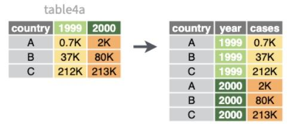
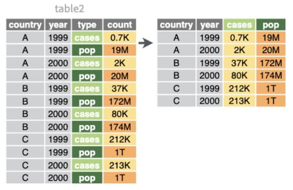
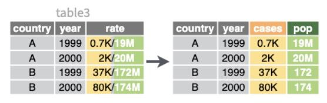
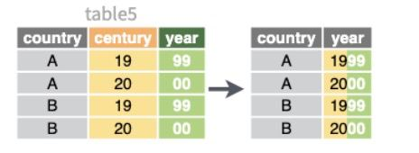

```{r setup, include = FALSE}
# Ajuste comunes de los chunk
knitr::opts_chunk$set(fig.width = 9, fig.asp = 1, out.width = "100%",
                      message = FALSE, warning = FALSE,
                      echo = TRUE, res = 400)
```

# Objetivos

El objetivo de este pequeño manual es aprender a preparar bien nuestros datos, bajo el concepto de _tidy data_, como paso previo a su manejo con el conjunto de herramientas de `{tidyverse}`.

## Paquetes necesarios

Necesitaremos los siguientes paquetes (todos incluidos en `{tidyverse}`)

* **Formato de datos** mejorando los `data.frame`: paquete `{tibble}`
* **Importar datos rectangulares**: paquete `{readr}`
* **Ordenar los datos**: paquete `{tidyr}`

```{r paquetes}
# Borramos variables del environment
rm(list = ls())

# Paquetes (si no están instalados, install.packages())
library(tibble)
library(readr)
library(tidyr)
# todo incluido con library(tidyverse
```


# Datos de tipo tibble

Los **datos en formato tibble** (del paquete `{tibble}` incluido ya en `{tidyverse}`) son un tipo de `data.frame` mejorado, para una **gestión más ágil, eficiente y coherente**. Las tablas en formato `tibble` tienen **4 ventajas principales**:

* Imprime **mayor información de las variables**, y solo **imprime por defecto las primeras filas**.

```{r}
library(tibble)
# tibble
tabla_tb <- tibble("x" = 1:30, "y" = rep(c("a", "b", "c"), 10),
                   "z" = 31:60, "logica" = rep(c(TRUE, TRUE, FALSE), 10))
tabla_tb
```

* Mantiene la **integridad de los datos** (no cambia los tipos de las variables y hace una carga de datos inteligente).

```{r}
tibble("fecha" = as.Date(c("1989-01-01", "1989-02-01", "1989-03-01")),
       "valores" = 1:3)
```


* La función `tibble()` **construye las variables secuencialmente**.

```{r error = TRUE}
# data.frame
data.frame("x" = 1:3, "z" = 11:13, "x*z" = x * z)
```

```{r}
# tibble
tabla_tb <- tibble("x" = 1:3, "z" = 11:13, "x*z" = x * z)
tabla_tb
```


Puedes consultar **más funcionalidades** de dichos datos en <https://tibble.tidyverse.org/>. Ahora además de poder ver una cabecera de las filas con `head()` tenemos la función `glimpse()`, que nos permite **obtener el resumen de columnas**

```{r}
glimpse(tabla_tb)
```

Si ya tienes un `data.frame` es altamente recomendable **convertirlo a tibble** con `as_tibble()`.


## Importación

En `{tidyverse}` no solo tenemos distintas funciones para cargar archivos (los paquetes `{readr}`, `{readxl}`, `{haven}`, `{rvest}` o `{googlesheets4}` como ejemplos) sino que disponemos de distintos paquetes para la carga de datos desde API como las del **AEMET, Our World in Data, Eurostat, Twitter o Spotify**.

&nbsp;

En concreto, el paquete `{readr}`, dentro del entorno `{tidyverse}`, contiene distintas funciones útiles para la carga de **datos rectangulares** (sin formatear).

* `read_csv()`: archivos `.csv` cuyo separador sea la coma `,`
* `read_csv2()`: archivos `.csv` cuyo separado sea la coma `;`
* `read_tsv()`: archivos cuyos valores estén separados por un tabulador.
* `read_delim()`: función general para leer archivos delimitados por caracteres.

Todos necesitan como argumento la **ruta del archivo**, amén de otros argumentos opcionales (saltar o no cabecera, si los decimales son con punto o coma, etc)

```{r readr, echo = FALSE,  out.width = "90%", fig.align = "center", fig.cap = "Resumen del paquete `{readr}`. Ver más en https://readr.tidyverse.org/"}
knitr::include_graphics("https://github.com/rstudio/cheatsheets/raw/main/pngs/thumbnails/data-import-cheatsheet-thumbs.png")
``` 

Podemos cargar tanto archivos que tengamos en local como archivos de la web.

```{r}
datos_covid <- read_csv("https://cnecovid.isciii.es/covid19/resources/casos_tecnica_ccaa.csv")
datos_covid
```

&nbsp;

El paquete `{readxl}` contiene distintas funciones útiles para la carga de **archivos formateados por Excel** 

* `read_excel()`: para archivos Excel en general.
* `read_xls()`: para archivos `.xls` en particular.
* `read_xlsx()`: para archivos `.xlsx` en particular.

El paquete `{haven}` contiene distintas funciones útiles para la carga de **archivos de SAS, SPSS y Stata**. En todos los paquetes mencionados, podemos ejecutar funciones equivalentes `write_...()` para exportar dichos datos y guardarlos en los formatos mencionados. El paquete `{rvest}` contiene distintas funciones útiles para screpear web sencillas como wikipedia. Puedes ver más información en <https://rvest.tidyverse.org/>


# Tidy data


```{r flujo-tidy-data2, echo = FALSE,  out.width = "90%", fig.align = "center", fig.cap = "Flujo deseable de datos según Hadley Wickham, extraída de https://r4ds.had.co.nz/wrangle-intro.html"}
knitr::include_graphics("https://d33wubrfki0l68.cloudfront.net/e3f9e555d0035731c04642ceb58a03fb84b98a7d/4f070/diagrams/data-science-wrangle.png")
``` 

La **organización de nuestros datos** es fundamental para que su preparación y explotación sea lo más eficiente posible. El concepto **tidy data** fue introducido por **Hadley Wickham** como el primer paso a realizar del entorno de paquetes que posteriormente se fueron desarrollando bajo el nombre de `{tidyverse}`, desarrollando un flujo de trabajo desde la carga hasta la visualización.

> Tidy datasets are all alike, but every messy dataset is messy in its own way (Hadley Wickham, Chief Scientist en RStudio).


Los **conjuntos tidy o datos ordenados** tienen tres objetivos principales:

1. **Estandarización** en su estructura.
2. **Sencillez** en su manipulación.
3. Listos para ser **modelizados y visualizados**.

Para ello, los **datos ordenados o tidy data** deben cumplir:

* Cada **variable en una columna**.
* Cada **observación/registro/individuo en una fila** diferente.
* Cada **celda con un único valor**.
* Cada **conjunto** o unidad observacional conforma una **tabla**.

```{r tidy-data, echo = FALSE,  out.width = "90%", fig.align = "center", fig.cap = "Infografía con datos ordenados (tidy data) extraída de https://r4ds.had.co.nz/tidy-data.html"}
knitr::include_graphics("https://d33wubrfki0l68.cloudfront.net/6f1ddb544fc5c69a2478e444ab8112fb0eea23f8/91adc/images/tidy-1.png")
``` 

Lo contrario lo llamaremos **datos desordenados** o _messy data_. 


## Messy data: valores en el nombre

Veamos un primer ejemplo con el conjunto `table4a` del paquete `{tidyr}`.

```{r}
library(tidyr)
table4a
```

En este ejemplo de 3 filas y 3 columnas, tenemos dos columnas `1999` y `2000` que **no están representando cada una a una sola variable**: ambas son la misma variable, solo que medida en años distintos, **cada fila está representando dos observaciones (1999, 2000) en lugar de un solo registro**.

Lo que haremos será **incluir una nueva columna llamada `year`** que nos marque el año y otra `values` que nos diga el valor de la variable de interés en cada uno de esos años. Con la función `pivot_longer` del mencionado paquete le indicaremos lo siguiente:

* `cols`: **nombre de las columnas a pivotar**.
* `names_to`: nombre de la columna a la que vamos a mandar los valores que figuran ahora en los nombres de las columnas.
* `values_to`: nombre de la columna a la que vamos a mandar los valores.

```{r}
table4a %>%
  pivot_longer(cols = c("1999", "2000"),
               names_to = "year",
               values_to = "values") 
```


```{r tidy1, echo = FALSE,  out.width = "99%", fig.align = "center", fig.cap = "Imagen extraída de https://github.com/rstudio/cheatsheets/blob/main/tidyr.pdf"}

``` 

&nsbp;

En dicho paquete tenemos un segundo ejemplo de messy data con la tabla `relig_income`

```{r}
relig_income[1:5, ]
```

Salvo la primera, el **resto de columnas tienen como nombre los valores de una variable en sí misma (ingresos)**. Ahora en lugar de indicarle el nombre de todas vamos a indicarle **la columna que NO queremos pivotar**.

```{r}
# No necesitamos comillas en el nombre salvo que tengan caracteres que no sean letras
relig_income %>%
  pivot_longer(-religion, names_to = "ingresos", values_to = "frec") 
```


## Messy data: un registro en varias filas


También podemos encontrarno con el **caso inverso**: tener un mismo registro (datos de un mismo individuo) pero dividido en varias filas con `pivot_wider()` **«ampliaremos» la tabla a lo ancho**

```{r}
table2[1:5, ]
```


```{r}
table2 %>%
  pivot_wider(names_from = type,
              values_from = count)
```


```{r tidy2, echo = FALSE,  out.width = "99%", fig.align = "center", fig.cap = "Imagen extraída de https://github.com/rstudio/cheatsheets/blob/main/tidyr.pdf"}

``` 


## Messy data: múltiples valores en celda


Otro caso de messy data es el de la tabla `table3`, donde en cada celda tenemos múltiples valores guardados, como tipo texto en lugar de tipo numérico (lo que deberían ser).

```{r}
table3
```

En la columna `rate` hay **guardados dos valores, separados por /**, en una **celda no hay un único valor**. La función `separate()` nos permitirá **separar los múltiples valores**

```{r}
table3 %>%
  separate(rate,
           into = c("cases",
                    "population")) #<<
```

```{r tidy3, echo = FALSE,  out.width = "99%", fig.align = "center", fig.cap = "Imagen extraída de https://github.com/rstudio/cheatsheets/blob/main/tidyr.pdf"}

``` 


Si **queremos un caracter concreto para dividir** podemos indicárselo explícitamente

```{r}
table3 %>%
  separate(rate, into = c("cases", "population"), sep = "/")
```


De la misma manera que **podemos separar columnas también podemos unirlas**. Para ello vamos a usar la tabla `table5`: con la función `unite()` vamos a **unir el siglo (en century) y el año (en year)**.

```{r}
table5 %>%
  unite(date, century, year)
```


```{r tidy4, echo = FALSE,  out.width = "99%", fig.align = "center", fig.cap = "Imagen extraída de https://github.com/rstudio/cheatsheets/blob/main/tidyr.pdf"}

``` 


### Convertir al tipo adecuado

Una opción muy útil que podemos usar al **aplicar la separación de los múltiples valores** es **convertir los datos al tipo adecuado**. Los datos unidos en `rate` eran **caracteres** (no podían ser numéricos). Al separarlos, por defecto, aunque ahora ya son solo números, **los separa como si fueran textos**. Con `convert = TRUE` podemos indicarle que identifique el tipo de dato y lo convierta.

```{r}
table3 %>%
  separate(rate, 
           into = c("cases",
                    "population"),
           convert = TRUE)
```


## Ejercicios

<details>
  <summary>📝<strong>Ejercicio 1</strong>: convierte en _tidy data_ el siguiente _data.frame_.
```{r}
tabla_tb <- tibble("trimestre" = c("T1", "T2", "T3"),
                   "2020" = c(10, 12, 7.5),
                   "2021" = c(8, 0, 9))
```
</summary>
  
- Solución:

El problema es que las dos columnas con nombres de año son en realidad valores que deberían pasar a ser variables, así que deberíamos disminuir aplicar `pivot_longer()`.

```{r}
library(tidyr)
tabla_tb <- tibble("trimestre" = c("T1", "T2", "T3"),
                   "2020" = c(10, 12, 7.5),
                   "2021" = c(8, 0, 9))

# Aplicamos pivot_longer
tabla_tb %>% pivot_longer(cols = c("2020", "2021"),
                          names_to = "año", values_to = "valores")
```

</details>

<details>
  <summary>📝<strong>Ejercicio 2</strong>: convierte en _tidy data_ el siguiente _data.frame_.
```{r}
tabla_tb <- tibble("año" = c(2019, 2019, 2020, 2020, 2021, 2021),
                   "variable" = c("A", "B", "A", "B", "A", "B"),
                   "valor" = c(10, 9383, 7.58, 10839, 9, 32949))
```
</summary>
  
- Solución:


El problema es que las filas que comparten año son el mismo registro (pero con dos características que tenemos divididas en dos filas), así que deberíamos disminuir aplicar `pivot_wider()`.

```{r}
tabla_tb <- tibble("año" = c(2019, 2019, 2020, 2020, 2021, 2021),
                   "variable" = c("A", "B", "A", "B", "A", "B"),
                   "valor" = c(10, 9383, 7.58, 10839, 9, 32949))

# Aplicamos pivot_wider
tabla_tb %>% pivot_wider(names_from = "variable",
                         values_from = "valor")
```

</details>


<details>
  <summary>📝<strong>Ejercicio 3</strong>: convierte en _tidydata_ la tabla `table5` del paquete `{tidyr}`. </summary>
  
- Solución:

Primero uniremos el siglo y las dos últimas cifras del año para obtener el año completo (guardado en año). Tras ello deberemos separar el valor del ratio en denominador y numerador (ya que ahora hay dos valores en una celda), y convertiremos el tipo de dato en la salida para que sea número.

```{r}
table5 %>%
  unite(año, century, year, sep = "") %>%
  separate(rate, c("numerador", "denominador"), convert = TRUE)
```

</details>


