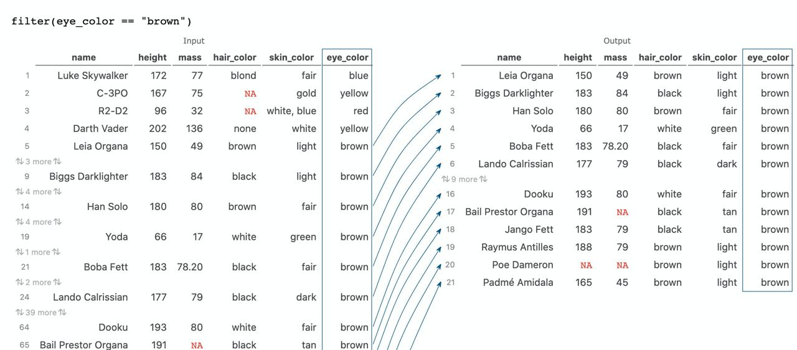
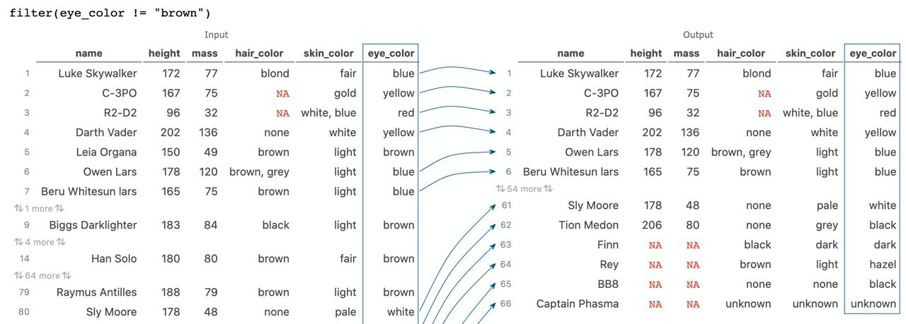
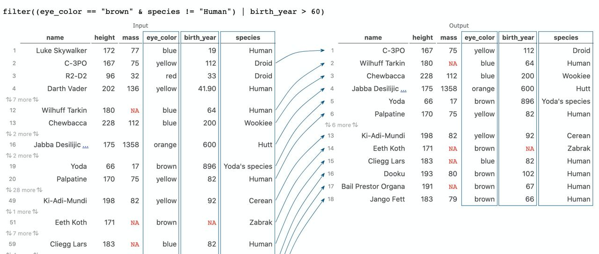
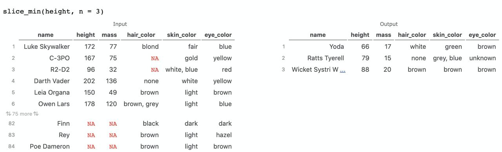
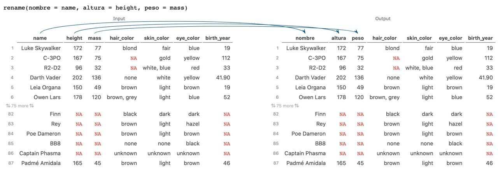
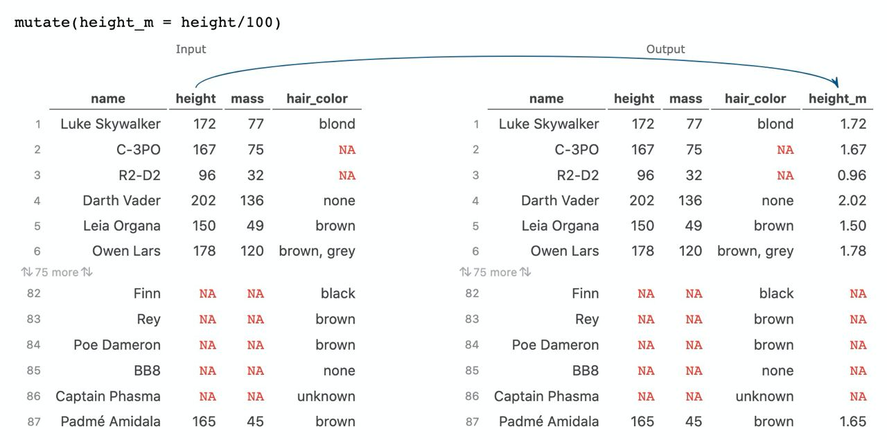

```{r setup, include = FALSE}
# Ajuste comunes de los chunk
knitr::opts_chunk$set(fig.width = 9, fig.asp = 1, out.width = "100%",
                      message = FALSE, warning = FALSE,
                      echo = TRUE, res = 400)
```

# Objetivos

El objetivo de este pequeño manual es aprender a preprocesar de forma **limpia y eficiente nuestros datos**, sin bucles ni estructuras de programación de antaño, haciendo uso del conjunto de herramientas de `{tidyverse}`.

## Paquetes necesarios

Necesitaremos los siguientes paquetes (todos incluidos en `{tidyverse}`)

* **Manejo de datos**: paquete `{tidyverse}`.
* **Resumen numérico**: paquete `{skimr}`.

```{r paquetes}
# Borramos variables del environment
rm(list = ls())

# Paquetes (si no están instalados, install.packages())
library(tidyverse)
library(skimr)
```

# ¿Qué es tidyverse?


El conjunto de paquetes de `{tidyverse}` supuso un antes y un después en el preprocesamiento de los datos en `R`. Aunque conocemos ya un formato «excelizado» de almacenar los datos (los datos en tipo `tibble` que mejoran los `data.frames`), muchas veces los **datos no los tenemos en el formato deseado**, o directamente queremos realizar algunas **transformaciones en los mismos**. Para trabajar con los datos vamos a cargar `{tidyverse}`, un **entorno de paquetes para el manejo de datos**.


```{r}
library(tidyverse)
```

```{r flujo-tidyverse, echo = FALSE,  out.width = "90%", fig.align = "center", fig.cap = "Imagen extraída de https://sporella.github.io/datos_espaciales_presentacion/#30"}
knitr::include_graphics("https://dadosdelaplace.github.io/courses-ECI-2022/img/flujo_tidyverse.png")
``` 

El **entorno tidyverse** es una de las **herramientas más importantes en el manejo de datos en R**, una **colección de paquetes** pensada para el manejo, la exploración, el análisis y la visualización de datos, **compartiendo una misma filosofía y gramática**

```{r flujo-tidyverse-2, echo = FALSE,  out.width = "90%", fig.align = "center", fig.cap = "Imagen extraída de https://www.storybench.org/getting-started-with-tidyverse-in-r/"}
knitr::include_graphics("https://dadosdelaplace.github.io/courses-ECI-2022/img/flujo_tidyverse_1.png")
``` 


* `{tidyr}`: para **adecuar los datos a tidy data**

* `{tibble}`: **mejorando los data.frame** para un manejo más eficiente.

* Paquetes `{readr}` para una **carga rápida y eficaz de datos rectangulares** (formatos .csv, .tsv, etc). Paquete `{readxl}` para **importar archivos .xls y .xlsx**. Paquete `{haven}` para importar archivos desde **SPSS, Stata y SAS**. Paquete `{httr}` para **importar desde web**. Paquete `{rvest}` para **web scraping**.

* `{dplyr}`: una **gramática de manipulación de datos** para facilitar su procesamiento.

* `{ggplot2}`: una **gramática para la visualización** de datos.

* Paquete `{stringr}` para un manejo sencillo de **cadenas de texto**. Paquete `{forcast}` para un manejo de **variables cualitativas** (en R conocidas como factores).

* `{purrr}`: manejo de **listas**.

* `{lubridate}` para el **manejo de fechas**.

&nbsp;

La **documentación completa** de todo el entorno puede consultarse en <https://www.tidyverse.org/>.


# Intro a tidyverse

La mayoría de las funciones que aquí aparecen salen concretamente del paquete `{dplyr}` (incluido en `{tidyverse}`).

```{r dplyr, echo = FALSE,  out.width = "90%", fig.align = "center", fig.cap = "Cheet sheet de las opciones del paquete dplyr para la manipulación de datos extraída de https://github.com/rstudio/cheatsheets/blob/master/data-transformation.pdf"}
knitr::include_graphics("https://dadosdelaplace.github.io/courses-ECI-2022/img/dplyr.png")
``` 

## Conjunto starwars

Para nuestra **introducción de tidyverse** vamos a trastear con el conjunto de datos `starwars` del paquete `{dplyr}`.


```{r luke-starwars, echo = FALSE,  out.width = "90%", fig.align = "left", fig.cap = "Imagen extraída de https://rstudio-education.github.io/"}
knitr::include_graphics("https://rstudio-education.github.io/bootcamper/slides/02-visualize-data/img/luke-skywalker.png")
``` 

```{r}
starwars
dim(starwars)
glimpse(starwars)
```

Dicho conjunto de datos, extraído de la [Star Wars API](https://swapi.dev/), recopila **14 variables para 87 personajes de Star Wars**. 

```{r}
print(starwars, n = 3, width = Inf)
```

Los tipos de variables que tenemos son:

* `int`: números enteros (`height`).
* `dbl`: números reales (`mass`, `birth_year`).
* `chr`: cadenas de texto (`name`, `hair_color`, `skin_color`, `eye_color`, `sex`, `gender`, `homeworld`, `species`).
* `list`: listas (`films`, `vehicles`, `starships`).

**PARÉNTESIS**. Los **datos de tipo lista** (aparecen con un icono distinto en el menú de variables) son el dato más flexible de `R`: permiten **concatenar datos de cualquier tipo PERO también de cualquier longitud**. Por ejemplo en `starwars` tenemos guardados las películas de cada personaje en modo lista en la variable `starwars$films`, así que podemos extraer las películas en las que aparecen los tres primeros personajes, basta con ejecutar (del conjunto starwars –> accedemos a la variable films con `$`)

```{r}
starwars$films[1:2]
```

El paquete `{purrr}` contienen multitud de herramientas para **aplicar de forma sencilla funciones a cada elemento de una lista**.


## Filosofía: pipeline (tuberías)

En este entorno de trabajo tendremos un **operador clave**: el **operador pipeline (%>%)**, el cual lo debemos interpretar como una **tubería conectada a los datos por el que pasan operaciones**, de una forma legible. Con el **pipeline %>%** podremos escribir (y leer) la concetanción de órdenes de forma sencilla y **léxicamente interpertable**

```{r eval = FALSE}
# Idea (no evaluar, por eso eval = FALSE)
datos %>%
  filtro(...) %>%
  ordeno(...) %>%
  selecciono(...) %>%
  modifico(...) %>%
  agrupo(...) %>%
  resumo(...) %>%
  visualizo(...)
```

&nbsp;

Dicho operador depende del paquete `{magrittr}`: para evitar esta dependencia (cuantos menos paquetes, mejor), desde la **versión 4.1.0 de R** disponemos de un operador nativo, el **operador |>** (disponible además fuera de tidyverse).


# Operaciones con filas (individuos)

## Filtrar filas: filter()

Una de las **operaciones más comunes** es **filtrar registros en base a alguna condición**: con `filter()` se seleccionarán solo individuos que cumplan ciertas condiciones.


```{r eval = FALSE}
# Idea
starwars %>%
  filtro(cond1, cond2, ...)
```

Por ejemplo, vamos a **filtrar aquellos personajes con ojos marrones** (cumpliendo la condición `eye_color == "brown"`)

```{r}
starwars %>%
  filter(eye_color == "brown")
```


```{r filter1, echo = FALSE,  out.width = "90%", fig.align = "center", fig.cap = "Flujo de https://tidydatatutor.com/"}

``` 


El operador de comparación `==` puede ser cambiado por otros operadores que no permiten evaluar (no asigna nada, solo pregunta) comparaciones:

* `!=`: parte de la izquierda distinta de la derecha.
* `<`, `>`: menor, mayor que...
* `<=`, `>=`: menor o igual, mayor igual que...
* `%in%`: si los valores pertenecen a una lista finita de opciones permitidas.
* `between(variable, val1, val2)`: si los valores (normalmente continuos) son mayores que `val1` y menores que `val2`

Así filtraríamos aquellos **personajes que no tienen los ojos marrones**

```{r}
starwars %>%
  filter(eye_color != "brown")
```


```{r filter2, echo = FALSE,  out.width = "90%", fig.align = "center", fig.cap = "Flujo de https://tidydatatutor.com/"}

``` 

Los valores de la derecha no tienen porque ser únicos: podemos preguntar para quedarnos con aquellos personajes cuyo **color de ojos** esté **dentro de un vector de opciones**.

```{r}
# con ojos marrones o azules o rojos
starwars %>% 
  filter(eye_color %in% c("brown", "blue"))
```

Incluso preguntar si variables numéricas están dentro de un intervalo dado.

```{r}
# con estatura entre 120 y 160 cm
starwars %>%
  filter(between(height, 120, 160))
```


```{r filter3, echo = FALSE,  out.width = "90%", fig.align = "center", fig.cap = "Flujo de https://tidydatatutor.com/"}
knitr::include_graphics("./img/filter3.jpg")
``` 


Las condiciones también se pueden **concatenar**, pudiendo en pocas líneas realizar un filtro complejo

* `a & b`: solo devolverá `TRUE` cuando se cumpla tanto `a` como `b`.
* `a | b`: devolverá `TRUE` cuando se cumpla al menos una de ellas (a y no b, b y no a, o ambas).

Por ejemplo, seleccionamos los **personajes con ojos marrones Y ADEMÁS NO humanos**, o los personajes con más de 60 años.

```{r}
starwars %>%
  filter((eye_color == "brown" &
            species != "Human") |
           birth_year > 60)
```


```{r filter5, echo = FALSE,  out.width = "90%", fig.align = "center", fig.cap = "Flujo de https://tidydatatutor.com/"}

``` 


## Rebanadas de los datos: slice()

En lugar de por una condición, también podemos **seleccionar filas por su posición** con `slice()`.

```{r}
# slice: extraemos filas por índice de fila.
starwars %>% slice(1)
```

Podemos **extraer varias a la vez**, incluso **usar una secuencia de índices a extraer**, por ejemplo solo las filas pares.

```{r}
# filas pares hasta la octava
starwars %>%
  slice(seq(2, 8, by = 2)) 
```


Disponemos además de distintas opciones por defecto

* `slice_head(n = ...)`: extraer las n primeras filas.
* `slice_tail(n = ...)`: extraer las n últimas filas.
* `slice_sample(n = ...)`: extrae n filas elegidas aleatoriamente.
* `slice_min(var, n = ...)` y `slice_max(var, n = ...)`: **extrae las n filas con menor/mayor de una variable** (si hay empate, mostrará todas salvo que `with_ties = FALSE`). 


Por ejemplo, así extraeríamos los 3 personajes más bajitos

```{r}
# los 3 más bajitos
starwars %>%  slice_min(height, n = 3) 
```


```{r filter6, echo = FALSE,  out.width = "90%", fig.align = "center", fig.cap = "Flujo de https://tidydatatutor.com/"}

``` 


## Reordenar filas: arrange()

Otra operación habitual en las filas es **ordenar las filas en función del valor de alguna de las variables** con `arrange()`,  pasándole como argumento el nombre de la variable que usaremos para la ordenación. Por defecto la ordenación es de menor a mayor pero podemos invertirlo usando `desc()`.

```{r eval = FALSE}
# Idea
datos %>%
  filtro(cond1, cond2) %>%
  ordeno(var1, desc(var2))
```

Por ejemplo, vamos a **ordenar** los personajes por altura, de bajitos a altos, y en caso de empate, por peso (pero al revés, de pesados a ligeros).


```{r}
starwars %>%  arrange(height, desc(mass)) 
```


## Eliminar filas

La misma lógica que hemos usado para seleccionar filas podemos usarla para **eliminar filas**:

* `filter(!condicion)`: filtramos aquellas filas que NO CUMPLEN la condición (eliminando las que sí).
* `slice(-indices)`: eliminamos las filas que ocupan los indices.

Por ejemplo, vamos a eliminar las 80 primeras filas.

```{r}
# eliminamos las 80 primeras filas
starwars %>% slice(-(1:80)) 
```


Podemos también **eliminar los registros ausentes** en alguna de sus variables con `drop_na()`. Si no especificamos variables, elimina todos los registros que tenga alguno de sus campos ausente.

```{r}
starwars %>% drop_na()
```

Podemos indicarle que nos elimine filas con datos ausentes fijándonos solo en **algunos campos en concreto**.

```{r}
starwars %>% drop_na(mass, height, sex, gender, birth_year)
```

&nbsp;

Otra opción es **eliminar filas duplicadas** con `distinct()`, pasándole como argumentos el nombre de las variables que usaremos para quitar duplicados, por ejemplo, personajes con igual par de color de pelo y ojos.

Por defecto, solo extrae las columnas en base a las cuales hemos eliminado duplicados. Si queremos que nos mantenga todas deberemos explicitarlo con `.keep_all = TRUE`.

```{r}
# Elimina filas con igual (color_pelo, color_ojos)
starwars %>%
  distinct(hair_color, eye_color)
```
  
## Añadir filas: bind_rows()

Si quisiéramos añadir un nuevo registro manualmente, podremos hacerlo con `bind_rows()`, asegurándonos que las **variables en el nuevo registro son las mismas que en el original**. Por ejemplo, vamos a añadir al fichero original los 3 primeros registros (al final).

```{r}
starwars_nuevo <- bind_rows(starwars, starwars[1:3, ])
dim(starwars)
dim(starwars_nuevo)
```

## Ejercicios


<details>
  <summary>📝<strong>Ejercicio 1</strong>: selecciona del conjunto de `starwars` solo los personajes que sean humanos (`species == "Human"`).</summary>

- Solución:

```{r}
starwars %>%
  filter(species == "Human")
```
</details>

<details>
  <summary>📝<strong>Ejercicio 2</strong>: selecciona del conjunto de `starwars` solo los personajes cuyo peso esté entre 65 y 90 kg.</summary>

- Solución:

```{r}
starwars %>%
  filter(between(mass, 65, 90))
```
</details>

<details>
  <summary>📝<strong>Ejercicio 3</strong>: selecciona del conjunto de `starwars` los personajes no humanos, hombres y que midan más de 170 cm, o los personajes con ojos marrones o rojos. </summary>

- Solución:

```{r}
starwars %>%
  filter((species != "Human" & sex == "Male" & height > 170) |
           eye_color %in% c("brown", "red"))
```
</details>

<details>
  <summary>📝<strong>Ejercicio 4</strong>: selecciona solo los personajes que sean humanos y de ojos marrones, para después ordernarlos en altura descendente y peso ascendente.</summary>

- Solución:

```{r}
# Podemos combinar varias acciones en pocas líneas
starwars %>%
  filter(eye_color == "brown",
         species == "Human") %>%
  arrange(height, desc(mass))
```
</details>

<details>
  <summary>📝<strong>Ejercicio 5</strong>:  extrae 3 registros aleatoriamente. </summary>

- Solución:

```{r}
starwars %>%
  slice_sample(n = 3)
```
</details>

<details>
  <summary>📝<strong>Ejercicio 6</strong>: selecciona los 3 personajes más mayores y los 3 personajes más bajitos.</summary>

- Solución:

```{r}
starwars %>%
  slice_max(birth_year, n = 3)
```

```{r}
starwars %>%
  slice_min(height, n = 3)
```
</details>

<details>
  <summary>📝<strong>Ejercicio 7</strong>: para saber que valores únicos hay en el color de pelo, elimina duplicados por dicha variable `hair_color`, eliminando antes los ausentes de dicha variable. </summary>

- Solución:

```{r}
starwars %>%
  drop_na(hair_color) %>%
  distinct(hair_color)
```

</details>


# Operaciones con columnas

## Seleccionar columnas: select()

La opción más sencilla para **seleccionar variables** es `select()`, con argumentos los nombres de columnas (¡SIN COMILLAS!).

```{r eval = FALSE}
# Idea
datos %>%
  filtro(cond1, cond2) %>%
  ordeno(var1, desc(var2)) %>%
  selecciono(col1, col2, ...)
```

Seleccionamos por ejemplo la columna `hair_color`

```{r}
# seleccionamos 1 columna
starwars %>% select(hair_color)
```

```{r select1, echo = FALSE,  out.width = "150%", fig.align = "center", fig.cap = "Flujo de https://tidydatatutor.com/"}
knitr::include_graphics("./img/select1.jpg")
``` 


Como sucedía al filtrar, la función `select()` es bastante versatil y nos permite:

* Seleccionar **varias variables a la vez** (concatenando sus nombres)

```{r}
# color de piel y de pelo (en ese orden)
starwars %>% select(c(skin_color, hair_color))
```

```{r}
# desde name hasta hair_color
starwars %>% select(c(name:hair_color))
```

* **Deseleccionar** columnas anteponiendo `-`
* Seleccionar columnas que **comiencen por un prefijo** (`starts_with()`), **terminen** con un sufijo (`ends_with()`), **contengan** un texto (`contains()`) o cumplan una **expresión regular** (`matches()`).

```{r}
# selecciona variables cuyo nombre acaba en "color"
starwars %>%  select(ends_with("color"))
```

```{r}
# empiezan por h
starwars %>% select(starts_with("h"))
```

* Seleccionar columnas de **un tipo** haciendo uso de `where(is.numeric)`, etc.


```{r}
# Solo columnas numéricas
starwars %>% select(where(is.numeric))
```


## Recolocar columnas: relocate()

Fíjate que con `select()` podrías además recolocar columnas, indícandole el orden, ayudándote también del selector `everything()`

```{r}
starwars %>%  select(c(species, name, birth_year, everything()))
```

Para facilitar la recolocación tenemos una función para ello, `relocate()`,  indicándole en `.after` o `.before` detrás o delante de qué columnas queremos moverlas.

```{r}
starwars %>% relocate(species, .before = name)
```

## Extraer columnas: pull()

Si observas la salida de los `select()`, sigue siendo una tabla `tibble`, nos preserva la naturaleza de nuestros datos.

```{r}
starwars %>% select(name)
```


A veces no querremos dicha estructura sino **extraer literalmente la columna en un vector**, algo que podemos hacer con `pull()`

```{r}
starwars %>% pull(name)
```


## Renombrar columnas: rename()

A veces también podemos querer **modificar la «metainformación» de los datos**, renombrando las columnas. Para ello usaremos la función `rename()` poniendo **primero el nombre nuevo y luego el antiguo**. Como ejemplo, vamos a traducir el nombre de las columnas `name, height, mass` a castellano.

```{r}
starwars %>% 
  rename(nombre = name, altura = height, peso = mass)
```


```{r rename1, echo = FALSE,  out.width = "150%", fig.align = "center", fig.cap = "Flujo de https://tidydatatutor.com/"}

``` 


---

## Ejercicios

<details>
  <summary>📝<strong>Ejercicio 1</strong>: filtra el conjunto de personajes y quédate solo con aquellos que en la variable `height` no tengan un dato ausente.</summary>

- Solución:

**IMPORTANTE**: todo lo que hagas en la tabla original, si el resultado final no se lo asignas `<-` a otra variable, lo verás en consola pero no se guardará en ningún sitio. Lo que no guardes, no existe.


```{r}
starwars_NA <- starwars %>% drop_na(height)
starwars_NA 
```
</details>

<details>
  <summary>📝<strong>Ejercicio 2</strong>: con los datos obtenidos del filtro anterior, selecciona solo las variables `name`, `height`, así como todas aquellas variables que CONTENGAN la palabra `color` en su nombre. </summary>

- Solución:

```{r}
starwars %>%
  drop_na(height) %>%
  select(c(name, height, contains("color")))
```
</details>

<details>
  <summary>📝<strong>Ejercicio 3</strong>: con los datos obtenidos del ejercicio, traduce el nombre de las columnas a castellano.</summary>
  
- Solución:

```{r}
starwars %>%
  drop_na(height) %>%
  select(c(name, height, contains("color"))) %>%
  rename(nombre = name, altura = height,
         color_pelo = hair_color,
         color_piel = skin_color,
         color_ojos = eye_color)
```
</details>


<details>
  <summary>📝<strong>Ejercicio 4</strong>: con los datos obtenidos del ejercicio, coloca la variable de color de pelo justo detrás de la variable de nombres.</summary>

- Solución:

```{r}
starwars %>%
  drop_na(height) %>%
  select(c(name, height, contains("color"))) %>%
  rename(nombre = name, altura = height,
         color_pelo = hair_color,
         color_piel = skin_color,
         color_ojos = eye_color) %>%
  relocate(color_pelo, .after = nombre)
```
</details>


# Modificar/crear/recategorizar variables

## Crear variables: mutate()


A veces también querremos **modificar o crear nuestras propias variables**. Para ello tenemos la función `mutate()`. 

```{r eval = FALSE}
# Idea
datos %>%
  filtro(cond1, cond2) %>%
  ordeno(var1, desc(var2)) %>%
  selecciono(col1, col2, ...) %>%
  modifico(var_nueva = funcion(var_existentes))
```

Para empezar, vamos a crear una **nueva variable** `height_m` con la altura en centímetros.

```{r}
# altura en metros
starwars %>%
  mutate(height_m = height / 100) %>%
  select(c(name, mass, height, height_m))
```


```{r mutate1, echo = FALSE,  out.width = "150%", fig.align = "center", fig.cap = "Flujo de https://tidydatatutor.com/"}

``` 

Otra opción es **quedarnos solo con las columnas nuevas** creadas con `transmute()`

```{r}
starwars %>%
  transmute(height_m = height / 100)
```

También se pueden aplicar **funciones más complejas** como `if_else()` o `case_when()` que nos sirven para recategorizar variables (si se cumple una condición o no, o en función de distintos casos). En el ejemplo inferior creamos una nueva variable llamada `humano` que contendrá `"humano"` si la especie es humana y `"no humano"` en cualquier otro caso.


```{r}
# Si la especie es "Human" ponemos "humano; en otro caso, "no humano"
starwars %>%
  mutate(humano = if_else(species == "Human", "humano", "no humano"))
```


## Recategorizar: case_when()

Una operación también muy habitual es querer **recategorizar nuestras variables**. Supongamos por ejemplo que queremos crear una **categoría en función de su altura**. Para ello podemos podemos usar  `case_when`, en el que le podemos indicar que valores asignamos en función de condiciones. Vamos a crear una variable nueva de altura

* Si `height > 180` –> serán `"altos"`.
* Si `height <= 180` y `height > 120` –> serán `"bajos"`
* Si `height <= 120` y `height > 0` –> serán `"enanos"`
* Si no se cumple lo anterior –> serán `"ausentes"`

```{r}
starwars %>%
  mutate(altura = case_when(height > 180 ~ "altos",
                               height > 120 ~ "bajos",
                               height > 0 ~ "enanos",
                               TRUE ~ "ausentes")) %>%
   select(c(name, height, mass, altura))
```


## Ejercicios


<details>
  <summary>📝<strong>Ejercicio 1</strong>: define una función llamada `IMC()`, que dados dos argumentos `peso` y `estatura` (en metros), nos devuelve el índice de masa corporal ($IMC = \frac{peso}{altura^2}$).</summary>
  
- Solución:

Primero definimos la función `IMC` (calcula el IMC dada estatura y peso).

```{r}
# Suponiendo a la altura ya en metros
IMC <- function(peso, estatura) {
  
  IMC <- peso / estatura^2
  return(IMC)
}

IMC(90, 1.60)
IMC(71, 1.73)
```
</details>

<details>
  <summary>📝<strong>Ejercicio 2</strong>: con esa función definida, añade a `starwars` una nueva columna que indique el IMC de cada personaje. </summary>

- Solución:

La función definida como `IMC()` podemos ahora aplicarla dentro del `mutate()`.

```{r}
starwars %>%
  mutate(height_m = height / 100,
         IMC = IMC(mass, height_m)) %>%
  # Las movemos al inicio (por defecto las mete al final)
  relocate(height_m, IMC, .after = name)
```
</details>

<details>
  <summary>📝<strong>Ejercicio 3</strong>: selecciona los 3 personajes con mayor IMC y los 3 con menos.</summary>
  
- Solución:

```{r}
starwars_IMC <- 
  starwars %>%
  mutate(height_m = height / 100, IMC = IMC(mass, height_m))
starwars_IMC %>% slice_max(IMC, n = 3)
starwars_IMC %>% slice_min(IMC, n = 3)
```
</details>

<details>
  <summary>📝<strong>Ejercicio 4</strong>:  define una nueva variable llamada `edad` que nos recategorice la variable `birth_year`: `"menor"` para los que tengan menos de 18 años; `"adulto"` entre 18 y 65 años (ambos inclusive); `"mayor"` de 66 a 99 años; y `"centenario"` de 100 en adelante. </summary>

- Solución:

```{r}
starwars %>%
  mutate(edad =
           case_when(birth_year < 18 ~ "menor",
                     between(birth_year, 18, 65) ~
                       "adulto",
                     between(birth_year, 66, 99) ~
                       "mayor",
                     TRUE ~ "centenario"))
```

</details>

# Resumir información

## Contar datos: count()

Lo primero que querremos hacer al resumir información seguramente sea contar datos, para lo cual tenemos  la función `count()` 

```{r eval = FALSE}
# Idea
datos %>%
  filtro(cond1, cond2) %>%
  ordeno(var1, desc(var2)) %>%
  selecciono(col1, col2, ...) %>%
  cuento(var1, var2)
```

Cuando lo usamos en solitario, `count()` nos devolverá simplemente el **número de registros**

```{r}
starwars %>% count()
```

Cuando lo usamos pasándole como argumento una o varias variables, `count()` nos cuenta lo que se conoce en estadística como **frecuencias absolutas**: el número de elementos pertenecientes a cada una de las **modalidades**. En el caso por ejemplo del fichero de `starwars` `sex` tiene 4 modalidades `female, hermaphroditic, male, none`.

```{r}
starwars %>% count(sex)
```

Si pasamos varias variables nos calcula las **frecuencias absolutas n-dimensionales**

```{r}
starwars %>% count(sex, gender)
```

## Agrupar: group_by()

Una de las funciones más potentes para resumir la información es `group_by()`  que nos permitirá **agrupar nuestros registros**

```{r eval = FALSE}
# Idea
datos %>%
  filtro() %>%
  ordeno() %>%
  selecciono() %>%
  modifico() %>%
  agrupo(var1, var2, ...) %>%
  cuento(var) %>%
  desagrupo()
```

Cuando aplicamos `group_by()` es importante entender que **NO MODIFICA los datos**: nos crea una variable de grupo que **modificará las acciones futuras que apliquemos**. Internamente, es como generar **múltiples subtablas**, y las operaciones aplicadas después se **aplicarán a cada una por separado**.


Por ejemplo, vamos a **agrupar por las variables `sex` y `gender`**, y después aplicaremos `count()`: ya no realiza el conteo de filas en general, sino que cuenta los registros para cada par sexo-género distinto (realiza la acción en cada subtabla).

```{r}
starwars %>%
  group_by(sex, gender) %>% 
  count() %>%
  ungroup()
```

**IMPORTANTE**: siempre que agrupes, acuérdate de desagrupar con `ungroup()`.


```{r group1, echo = FALSE,  out.width = "150%", fig.align = "center", fig.cap = "Flujo de https://tidydatatutor.com/"}
knitr::include_graphics("./img/group_1.jpg")
``` 

```{r group-count, echo = FALSE,  out.width = "150%", fig.align = "center", fig.cap = "Flujo de https://tidydatatutor.com/"}
knitr::include_graphics("./img/group_count.jpg")
``` 


## Resumir: summarise()


La función `summarise()` unida a `group_by()` es de las más útiles de `{tidyverse}` ya que nos permite **sumarizar o resumir nuestros datos** de **forma desagregada**

```{r eval = FALSE}
# Idea
datos %>%
  filtro() %>%
  selecciono() %>%
  agrupo(var1, var2, ...) %>% 
  resumo() %>%
  desagrupo()
```

Un ejemplo: vamos a calcular la **media de las alturas**. Si lo hacemos sin `group_by()` se hará de todos los personajes.

```{r}
starwars %>%
  drop_na(height) %>%
  summarise(media_altura = mean(height)) 
```

Si la misma acción la realizamos con un `group_by()` previo, la media de las alturas se hará ahora **de forma independiente, en cada subtabla por grupo creada**.

```{r}
starwars %>%
  drop_na(height) %>%
  group_by(sex) %>% 
  summarise(media = mean(height)) %>%
  ungroup()
```


```{r group-summa, echo = FALSE,  out.width = "150%", fig.align = "center", fig.cap = "Flujo de https://tidydatatutor.com/"}
knitr::include_graphics("./img/group_summarise.jpg")
``` 

También podemos **resumir varias variables a la vez**, haciendo uso de la función `across()`

* primero indicamos **las variables a recorrer** (en este caso `height:mass`)
* después indicamos la función a aplicar (en este caso, la media `mean()`
* por último indicamos  argumentos extras si fuesen necesarios (en este caso, `na.rm = TRUE` para eliminar los ausentes en la media)

```{r}
starwars %>%
  group_by(sex) %>% 
  summarise(medias = across(height:mass, mean, na.rm = TRUE)) %>% 
  ungroup()
```

Además la función `across()` podemos combinarla con `where()`, para que resuma las variables de un mismo tipo, por ejemplo `where(is.numeric)` selecciona solo las numéricas.

```{r}
starwars %>%
  drop_na(height, mass) %>%
  group_by(sex, gender) %>%
  summarise(across(where(is.numeric), mean)) %>%
  ungroup()
```

Algunas de las funciones más útiles dentro de `summarise()`:

* `sum()`, `mean()`, `median()`
* `min()`, `which.min()`, `max()`, `which.max()`
* `n()` (número de registros), `n_distinct()` (número de registros únicos).


## Resumir: skim()

En el paquete `{skimr}` tenemos una función `skim()` que nos permite **resumir rápidamente nuestras variables**, proporcionándonos los principales parámetros de centralización, dispersión y localización.

```{r}
starwars %>% skim()
```

## Operaciones por filas: rowwise()

Por último, una opción muy útil usada antes de una operación, la función `rowwise()`: toda operación que venga después se aplicará **en cada fila por separado**. Por ejemplo, vamos a definir un conjunto dummy de notas.

```{r}
notas <- tibble("mates" = sample(0:10, size = 4, replace = TRUE),
                "lengua" = sample(0:10, size = 4, replace = TRUE))
```

Si aplicamos la media directamente, en cada fila el valor `media_curso` es **idéntico ya que nos ha hecho la media global**.

```{r}
notas %>%
  mutate(media_curso = mean(c(mates, lengua)))
```

En realidad a nosotros nos gustaría **sacar una media por registro, por alumno**. Para eso usaremos `rowwise()` antes del cálculo.

```{r}
# Aplicado por fila
notas %>%
  rowwise() %>%
  mutate(media_curso = mean(c(mates, lengua)))
```


## Ejercicios

<details>
  <summary>📝<strong>Ejercicio 1</strong>: con `group_by()` y `count()`, extrae cuántas personajes a cada especie de `starwars`. </summary>
  
- Solución:

```{r}
starwars %>% 
  group_by(species) %>%
  count() %>%
  ungroup()
```

</details>

<details>
<summary>📝<strong>Ejercicio 2</strong>: determina con `summarise()` y `n_distinct()` el número de especies distintas. </summary>
  
- Solución:

```{r}
starwars %>%
  summarise(especies_distintas = n_distinct(species))
```
</details>

<details>
  <summary>📝<strong>Ejercicio 3</strong>:  tras eliminar ausentes de peso y altura, añade una nueva variable que nos calcule el IMC de cada personaje, y determina el IMC medio de nuestros datos desagregados por sexo. </summary>
  
- Solución:

```{r}
starwars %>%
  drop_na(height, mass) %>%
  mutate(IMC = mass / (height/100)^2) %>%
  group_by(sex) %>%
  summarise(media_IMC = mean(IMC)) %>%
  ungroup()
```
</details>

<details>
  <summary>📝<strong>Ejercicio 4</strong>: obtén la edad mínima y máxima de cada sexo. </summary>
  
- Solución:

```{r}
starwars %>% drop_na(birth_year) %>%
  group_by(sex) %>%
  summarise(edad_min = min(birth_year),
            edad_max = max(birth_year))
```
</details>

