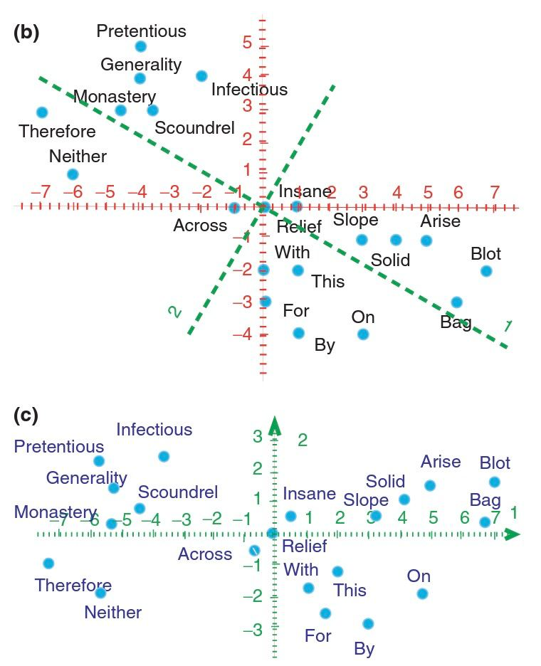
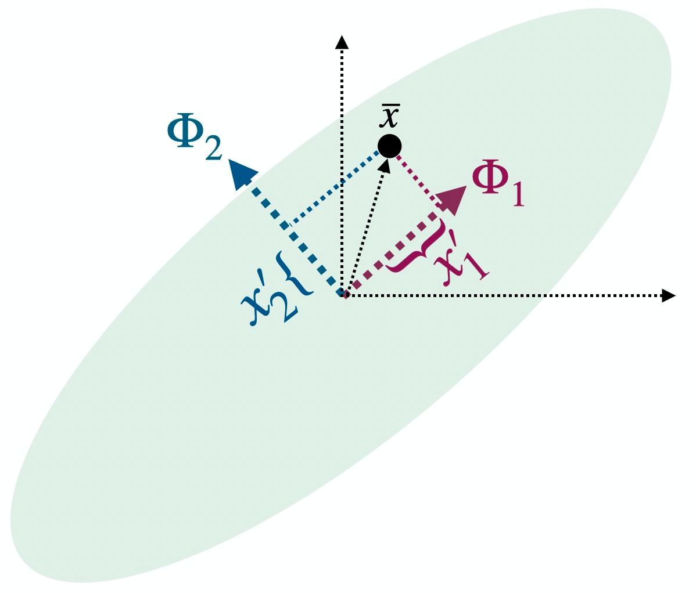

```{r setup, include = FALSE}
# Ajuste comunes de los chunk
knitr::opts_chunk$set(fig.width = 9, fig.asp = 1, out.width = "100%",
                      message = FALSE, warning = FALSE,
                      echo = TRUE, res = 400)
```

# Objetivos

El objetivo de este pequeño manual es aprender a implementar e interpretar el **análisis de componentes principales* en `R` 

## Paquetes necesarios

Necesitaremos los siguientes paquetes

* **Manejo de datos**: paquete `{tidyverse}`.
* **Resumen numérico**: paquete `{skimr}`.
* **Correlaciones**: paquetes `{corrr}` y `{corrplot}`
* **Componentes principales**: paquetes `{FactoMineR}` y `{factoextra}`
* **Visualización de componentes**: paquete `{learntidymodels}`


```{r paquetes}
# Borramos variables del environment
rm(list = ls())

# Paquetes (si no están instalados, install.packages())
library(tidyverse)
library(skimr)
library(corrr)
library(corrplot)
library(FactoMineR)
library(factoextra)
library(learntidymodels)
```

# Teoría: análisis multidimensional


> El Análisis Multivariante es la rama de la estadística que estudia las relaciones (CONJUNTAMENTE) entre conjuntos de variables dependientes y los individuos para los cuales se han medido dichas variables (Kendall)


De aquí en adelante usaremos la siguiente notación

* $n$ tamaño muestral (número de individuos --> filas).

* $\boldsymbol{X}_i = \left(\boldsymbol{X}_{1, i}, \ldots, \boldsymbol{X}_{i, p} \right)$ conjunto de $p$ variables (--> columnas) medidas para cada individuo $i=1,\ldots,n$.

* Nuestros datos estarán en forma de tabla o matriz $\boldsymbol{X}$ de $n$ filas y $p$ columnas (con $p \ll n$)


Antes de empezar veamos un ejemplo sencillo de datos multivariantes con algo que seguramente nos sea familiar: la **distribución Normal o campana de Gauss** $X \sim \mathcal{N}\left(\mu, \sigma \right)$, cuya función de densidad es

$$f(x) = \frac{1}{\sigma {\sqrt{2\pi}}} e^{-{\frac{(x-\mu )^{2}}{2\sigma^{2}}}}, \quad \mu \in\mathbb{R},~\sigma >0$$

&nbsp;

La normal univariante depende de **dos parámetros**:

* **esperanza o media** $\mu = {\rm E} [X]$ 
* **varianza** (unidimensional) $\sigma^2 := {\rm Var} [X] = {\rm E} [\left(X - \mu \right)^2] = {\rm E} [X^2] - \mu^2$


```{r}
library(tidyverse)
# Generamos una muestra normal (n = 10 000)
data <- tibble("x" = rnorm(n = 10000, mean = 0, sd = 1))
```

```{r out.width = "80%"}
# Ploteamos
ggplot(data, aes(x = x)) +
  geom_density(fill = "#F29288", alpha = 0.5, size = 1.2) +
  labs(x = "x", y = "f(x) (función densidad)")
```
  
**¿Y si medimos para cada individuo DOS variables?**

Si tenemos $\boldsymbol{X} = \left(X_1, X_2 \right)$, ¿qué estadísticos tenemos ahora a nuestra disposición?

* **Medidas marginales** (cada variable por separado):
  - medias $\mu_1:= {\rm E} [X_1]$ y $\mu_2:= {\rm E} [X_2]$
  - varianzas $\sigma_{1}^{2}:=\sigma_{1, 1}^{2} = \sigma_{X_1, X_1}^2$ y $\sigma_{2}^{2}:=\sigma_{2, 2}^{2} = \sigma_{X_2, X_2}^2$.

&nbsp;

## Matriz de covarianzas

La varianza ${\rm Var} [X] := \sigma_{X}^2 = {\rm E} [ \left( X - \mu \right)^2 ]$ es una medida de dispersión que nos **cuantifica** la relación de una variable consigo misma. ¿Y si en lugar de medir $X_1$ vs $X_1$ medimos $X_1$ vs $X_2$?

Definiremos la **covarianza** como una especie de varianza en la que cambiamos una de las $X$ por otra variable

$$Cov [X_1, X_2] := \sigma_{1,2} =  {\rm E} [ \left( X_1 - \mu_1 \right) \left( X_2 - \mu_2 \right) ] = {\rm E}[X_1 * X_2] - \mu_1 * \mu_2 = \sigma_{2,1}$$

&nbsp;

Desde un punto de vista teórico, dada una variable aleatoria bidimensional $\boldsymbol{X} = \left(X_1, X_2 \right)^{T}$, con vector de medias $\boldsymbol{\mu} = \left(\mu_1, \mu_2 \right)^{T}$ definiremos la **matriz de varianzas y covarianzas** $\Sigma$ de la siguiente manera:

$$\boldsymbol{\Sigma} := \begin{pmatrix} \sigma_{1,1}^2 & \sigma_{1,2} \\ \sigma_{2,1} & \sigma_{2,2}^2 \end{pmatrix} = \begin{pmatrix} \sigma_{1}^2 & \sigma_{1,2} \\ \sigma_{1,2} & \sigma_{2}^2 \end{pmatrix}, \quad \left| \boldsymbol{\Sigma} \right| = \sigma_{1}^{2}  \sigma_{2}^{2} - \sigma_{1,2}^{2} > 0$$


Se puede expresar **matricialmente** como

$\begin{eqnarray}\boldsymbol{\Sigma} = {\rm E} \left[\left(\boldsymbol{X} - \boldsymbol{\mu} \right)^{T}\left(\boldsymbol{X} - \boldsymbol{\mu} \right) \right] &=& {\rm E} \left[\left( X_1  - \mu_1, X_2 - \mu_2 \right)^{T} \begin{pmatrix} X_1  - \mu_1 \\ X_2 - \mu_2 \end{pmatrix} \right] \\ &=& \begin{pmatrix} {\rm E} \left[ \left(X_1  - \mu_1 \right)^2 \right] & {\rm E} \left[\left(X_1  - \mu_1 \right)\left(X_2  - \mu_2 \right) \right] \\ {\rm E} \left[\left(X_2  - \mu_2 \right)\left(X_1  - \mu_1 \right) \right] & {\rm E} \left[\left(X_2  - \mu_2 \right)^2\right] \end{pmatrix} \end{eqnarray}$

**IMPORTANTE**: es una **matriz simétrica** (nos da igual medir $X$ vs $Y$, que $Y$ vs $X$).


En el caso de una normal multivariante (caso general) de $p \ll n$ variables la matriz de covarianzas quedaría así:

$$\boldsymbol{X} = \left(X_1, \ldots, X_p \right)^{T}  \sim \mathcal{N} \left( \boldsymbol{\mu}, \boldsymbol{\Sigma} \right), \quad f(x_1, \ldots, x_p) = \frac{1}{\left(2\pi \right)^{p/2} \left| \Sigma \right|^{1/2}} e^{-\frac{1}{2}{(\boldsymbol{x} - \mu )^{T} \boldsymbol{\Sigma}^{-1}(\boldsymbol{x} - \mu )}}$$

$$\boldsymbol{\Sigma} = \left(\Sigma_{i,j} \right)_{i,j=1,\ldots,p}, \quad \Sigma_{i,j}:= Cov [X_i, X_j ] = {\rm E}[(X_i-\mu_i) (X_j - \mu_j)]$$

## Versión muestral

Lo anterior nos permite conocer la **formulación teórica (poblacional)**: ¿cómo calculamos la varianza y covarianza cuando tenemos una muestra $\boldsymbol{X}$ de $n$ individuos y $p$ observaciones medidas?


$$\boldsymbol{X} = \begin{pmatrix} x_{1, 1} & \ldots & x_{1, p} \\ \vdots & \ddots & \vdots \\ x_{n, 1} & \ldots & x_{n, p} \end{pmatrix} \quad \text{muestra}$$

### p = 2

* **Varianzas muestrales**: $s_{x_1}^{2} := s_{1}^2 = \frac{1}{n} \sum_{i=1}^n \left(x_{i, 1} - \overline{x}_1 \right)^2$ y $s_{x_2}^{2} := s_{2}^2 = \frac{1}{n} \sum_{i=1}^n \left(x_{i, 2} - \overline{x}_2 \right)^2$, donde $\overline{x}_1$ y $\overline{x}_2$ son sus medias muestrales.

* **Covarianza muestral**: $s_{x_1, x_2}^{2} := s_{1, 2} = s_{2, 1}^2 = \frac{1}{n} \sum_{i=1}^n \sum_{j=1}^n \left(x_{i, 1} - \overline{x}_1 \right)\left(x_{j, 2} - \overline{x}_2 \right)$

Seguramente dichos valores los hallas visto divididos por $n-1$ en lugar de $n$: los valores muestrales son estimadores de los valores poblacionales, y de aquí en adelante usaremos **estimadores insesgados**, estimadores $T$ del valor población $U$ tal que ${\rm E}[T] = U$

* Estimador insesgado de $\mu_{x}$: $\overline{x}$ tal que ${\rm E}[\overline{x}] = \mu$

* Estimador insesgado de $\sigma_{x}^2$: la **cuasivarianza** $S_{x}^2 = \frac{n}{n-1} s_{x}^{2}$ tal que ${\rm E}[\sigma_{x}^2] = S_{x}^2$

* Estimador insesgado de $\sigma_{x, y}$: la **cuasicovarianza** $S_{x, y} = \frac{n}{n-1} s_{x, y}$ tal que ${\rm E}[\sigma_{x, y}] = S_{x, y}$

### Matriz de covarianzas (versión muestral)


En un **caso general**, dada una muestra $\boldsymbol{X}$ de $n$ individuos y $p$ variables

$$S_{x_{k}}^2 := S_{k}^2 = \frac{1}{n-1} \sum_{i=1}^{n} \left(x_{i, k} - \overline{x}_k \right)^2 \quad \text{(cuasi) var. muestrales (marginales)}$$


$$S_{x_{k}, x_{l}} := S_{k, l} = \frac{1}{n-1} \sum_{i=1}^{n} \sum_{j=1}^{n} \left(x_{i, k} - \overline{x}_k \right)\left(x_{j, l} - \overline{x}_l \right) \quad \text{(cuasi) covarianzas}$$

Así, la **matriz de (cuasi) covarianzas empíricas** quedará como

$$S := \frac{1}{n-1} \left(\boldsymbol{X} - \boldsymbol{\mu} \right)^{T} \left(\boldsymbol{X} - \boldsymbol{\mu} \right) =_{\boldsymbol{\mu} = 0} \frac{1}{n-1} \boldsymbol{X}^{T} \boldsymbol{X} = \begin{pmatrix} S_{1,1} &  \ldots & S_{1, p} \\ \vdots & \ddots & \vdots \\ S_{p,1} & \ldots & S_{p, p} \end{pmatrix}$$

&nbsp;


Las **covarianzas (y varianzas)** tienen un **«problema»**: **dependen de la magnitud** de los datos, proporcionando una medida que solo nos sirve para ser comparada con otra covariana, pero que **no nos proporciona una escala absoluta** para poder cuantificar.

### Matriz de correlaciones (versión muestral)


Para resolverlo, tenemos la **correlación (de Pearson)** 

$$\rho_{k, l} := r_{k, l} = \frac{s_{k, l}}{\sqrt{s_{k}^2} \sqrt{s_{l}^2}} = \frac{S_{k, l}}{\sqrt{S_{k}^2} \sqrt{S_{l}^2}}$$

tal que siempre $-1 \leq r_{k, l} \leq 1$.

&nbsp;


De esta forma la **matriz de correlaciones** se puede expresar como

$$R := \left(r_{k, l} \right)_{k,l=1,\ldots,p} = D^{-1/2} S D^{-1/2}, \quad D = diag(S) = \begin{pmatrix} S_{1,1}^2 & \ldots & 0 \\ \vdots  & \ddots & \vdots \\  0 & \ldots & S_{p, p}^2 \end{pmatrix}$$


# Teoría: análisis de componentes principales

## Objetivo: ¿reducir dimensión?

El **objetivo «mainstream»** del **análisis de componentes principales** (PCA en inglés) suele ser el de **reducir la dimensión** de nuestros datos: pasar de un conjunto de $n$ individuos y $p$ variables a otro de $k < p$ variables (para los mismos $n$ individuos).

&nbsp;

Esta reducción de la dimensión se suele hacer con **3 objetivos** principalmente:

* **Mejora computacional** de los algoritmos al tener un dataset más reducido.

* **Permitir la visualización** en 2 o 3 dimensiones de conjuntos $n$-dimensionales.

* **«Reflotar» patrones** subyacentes en los datos.


```{r echo = FALSE,  out.width = "100%", fig.align = "center", fig.cap = "Extraída de https://towardsdatascience.com/dimensionality-reduction-cheatsheet-15060fee3aa"}

knitr::include_graphics("https://miro.medium.com/max/959/1*kK4aMPHQ89ssFEus6RT4Yw.jpeg")
``` 


¿Entonces? ¿No tiene sentido aplicar componentes principales o técnicas de reducción de la dimensión en **datos bidimensionales**?

&nbsp;

Empecemos por un sencillo ejemplo, visualizando la **longitud y anchura de pétalo** del famoso conjunto de datos `iris`. **¿Cuáles podrían ser los objetivos?** ¿Tiene sentido en este ejemplo aplicar **técnicas de reducción de la dimensión** como las componentes principales?


```{r out.width = "100%"}
library(tidyverse)
ggplot(iris, aes(x = Petal.Width, y = Petal.Length)) +
  geom_point(size = 5) +
  labs(x = "Anchura pétalo", y = "Longitud pétalo",
       caption = "Iris dataset extraído de Fisher (1936) y Anderson (1935).") +
  theme_minimal()
```


```{r echo = FALSE,  out.width = "80%", fig.align = "center", fig.cap = "Gráfica extraída de https://towardsdatascience.com/a-one-stop-shop-for-principal-component-analysis-5582fb7e0a9c"}
knitr::include_graphics("https://miro.medium.com/max/1400/1*V3JWBvxB92Uo116Bpxa3Tw.png")
``` 

Como veremos, el **objetivo real** será **maximizar la información obtenido al menor coste posible**, y eso hace que siga siendo útil, aunque no reduzcamos dimensiones, hacerlo en el caso bidimensional: una **clave** de las componentes principales es que las **componentes resultantes** serán **ortogonales** (perpendiculares), es decir, **linealmente independientes**.

&nbsp;

Las **componentes principales** pueden ser una herramienta muy útil para atajar problemas de **colinealidad** (variables altamente correladas entre sí, interfiriendo entre ellas)

## Idea principal

La **idea subyacente** tras el cálculo de las componentes principales se puede resumir de forma **geométrica**: para un conjunto de puntos $p$-dimensionales, encontrar un **nuevo sistema de coordenadas** de dimensión $k \leq p$ en el que expresar los datos, de forma que las **nuevas variables sean linealmente independientes**.

En el **caso bidimensional**, el resultado de aplicar componentes principales será una especie de «rotación» de los datos


```{r echo = FALSE, out.width = "75%", fig.align = "center"}
knitr::include_graphics("https://miro.medium.com/max/1400/1*V3JWBvxB92Uo116Bpxa3Tw.png")
``` 


En el **caso bidimensional**, la idea será buscar esa **elipse** en torno a la cual tenemos los datos, de forma que la dirección que marca el **eje mayor** será la **primera componente** (la que tiene mayor rango --> mayor varianza) y la dirección que marca el **eje menor** será la **segunda componente**.


```{r echo = FALSE,  out.width = "77%", fig.align = "center", fig.cap = "Gráfica extraída de Hervé and Lynne (2010)"}
knitr::include_graphics("./img/pca_words_1.jpg")
```


```{r echo = FALSE,  out.width = "58%", fig.align = "center", fig.cap = "Gráfica extraída de Hervé and Lynne (2010)"}

```

📚 **«Principal Component Analysis»**. Hervé and Lynne (2010) <http://staff.ustc.edu.cn/~zwp/teach/MVA/abdi-awPCA2010.pdf>


## Caso inicial bidimensional


Vamos a empezar por un **ejemplo sencillo (bidimensional)** tomando de `{iris}` solo las variables del pétalo.

```{r}
iris_bi <-
  tibble(iris) %>%
  select(contains("Petal"))
iris_bi
```


```{r}
ggplot(iris_bi, aes(x = Petal.Width, y = Petal.Length)) +
  geom_point(size = 3) +
  labs(x = "Anchura pétalo", y = "Longitud pétalo",
       caption = "Iris dataset extraído de Fisher (1936) y Anderson (1935).") +
  theme_minimal() +
  theme(axis.title.x = element_text(size = 23),
        axis.text.x = element_text(size = 15),
        axis.title.y = element_text(size = 23),
        axis.text.y = element_text(size = 15),
        plot.caption = element_text(size = 15))
```

## Idea general

Los pasos a seguir serán los siguientes:

1. Encontrar las **direcciónes de máxima varianza**. Dichas direcciones vendrán determinadas por **dos vectores** $\left\lbrace \boldsymbol{\Phi}_1, \boldsymbol{\Phi}_2 \right\rbrace$ perpendiculares entre sí y que serán **combinación lineal de las variables** originales.

$$\Phi_1 = z_{1, 1} * \boldsymbol{x}_1 + z_{2, 1} * \boldsymbol{x}_2, \quad \Phi_2 = z_{1, 2} * \boldsymbol{x}_1 + z_{2, 2} * \boldsymbol{x}_2$$

```{r echo = FALSE,  out.width = "85%", fig.align = "center", fig.cap = "Direcciones de máxima varianza"}
knitr::include_graphics("./img/pca_iris_1.jpg")
```


2. Dado un registro $\boldsymbol{x}_i = \left(x_{i, 1}, x_{i, 2} \right)$ (que puede entenderse como un vector $\overline{\boldsymbol{x}}_i := \boldsymbol{x}_i$), lo que haremos será obtener las **nuevas coordenadas** **proyectando ortogonalmente** el vector sobre las nuevas direcciones:
$$x_{i, 1}' =\left| \boldsymbol{x}_i \right| cos (\alpha)  =  \frac{\langle \boldsymbol{x}_i, \Phi_1 \rangle}{ \left| \Phi_1 \right|}, \quad x_{i, 2}' =  \frac{\langle \boldsymbol{x}_i, \Phi_2 \rangle}{ \left| \Phi_2 \right|}$$


```{r echo = FALSE,  out.width = "78%", fig.align = "center", fig.cap = "Proyección ortogonal"}

```


3. Las **nuevas direcciones** las seleccionaremos  **ortonormales** (módulo unitario):
$$x_{i, 1}'  =  \langle \boldsymbol{x}_i, \Phi_1 \rangle =  \left(x_{i, 1}, x_{i, 2} \right) \left(z_{1, 1}, z_{2, 1} \right)^{T} = \boldsymbol{x}_{i} \boldsymbol{\Phi}_{1}^{T}, \quad x_{i, 2}' = \langle \boldsymbol{x}_i, \Phi_2 \rangle = \boldsymbol{x}_{i} \boldsymbol{\Phi}_{2}^{T}$$


```{r echo = FALSE,  out.width = "78%", fig.align = "center", fig.cap = "Proyección ortogonal"}

```


&nbsp;

Así, nuestros datos originales $\boldsymbol{X}$  (dimensiones $n \times p$) serán reconvertidos en un conjunto $\boldsymbol{X}'$ de dimensiones $n \times k$, con $k \leq p$, tal que 

$$\boldsymbol{X}' = \boldsymbol{X} \boldsymbol{\Phi}^{T}$$

tal que $\boldsymbol{\Phi}^{T}$ es una matriz $p \times k$ que contiene por columnas las $k$ **direcciones principales**

$$\boldsymbol{\Phi}^{T} = \begin{pmatrix} z_{1,1} & z_{2,1} & \ldots & z_{k,1} \\ z_{1,2} & z_{2,2} & \ldots & z_{k,2} \\ \vdots & \vdots & \ddots & \vdots \\ z_{1,p} & z_{2,p} & \ldots & z_{k,p} \end{pmatrix}$$


bajo la condición de que sean **direcciones ortonormales**

$$\Phi \Phi^{T} = \begin{pmatrix} 1 & \ldots & 0 \\  \vdots &  \ddots & \vdots \\ 0  & \ldots & 1 \end{pmatrix}$$

tal que dichas direcciones **maximicen la varianza**.


## Primera componente

Por ejemplo, para la **primera componente** el objetivo es encontrar, de entre todas las direcciones  $\boldsymbol{u}_1$ posibles, la dirección $\boldsymbol{\Phi}_1$ que **maximice la varianza de nuestros datos cuando los proyectamos sobre dicha dirección**

$$\boldsymbol{x}_{1}' = \boldsymbol{X} \boldsymbol{\Phi}_{1}^{T} = \begin{pmatrix} x_{1,1} & x_{1, 2} & \ldots & x_{1, p} \\ x_{2,1} & x_{2, 1} & \ldots & x_{2, p} \\ \vdots & \vdots & \ddots & \vdots
\\ x_{n,1} & x_{n, 2} & \ldots & x_{n, p}\end{pmatrix} \begin{pmatrix} z_{1,1} \\ z_{1,2} \\ \vdots \\ z_{1,p} \end{pmatrix} =  \begin{pmatrix} x_{1,1}^{'} \\ x_{2,1}^{'} \\ \vdots \\ x_{n, 1}^{'} \end{pmatrix}$$

&nbsp;

Dicha dirección por tanto saldrá de un proceso de **optimización**

$$\boldsymbol{\Phi}_1 = \arg \max_{\boldsymbol{u}_{1}^{T} \boldsymbol{u}_1 = 1} {\rm Var} \left( \boldsymbol{x}_{1}'  \right) = \arg \max_{\boldsymbol{u}_{1}^{T} \boldsymbol{u}_1 = 1} {\rm Var} \left( \boldsymbol{X} \boldsymbol{u}_{1}^{T} \right)$$


Si **centramos los datos** (restamos su media para tener media nula)


$$\begin{eqnarray}\boldsymbol{\Phi}_1 &=& \arg \max_{\boldsymbol{u}_{1}^{T} \boldsymbol{u}_{1} = 1} {\rm Var} \left( \boldsymbol{X}\boldsymbol{u}_{1}^{T} \right) = \arg \max_{\boldsymbol{u}_{1}^{T} \boldsymbol{u}_1 = 1} \left({\rm E} \left[\left( \boldsymbol{X} \boldsymbol{u}_1^{T} \right)^{T}\left( \boldsymbol{X} \boldsymbol{u}_{1}^{T} \right)\right] \right) \\ &=& \arg \max_{\boldsymbol{u}_{1}^{T} \boldsymbol{u}_{1} = 1} \left({\rm E} \left[ \boldsymbol{u}_{1} \boldsymbol{X}^{T} \boldsymbol{X} \boldsymbol{u}_1^{T} \right] \right) = \arg \max_{\boldsymbol{u}_{1}^{T} \boldsymbol{u}_1 = 1} \left( \boldsymbol{u}_1 {\rm E} \left[\boldsymbol{X}^{T} \boldsymbol{X} \right] \boldsymbol{u}_{1}^{T}  \right) \\ &=& \arg \max_{\boldsymbol{u}_{1}^{T} \boldsymbol{u}_1 = 1} \left( \boldsymbol{u}_1 S \boldsymbol{u}_{1}^{T}  \right)\end{eqnarray}$$


Si **estandarizamos los datos** (restamos su media y dividimos entre su desviación típica, teniendo **datos con media cero y varianza unitaria** para que todos los datos ponderen por igual)

$$\boldsymbol{\Phi}_1 = \arg \max_{\boldsymbol{u}_{1}^{T} \boldsymbol{u}_1 = 1} {\rm Var} \left( \boldsymbol{X} \boldsymbol{u}_1^{T} \right) = \arg \max_{\boldsymbol{u}_{1}^{T} \boldsymbol{u}_1 = 1} \left( \boldsymbol{u}_1 S \boldsymbol{u}_1^{T}  \right) = \arg \max_{\boldsymbol{u}_{1}^{T} \boldsymbol{u}_1 = 1} \left( \boldsymbol{u}_1 R \boldsymbol{u}_1^{T}  \right)$$


Para **encontrar esa dirección $\boldsymbol{u}_1$** que nos maximiza la varianza de los proyectados en ella, sujeto a la restrcción de que $\boldsymbol{u}_{1}^{T} \boldsymbol{u}_1 = 1$, se puede usar la técnica de los **multiplicadores de Lagrange** que nos dice que

$$\boldsymbol{\Phi}_1 =  \arg \max_{\boldsymbol{u}_{1}^{T} \boldsymbol{u}_1 = 1} \left( \boldsymbol{u}_1 R \boldsymbol{u}_1^{T}  \right) = \arg \max_{\boldsymbol{u}_{1}^{T} \boldsymbol{u}_1 = 1} \left( \boldsymbol{u}_1 R \boldsymbol{u}_1^{T}  - \lambda \left(\boldsymbol{u}_1^{T} \boldsymbol{u}_1  - 1\right) \right), \quad \lambda \in \mathbb{R}$$


Eso es equivalente a encontrar el valor que nos **iguale la derivada a cero**

$$\frac{\partial}{\partial \boldsymbol{u}_1} \left( \boldsymbol{u}_1 R \boldsymbol{u}_1^{T}  - \lambda \left(\boldsymbol{u}_1^{T} \boldsymbol{u}_1  - 1\right) \right) =   R \boldsymbol{u}_1  - \lambda \boldsymbol{u}_1^{T} = \left(R - \lambda \boldsymbol{Id}_{p} \right) \boldsymbol{u}_1^{T}  =  0$$


Esto es lo mismo que decir que $R \boldsymbol{u}_1^{T}  = \lambda \boldsymbol{u}_1^{T}$, es decir, la dirección que buscamos $\boldsymbol{u}_{1}^{T}$ es un **autovector de la matriz de covarianzas** (tras **estandarizar** los datos).


## Paréntesis: autovectores y autovalores

En álgebra matricial, dada una matriz $\boldsymbol{A}$ cuadrada de tamaño $p \times p$, decimos que $v$ es su **autovector** y $\lambda$ su **autovalor asociado** si y solo sí

$$A v= \lambda v, \quad v = \left(v_1, \ldots, v_p \right) \neq 0$$

Esto es equivalente a decir que 

$$A v - \lambda v = 0 \rightarrow (A - \lambda I_{p}) v = 0$$

donde $I_p$ es la matriz identidad de tamaño $p \times p$. Dicha ecuación tiene solución si y solo sí

$$\left| A - \lambda I_{p} \right| = 0$$

Además, por el **Teorema Fundamental del Algebra** sabemos que dicho determinante puede expresarse como un polinomio de grado $p$ (conocido como **polinomio característico**)

$$\left| A - \lambda I_{p} \right| = \left(\lambda_1 - \lambda \right)\left(\lambda_2 - \lambda \right) \ldots \left(\lambda_p - \lambda \right) = p (\lambda)$$

Además el determinante $\left| A \right|$ será el producto de todos sus autovalores.

## Recapitulando

Recapitulando, para obtener la **primera componente** $\boldsymbol{\Phi}_1$, debemos de 

* **Estandarizar** nuestros datos
* Calcular la **matriz de (cuasi)covarianzas** $\boldsymbol{S}$
* Calcula sus **autovectores** tal que $S \boldsymbol{\Phi}_{1}^{T} = \lambda_1 \boldsymbol{\Phi}_{1}^{T}$ (normalizados a módulo 1).


Además si es un autovector de la matriz de covarianzas tenemos entonces que la **varianza maximizada**, la **proporción de información** que **explica dicha componente**, será

$$\boldsymbol{\Phi}_{1} \left(  S \boldsymbol{\Phi}_{1}^{T} \right) = \boldsymbol{\Phi}_{1} \left( R \boldsymbol{\Phi}_{1}^{T} \right) =\boldsymbol{\Phi}_{1}\left(  \lambda_1 \boldsymbol{\Phi}_{1}^{T} \right) =  \lambda_1 \boldsymbol{\Phi}_{1} \boldsymbol{\Phi}_{1}^{T} =_{\text{ortonormales}} \lambda_1$$ 


Así que obtener la dirección (de todos los autovalores) que mayor información captura nos fijaremos en aquella que tenga **asociada el autovalor más grande**.


$$\boldsymbol{x}_{1}' = \boldsymbol{X} \boldsymbol{\Phi}_{1}^{T} = \begin{pmatrix} x_{1,1} & \ldots & x_{1, p}  \\ \vdots  & \ddots & \vdots
\\ x_{n,1}  & \ldots & x_{n, p}\end{pmatrix} \begin{pmatrix} z_{1,1} \\ \vdots \\ z_{1,p} \end{pmatrix} =  \begin{pmatrix} x_{1,1}^{'} \\ \vdots \\ x_{n, 1}^{'} \end{pmatrix}$$

donde $S \boldsymbol{\Phi}_{1}^{T} = \lambda_1 \boldsymbol{\Phi}_{1}^{T}$, siendo $\lambda_1$ el mayor de los autovalores de la matriz de (cuasi)covarianzas $S$, y $\boldsymbol{\Phi}_{1}^{T}$ su autovector asociado. El **resto de las componentes** se obtendrán de forma similar, siendo ortogonales a cada una de las direcciones obtenidas.

&nbsp;

El proceso completo es el siguiente:

* Dados unos datos $\boldsymbol{X}$ de $n$ individuos y $p$ variables, el objetivo es encontrar nuevas **direcciones ortonormales** $\left\lbrace \boldsymbol{\Phi}_1, \ldots, \boldsymbol{\Phi}_k \right\rbrace$, con $1 \leq k \leq p$, como combinación lineal de las variables originales.

* Los **datos son estandarizados**  tal que

$$\begin{pmatrix} \frac{x_{1,1} - \overline{x}_1}{S_{1}} & \frac{x_{1,2} - \overline{x}_2}{S_{2}} & \ldots & \frac{x_{1,p} - \overline{x}_p}{S_{p}} \\  \frac{x_{2,1} - \overline{x}_1}{S_{1}} & \frac{x_{2,2} - \overline{x}_2}{S_{2}} & \ldots & \frac{x_{2,p} - \overline{x}_p}{S_{p}} \\ \vdots & \vdots & \ddots & \vdots \\ \frac{x_{n,1} - \overline{x}_1}{S_{1}} & \frac{x_{n,2} - \overline{x}_2}{S_{2}} & \ldots & \frac{x_{n,p} - \overline{x}_p}{S_{p}} \end{pmatrix}$$

* Calcular la **matriz $S$ de (cuasi)covarianzas** de dichos datos estandarizados.

* Calculamos los $p$ **autovectores** $\left\lbrace \boldsymbol{\Phi}_1, \ldots, \boldsymbol{\Phi}_p \right\rbrace$, y sus **autovalores asociados** $\left\lbrace \lambda_1, \ldots, \lambda_p \right\rbrace$, de la matriz $S$, tal que $S  \boldsymbol{\Phi}_k = \lambda_k  \boldsymbol{\Phi}_k$.

* Seleccionamos las primeras $k \leq p$ componentes $\left\lbrace \boldsymbol{\Phi}_1, \ldots, \boldsymbol{\Phi}_k \right\rbrace$ asociadas a los primeros $\left\lbrace \lambda_1, \ldots, \lambda_k \right\rbrace$ autovalores.

* La **varianza (información) capturada** por la dirección $k$-ésima será igual a $\lambda_k$.

* Las nuevas coordenadas serán

$$\boldsymbol{X}^{'} = \boldsymbol{X} \boldsymbol{\Phi}^{T} = \begin{pmatrix} x_{1,1} & x_{1, 2} & \ldots & x_{1, p} \\ x_{2,1} & x_{2, 1} & \ldots & x_{2, p} \\ \vdots & \vdots & \ddots & \vdots
\\ x_{n,1} & x_{n, 2} & \ldots & x_{n, p}\end{pmatrix} \begin{pmatrix} z_{1,1} & z_{2,1} & \ldots & z_{k,1} \\ z_{1,2} & z_{2,2} & \ldots & z_{k,2}  \\ \vdots & \vdots & \ddots & \vdots \\ z_{1,p} & z_{2,p} & \ldots & z_{k,p} \end{pmatrix} = \begin{pmatrix} \boldsymbol{x}_1 \boldsymbol{\Phi}_1^{T} & \boldsymbol{x}_1 \boldsymbol{\Phi}_2^{T} & \ldots & \boldsymbol{x}_1 \boldsymbol{\Phi}_k^{T} \\ \boldsymbol{x}_2 \boldsymbol{\Phi}_1^{T} & \boldsymbol{x}_2 \boldsymbol{\Phi}_2^{T} & \ldots & \boldsymbol{x}_2 \boldsymbol{\Phi}_k^{T} \\ \vdots & \vdots & \ddots & \vdots \\ \boldsymbol{x}_n \boldsymbol{\Phi}_1^{T} & \boldsymbol{x}_n \boldsymbol{\Phi}_2^{T} & \ldots & \boldsymbol{x}_n \boldsymbol{\Phi}_k^{T}\end{pmatrix}$$


# PCA en R: caso «manual»


Volvemos a nuestro **ejemplo sencillo (bidimensional)** tomando de `{iris}` solo las variables del pétalo.

```{r}
iris_bi <- 
  tibble(iris) %>%
  select(contains("Petal"))
iris_bi
```


## Primer paso: estandarizar los datos.

```{r}
iris_bi_std <-
  iris_bi %>%
  mutate(Petal.Length = (Petal.Length - mean(Petal.Length)) /  sd(Petal.Length),
         Petal.Width = (Petal.Width - mean(Petal.Width)) / sd(Petal.Width))

iris_bi_std
```


```{r}
ggplot(iris_bi, aes(x = Petal.Width, y = Petal.Length)) +
  geom_point(size = 5) +
  labs(x = "Anchura pétalo", y = "Longitud pétalo",
       caption = "Iris dataset extraído de Fisher (1936) y Anderson (1935).",
       title = "Datos originales") +
  theme_minimal()
```


```{r}
ggplot(iris_bi_std, aes(x = Petal.Width, y = Petal.Length)) +
  geom_point(size = 5, color = "darkolivegreen") +
  labs(x = "Anchura pétalo", y = "Longitud pétalo",
       caption = "Iris dataset extraído de Fisher (1936) y Anderson (1935).",
       title = "Datos estandarizados") +
  theme_minimal()
```


## Segundo paso: calcular la matriz de covarianzas

```{r}
cov_mat <- cov(iris_bi_std)
cov_mat
```

Al estar estandarizados los datos, es equivalente a calcular la matriz de correlaciones

```{r}
library(corrr)
iris_bi_std %>% correlate(diagonal = 1)
```


## Tercer paso: calcular los autovalores y autovectores de la matriz de covarianzas

```{r}
autoelementos <- eigen(cov_mat)
autoelementos
```

**IMPORTANTE** al tener las **variables estandarizadas**, la **suma de los autovalores** es $p$ (ya que será la suma de las varianzas de las variables que tenemos).


## Cuarto paso: ordenar autovectores segun autovalores (de mayor a menor)

```{r}
order_lambda <-
  order(autoelementos$values, decreasing = TRUE)
lambda <- autoelementos$values[order_lambda]
PC <- autoelementos$vectors[, order_lambda]
lambda # autovalores ordenadores
```

La **varianza capturada** por $\boldsymbol{\Phi}_1$ es $1.963$ y $0.037$ para la segunda componente $\boldsymbol{\Phi}_2$.

```{r}
PC # autovectores asociados --> direcciones principales
```

## Quinto paso: calcular la varianza explicada acumulada por cada componente (una vez ordenadas)

```{r}
cumsum(lambda) / sum(lambda)
```

La **primera componente captura el 98.14% de la información (de la varianza)** y la segunda el 1.86% restante.

## Sexto paso: proyectar en las nuevas componentes para obtener las nuevas coordenadas
 

```{r}
iris_pca <- iris_bi_std * t(PC)
names(iris_pca) <- c("PC_1", "PC_2")
iris_pca
```

# PCA en R: con prcomp

Dentro de los paquete básicos cargados por `R` tenemos `prcomp` que nos permite realizar los cálculos anteriores de manera automática (`scale. = TRUE` debe ser indicado si los han datos no entran estandarizados previamente).

```{r}
pca <- prcomp(iris_bi, scale. = TRUE)
pca
```

* **Rotation**: la matriz cuyas columnas son las componentes principales $\boldsymbol{\Phi}_1, \boldsymbol{\Phi}_2$ (recuerda que dijimos que estábamos «rotando» los datos).

* **Standard deviations**: dado que cada $\lambda_j = {\rm Var} \left(\boldsymbol{\Phi}_j \right)$ representa la varianza de las componentes principales, lo que nos proporciona la salida es $\sqrt{\lambda_j}$, para cada $j=1,\ldots,p$

```{r}
pca$sdev^2 # autovalores
```

```{r}
pca <- prcomp(iris_bi, scale. = TRUE)
pca
```

La **primera componente** viene definida como

$$\boldsymbol{\Phi}_1 = 0.7071068 * Petal.Length^* +  0.7071068 * Petal.Width^*$$ 

La **segunda componente** viene definida como 

$$\boldsymbol{\Phi}_2 = -0.7071068 * Petal.Length^* +  0.7071068 * Petal.Width^*$$

## Scores

En `pca$x` quedan guardados los **scores** o nuevas coordenadas de nuestros datos

```{r}
as_tibble(pca$x)
```

También podemos calcularlas nosotros mismos **proyectando los datos en las nuevas componentes**

```{r}
as_tibble(as.matrix(iris_bi_std) %*%
            pca$rotation)
```


## Visualizando la transformación


```{r}
ggplot(iris_bi_std, aes(x = Petal.Width, y = Petal.Length)) +
  geom_point(size = 5, color = "darkolivegreen") +
  labs(x = "Anchura pétalo", y = "Longitud pétalo",
       caption = "Iris dataset extraído de Fisher (1936) y Anderson (1935).",
       title = "DATOS ESTANDARIZADOS") +
  theme_minimal()
```


```{r}
ggplot(as_tibble(pca$x), aes(x = PC1, y = PC2)) +
  geom_point(size = 5, color = "pink") +
  labs(x = "PC 1", y = "PC 2",
       caption = "Iris dataset extraído de Fisher (1936) y Anderson (1935).",
       title = "DATOS TRANSFORMADOS") +
  theme_minimal()
```


Si ahora pintamos los datos **codificando el color en función de la especie** podemos darnos cuenta de por qué la primera componente es la que captura prácticamente toda la información.


```{r}
ggplot(tibble(iris_bi_std, Species = iris$Species),
       aes(x = Petal.Width, y = Petal.Length,
           color = Species)) +
  geom_point(size = 5) +
  labs(color = "Especies",
       x = "Anchura pétalo", y = "Longitud pétalo",
       caption = "Iris dataset extraído de Fisher (1936) y Anderson (1935).",
       title = "DATOS ESTANDARIZADOS") +
  theme_minimal()
```

```{r}
ggplot(tibble(as_tibble(pca$x), Species = iris$Species),
       aes(x = PC1, y = PC2, color = Species)) +
  geom_point(size = 5) +
  labs(color = "Especies", x = "PC 1", y = "PC 2",
       caption = "Iris dataset extraído de Fisher (1936) y Anderson (1935).",
       title = "DATOS TRANSFORMADOS") +
  theme_minimal()
```


# PCA en R: con factominer y factoextra

Ahora que controlamos un poco cómo se calculan y qué significan, vamos a ampliar al dataset entero de iris `{iris}` con sus **4 variables numéricas**

```{r}
iris_full <- iris %>% select(-Species)

# Covarianza y correlación sin estandarizar antes
library(corrr)
cov(iris_full)
iris_full %>% correlate(diagonal = 1) %>% fashion()
```


## Visualizar correlaciones

Las correlaciones también podemos **visualizarlas** con el paquete `{corrplot}`

Las variables con mayor correlación (positiva además) es entre la longitud y la anchura del pétalo.


```{r}
library(corrplot)
corrplot(cor(iris_full), type = "upper", tl.col = "black")
```

]

## Calcular PCA

Con `{FactoMineR}` podemos calcular con `PCA()` de forma muy sencilla, indicándole que de momento no queremos gráficos, que queremos tantas componentes como variables (luego ya decidiremos con cual nos quedamos) y que estandarice los datos (`scale.unit = TRUE`).

```{r}
library(FactoMineR)
library(factoextra)
pca_fit <-
  PCA(iris_full, scale.unit = TRUE,
      ncp = ncol(iris_full), graph = FALSE)
```

## Autovalores

Para mostrar los autovalores basta con `pca_fit$eig` (ya nos los da ordenados y con la varianza explicada, tanto componente a componente como acumulada). También se obtienen con `get_eig(pca_fit)`

```{r}
pca_fit$eig # Alternativa: get_eig(pca_fit)
```

## Autovectores

En `pca_fit$svd$V` se guardan los **autovectores o componentes principales (de nuevo por columnas)** asociados a los autovalores que ya tenemos ordenados

```{r}
pca_fit$svd$V
```

Además con `pca_fit$var$contrib` nos muestra en **porcentaje lo que aporta cada variable** a la varianza explicada por cada componente (la suma de cada columna es el 100%)

```{r}
pca_fit$var$contrib
```

## Loadings

Así quedarían expresadas los **loadings de las nuevas componentes principales** en función de las variables originales (estandarizadas $^*$)

```{r echo = FALSE}
knitr::kable(pca_fit$svd$V,
             col.names = c("Phi_1", "Phi_2",
                           "Phi_3", "Phi_4"),
             digits = 3)
```


$$\boldsymbol{\Phi}_1 = 0.521 * Sepal.Length^* - 0.269 * Sepal.Width^* + 0.580 * Petal.Length^*  + 0.565 * Petal.Width^*$$

$$\boldsymbol{\Phi}_2 = 0.377 * Sepal.Length^*  + 0.923 * Sepal.Width^*  + 0.024 * Petal.Length^*  + 0.067 * Petal.Width^*$$

$$\boldsymbol{\Phi}_3 = -0.719 * Sepal.Length^*  + 0.244 * Sepal.Width^*  + 0.142 * Petal.Length^*  + 0.634 * Petal.Width^*$$

$$\boldsymbol{\Phi}_4 = -0.261 * Sepal.Length^*  + 0.124 * Sepal.Width^*  + 0.801 * Petal.Length^*  - 0.524 * Petal.Width^*$$


## Scores

En `pca_fit$ind$coord` tenemos guardados los **scores**, las **nuevas coordenadas de los datos** (los **datos proyectados** en las nuevas direcciones).

```{r}
pca_scores <- as_tibble(pca_fit$ind$coord)
names(pca_scores) <- c("PC_1", "PC_2", "PC_3", "PC_4")
pca_scores # Nuevas coordenadas
```

## Covarianzas y correlaciones

Podemos también calcular las **covarianzas entre cada componente principal y las variables originales**, tal que $Cov(\boldsymbol{\Phi}_i, \boldsymbol{x}_j ) = \lambda_i z_{i,j}$, donde $z_{i,j}$ es el coeficiente $j$-ésimo de la componente $i$-ésima (el peso de la variable $\boldsymbol{x}_j$ en la componente $\boldsymbol{\Phi}_i$)

La correlación será calculada como ${\rm Cor}(\boldsymbol{\Phi}_i, \boldsymbol{x}_j ) = \frac{Cov(\boldsymbol{\Phi}_i, \boldsymbol{x}_j )}{s_{\boldsymbol{\Phi}_i} s_{\boldsymbol{x}_j}} = \frac{\lambda_i z_{i,j}}{\sqrt{\lambda_i} s_{\boldsymbol{x}_j}} = \frac{\sqrt{\lambda_i}}{s_{x_j}} z_{i,j}$

Dichas correlaciones las tenemos guardadas en `pca_fit$var$cor` y representan las **coordenadas de cada variable en cada componente** 

```{r}
pca_fit$var$cor
```

En `pca_fit$var$cos2` tenemos las **correlaciones al cuadrado**, que expresan la **proporción de varianza de cada variable explicada por cada componente**

```{r}
round(pca_fit$var$cos2, 3)
```

## Visualizar componentes

Con `fviz_pca_var` podemos **visualizar de forma bidimensional** como se relacionan las variables originales con las dos componentes que mayor cantidad de varianza capturan.

La **primera componente captura** sobre todo las **dos variables del pétalo** (dichas variables prácticamente están sobre la horizontal de la primera componente). La **segunda componente** captura ligeramente el sépalo, aunque longitud del sépalo es la peor variable representada de todas.


```{r out.width = "93%"}
col <- c("#00AFBB", "#E7B800", "#FC4E07")
fviz_pca_var(pca_fit, col.var = "cos2",
             gradient.cols = col,
             repel = TRUE) +
  theme_minimal() + 
  labs(title = "Coordenadas de las variables",
       color = "Prop. var. explicada")
```


Con `fviz_cos2()` podemos mostrar el **porcentaje de la varianza de las variables que es explicada** por las componentes que le indiquemos en `axes`

Así podemos apreciar que todas las 
**dos primeras componentes ya son capaces de capturar** al menos el 75% de la varianza de todas y cada una de las variables, rozando el 100% en las variables `Sepal.Width` y `Petal.Length`


```{r out.width = "93%"}
fviz_cos2(pca_fit, choice = "var",
          axes = 1:2)
```


Con `fviz_eig()` podemos visualizar la varianza explicada por cada componente

```{r}
fviz_eig(pca_fit,
         barfill = "darkolivegreen",
         addlabels = TRUE) +
  theme_minimal() +
  labs(x = "Componente", 
       y = "% varianza explicada",
       title = "Porcentaje de varianza explicada")
```


También podemos visualizar la **varianza acumulada** de forma manual

```{r}
cumvar <- as_tibble(pca_fit$eig)
names(cumvar) <- c("autovalor", "var", "cumvar")

ggplot(cumvar, aes(x = 1:4, y = cumvar)) +
  geom_col(fill = "pink") +
  geom_hline(yintercept = 90,
             linetype = "dashed") +
  theme_minimal() +
  labs(x = "Componente", 
       y = "% varianza explicada",
       title = "% varianza acumulada")
```


Por último `fviz_pca_biplot()` nos permite visualizar en las dos dimensiones que más varianza capturan, e incluso nos permite **visualizar clústers** de observaciones con las elipses definidas por las matrices de covarianza de cada uno de los grupos. Observamos de nuevo como la componente determinante es la primera, que nos discrimina perfectamente la especie de Setosa.

```{r}
fviz_pca_biplot(pca_fit, col.ind = iris$Species, palette = "jco",
                addEllipses = TRUE, label = "var", col.var = "black", repel = TRUE,
legend.title = "Especie")
```


# PCA con tidymodels

Por último, ahora que entendemos las componentes principales vamos a calcularlas haciendo uso de `{tidymodels}`, un conjunto de paquetes y herramientas para obtener un **único flujo de trabajo en el preprocesamiento, modelización y evaluación** de modelos.


```{r tidymodels, echo = FALSE, out.width = "75%", fig.align = "center", fig.cap = "Infografía extraída de https://www.tmwr.org/dimensionality.html"}
knitr::include_graphics("https://www.tmwr.org/premade/data-science-model.svg")
``` 

```{r}
library(tidymodels)
```

---


# PCA con tidymodels

Ahora que hemos visto por encima la idea de `{tidymodels}` vamos a calcular las componentes principales del conjunto `iris` con dicha idea.


```{r iris-cor, out.width = "3%"}
iris_ful7 <- iris %>% select(-Species)
library(corrplot)
iris_full %>% cor() %>% 
  corrplot(tl.col = "black", method = "ellipse")
```

La receta tendrá los siguientes pasos:

* Indicar la **variable objetivo** (`Species`)
* Imputamos **datos ausentes**
* **Estandarizar/normalizar** los datos
* Eliminamos variables de **cero varianza**

```{r}
receta <- 
  recipe(Species ~ ., data = iris) %>%
  # Imputamos por la media las numéricas, por la moda las cuali
  step_impute_mean(all_numeric_predictors()) %>%
  step_impute_mode(all_nominal_predictors()) %>%
  # Estandarizamos
  step_normalize(all_numeric_predictors()) %>%
  # Filtro cero varianza
  step_zv(all_numeric_predictors())
receta
```


Para añadir el **análisis de componentes principales** basta con añadir `step_pca()`

```{r}
receta <-
  receta %>%
  step_pca(all_numeric_predictors(), num_comp = 4,
           prefix = "PC") 
```
 
Con el argumento `num_comp = 4` indícamos el número de componentes y con `prefix` el prefijo con el que llamaremos a las nuevas variables


```{r}
data_pc <- bake(receta %>% prep(), new_data = NULL)
data_pc
```


```{r}
ggplot(data_pc,
       aes(x = .panel_x, y = .panel_y,
           color = Species, fill = Species)) +
  geom_point(alpha = 0.4, size = 0.9) +
  ggforce::geom_autodensity(alpha = 0.3) +
  ggforce::facet_matrix(vars(-Species), layer.diag = 2) + 
  scale_color_brewer(palette = "Dark2") + 
  scale_fill_brewer(palette = "Dark2") +
  theme_minimal() +
  labs(title = "PCA con tidymodels")
```


```{r}
library(learntidymodels)
receta %>% prep() %>% 
  plot_top_loadings(component_number <= 4, n = 4) + 
  scale_fill_brewer(palette = "Paired")
```

